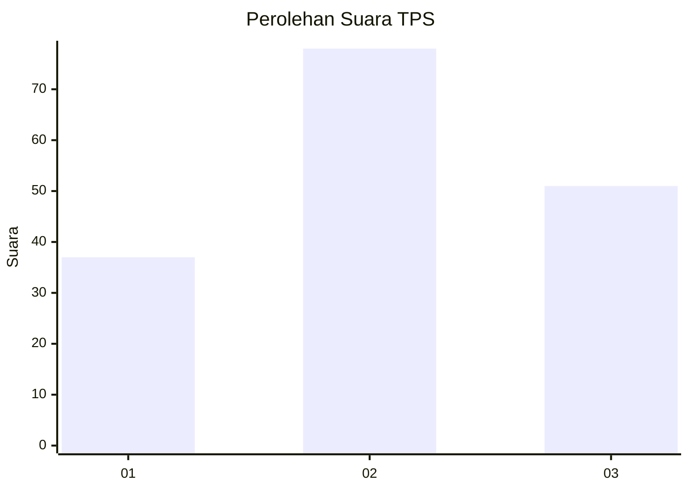
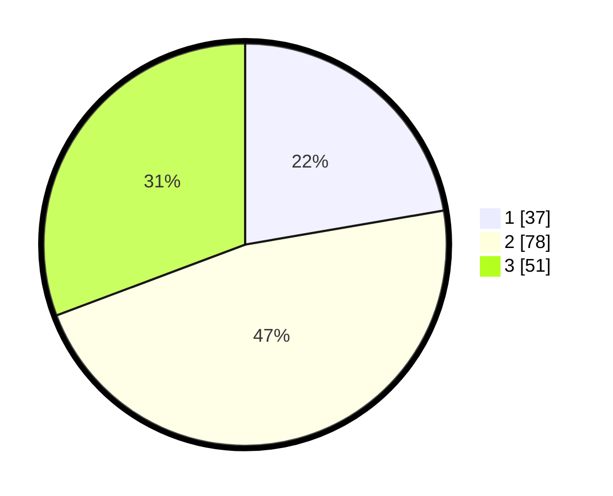

# Hasil

## Grafik

## Tabel

| No. | Nama Paslon    | Suara | Suara (raw) | Persentase |
|:--- |:-------------- | -----:| -----------:| ----------:|
| 1   | ANIES MUHAIMIN | 37    | [37][p-1]   | 22,29      |
| 2   | PRABOWO GIBRAN | 78    | [78][p-2]   | 46,99      |
| 3   | GANJAR MAHFUD  | 51    | [51][p-3]   | 30,72      |

[p-1]: https://github.com/gigit-pemilu/pemilu-2024-34-di-yogyakarta/blob/main/pilpres/hitung-suara/sub/34-di-yogyakarta/sub/04-sleman/sub/17-cangkringan/sub/2001-argomulyo/sub/005-tps/sub/paslon-1.txt
[p-2]: https://github.com/gigit-pemilu/pemilu-2024-34-di-yogyakarta/blob/main/pilpres/hitung-suara/sub/34-di-yogyakarta/sub/04-sleman/sub/17-cangkringan/sub/2001-argomulyo/sub/005-tps/sub/paslon-2.txt
[p-3]: https://github.com/gigit-pemilu/pemilu-2024-34-di-yogyakarta/blob/main/pilpres/hitung-suara/sub/34-di-yogyakarta/sub/04-sleman/sub/17-cangkringan/sub/2001-argomulyo/sub/005-tps/sub/paslon-3.txt

## Foto C Plano

https://sirekap-obj-formc.kpu.go.id/9544/pemilu/ppwp/34/04/17/20/01/3404172001005-20240214-234201--2a215676-d710-4059-b6f4-2d8707d91401.jpg

https://sirekap-obj-formc.kpu.go.id/9544/pemilu/ppwp/34/04/17/20/01/3404172001005-20240214-235833--42f47e52-7603-459a-ae9b-40916fad86f5.jpg

https://sirekap-obj-formc.kpu.go.id/9544/pemilu/ppwp/34/04/17/20/01/3404172001005-20240215-000049--969dcb5a-2ca2-4b70-9cad-9c0fcd38b515.jpg

## Metadata

| Key        | Value               |
| ---------- | ------------------- |
| Time Stamp | 2024-02-16 21:01:00 |

