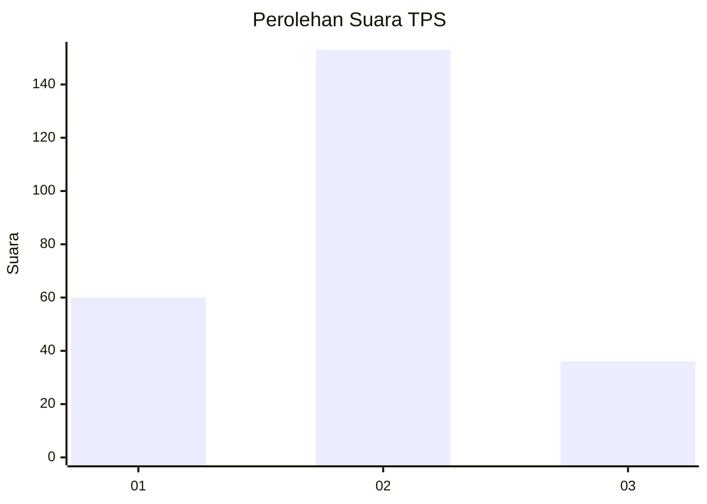
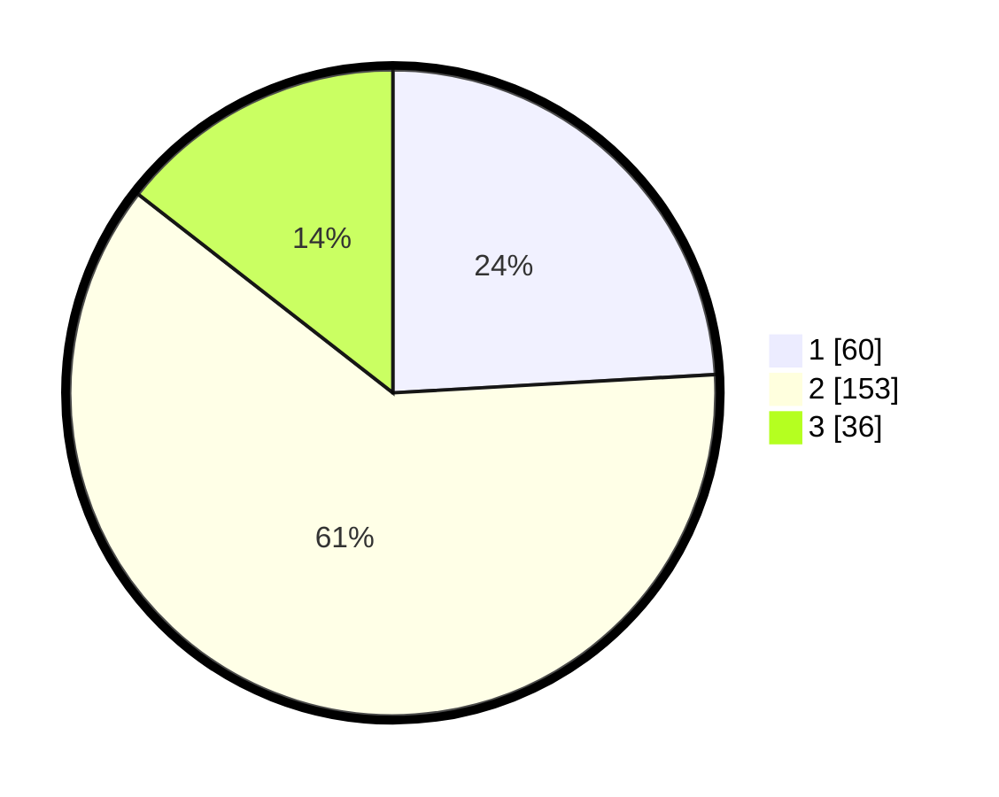

# Hasil

## Grafik

## Tabel

| No. | Nama Paslon    | Suara | Suara (raw) | Persentase |
|:--- |:-------------- | -----:| -----------:| ----------:|
| 1   | ANIES MUHAIMIN | 60    | [60][p-1]   | 24,10      |
| 2   | PRABOWO GIBRAN | 153   | [153][p-2]  | 61,45      |
| 3   | GANJAR MAHFUD  | 36    | [36][p-3]   | 14,46      |

[p-1]: https://github.com/gigit-pemilu/pemilu-2024-34-di-yogyakarta/blob/main/pilpres/hitung-suara/sub/34-di-yogyakarta/sub/04-sleman/sub/17-cangkringan/sub/2001-argomulyo/sub/007-tps/sub/paslon-1.txt
[p-2]: https://github.com/gigit-pemilu/pemilu-2024-34-di-yogyakarta/blob/main/pilpres/hitung-suara/sub/34-di-yogyakarta/sub/04-sleman/sub/17-cangkringan/sub/2001-argomulyo/sub/007-tps/sub/paslon-2.txt
[p-3]: https://github.com/gigit-pemilu/pemilu-2024-34-di-yogyakarta/blob/main/pilpres/hitung-suara/sub/34-di-yogyakarta/sub/04-sleman/sub/17-cangkringan/sub/2001-argomulyo/sub/007-tps/sub/paslon-3.txt

## Foto C Plano

https://sirekap-obj-formc.kpu.go.id/6d27/pemilu/ppwp/34/04/17/20/01/3404172001007-20240214-212223--9f287a52-6e02-410a-87ac-2661cef1e7e6.jpg

https://sirekap-obj-formc.kpu.go.id/6d27/pemilu/ppwp/34/04/17/20/01/3404172001007-20240214-212337--e48b5686-bc91-497b-b5a2-33eb2701bd6e.jpg

https://sirekap-obj-formc.kpu.go.id/6d27/pemilu/ppwp/34/04/17/20/01/3404172001007-20240214-212446--e42c2355-122b-4a5b-8aeb-036f09a58d03.jpg

## Metadata

| Key        | Value               |
| ---------- | ------------------- |
| Time Stamp | 2024-02-15 12:00:28 |

