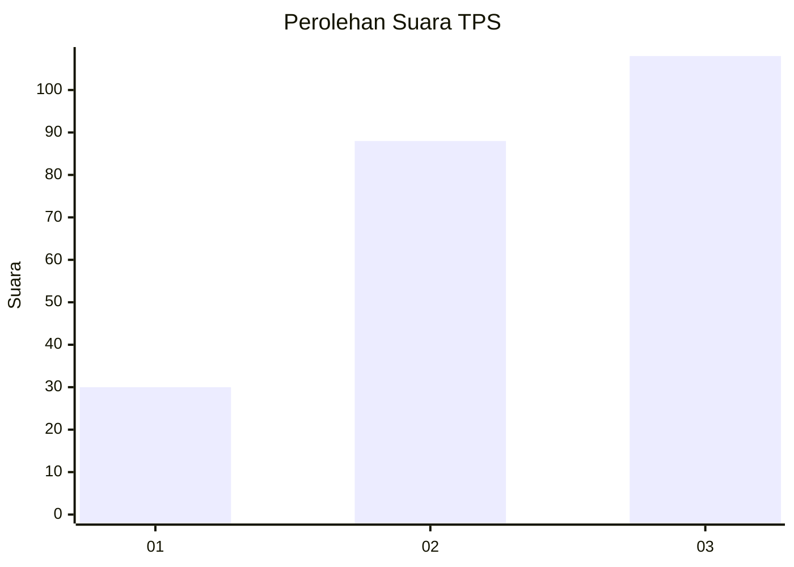
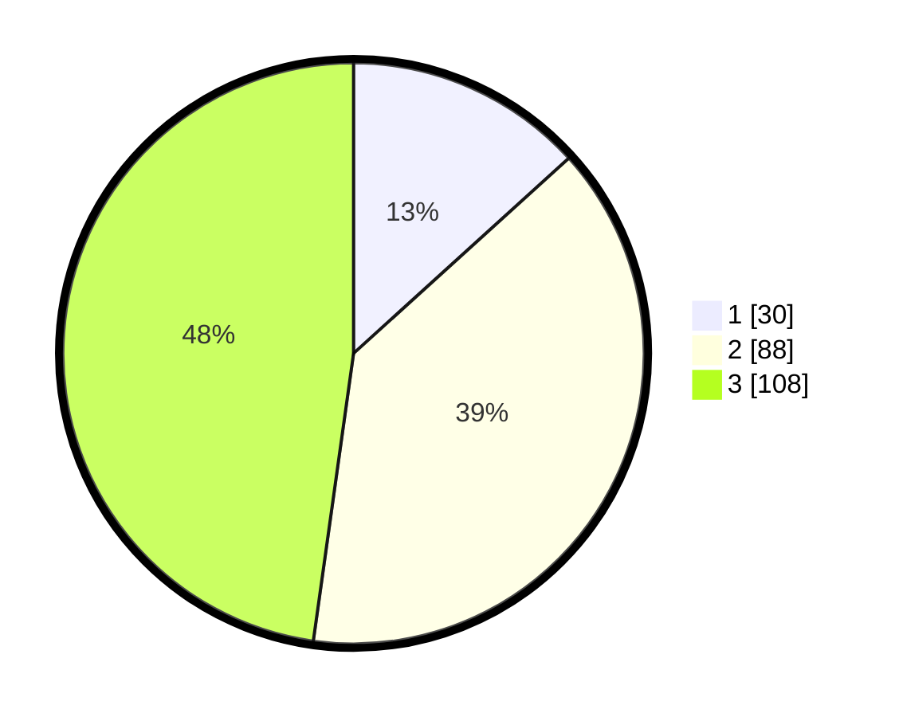

# Hasil

## Grafik

## Tabel

| No. | Nama Paslon    | Suara | Suara (raw) | Persentase |
|:--- |:-------------- | -----:| -----------:| ----------:|
| 1   | ANIES MUHAIMIN | 30    | [30][p-1]   | 13,27      |
| 2   | PRABOWO GIBRAN | 88    | [88][p-2]   | 38,94      |
| 3   | GANJAR MAHFUD  | 108   | [108][p-3]  | 47,79      |

[p-1]: https://github.com/gigit-pemilu/pemilu-2024-34-di-yogyakarta/blob/main/pilpres/hitung-suara/sub/34-di-yogyakarta/sub/04-sleman/sub/17-cangkringan/sub/2001-argomulyo/sub/010-tps/sub/paslon-1.txt
[p-2]: https://github.com/gigit-pemilu/pemilu-2024-34-di-yogyakarta/blob/main/pilpres/hitung-suara/sub/34-di-yogyakarta/sub/04-sleman/sub/17-cangkringan/sub/2001-argomulyo/sub/010-tps/sub/paslon-2.txt
[p-3]: https://github.com/gigit-pemilu/pemilu-2024-34-di-yogyakarta/blob/main/pilpres/hitung-suara/sub/34-di-yogyakarta/sub/04-sleman/sub/17-cangkringan/sub/2001-argomulyo/sub/010-tps/sub/paslon-3.txt

## Foto C Plano

https://sirekap-obj-formc.kpu.go.id/22eb/pemilu/ppwp/34/04/17/20/01/3404172001010-20240214-235121--25339de6-e0c6-4fe0-a9a5-d598f8411de9.jpg

https://sirekap-obj-formc.kpu.go.id/22eb/pemilu/ppwp/34/04/17/20/01/3404172001010-20240214-235236--2fcd0969-d003-41da-8c6e-f99b4877cc79.jpg

https://sirekap-obj-formc.kpu.go.id/22eb/pemilu/ppwp/34/04/17/20/01/3404172001010-20240214-235515--a274648f-ffe2-4764-b9f5-d93db132fac4.jpg

## Metadata

| Key        | Value               |
| ---------- | ------------------- |
| Time Stamp | 2024-02-15 16:00:26 |

