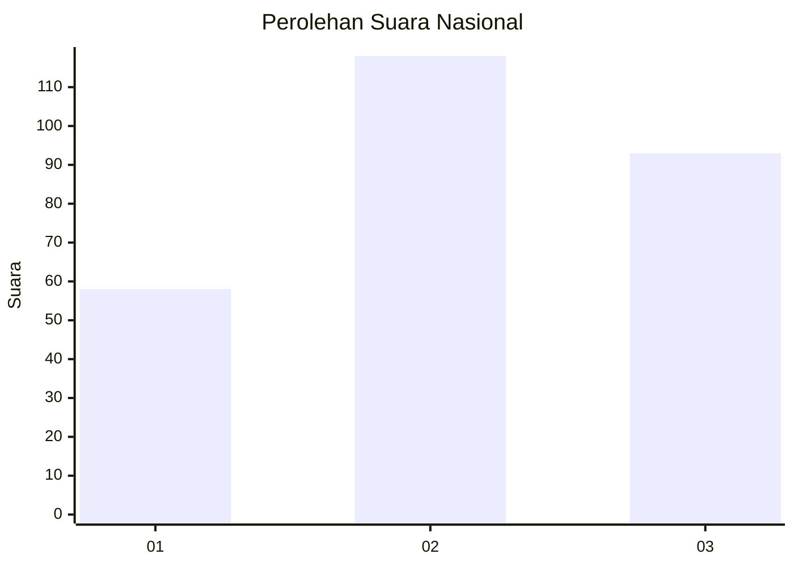
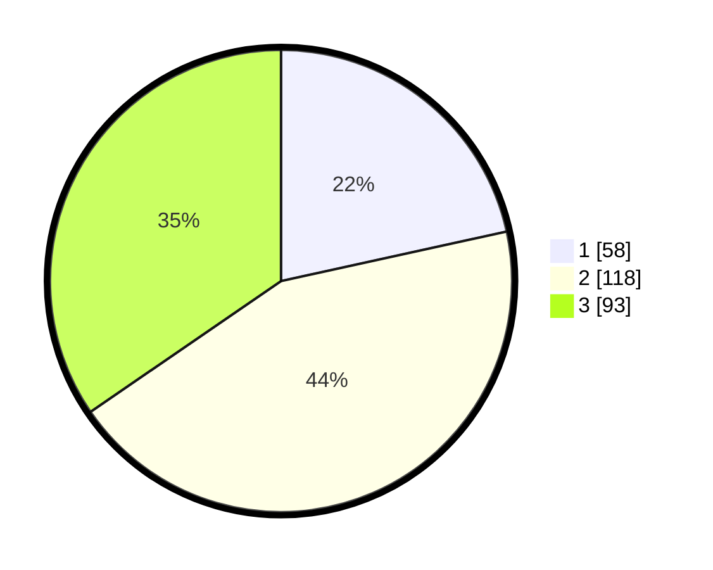

# Hasil

## Grafik

## Tabel

| No. | Nama Paslon    | Suara | Suara (raw) | Persentase |
|:--- |:-------------- | -----:| -----------:| ----------:|
| 1   | ANIES MUHAIMIN | 58    | [58][p-1]   | 21,56      |
| 2   | PRABOWO GIBRAN | 118   | [118][p-2]  | 43,87      |
| 3   | GANJAR MAHFUD  | 93    | [93][p-3]   | 34,57      |

[p-1]: https://github.com/gigit-pemilu/pemilu-2024/blob/main/pilpres/hitung-suara/sub/34-di-yogyakarta/sub/04-sleman/sub/17-cangkringan/sub/2001-argomulyo/sub/014-tps/sub/paslon-1.txt
[p-2]: https://github.com/gigit-pemilu/pemilu-2024/blob/main/pilpres/hitung-suara/sub/34-di-yogyakarta/sub/04-sleman/sub/17-cangkringan/sub/2001-argomulyo/sub/014-tps/sub/paslon-2.txt
[p-3]: https://github.com/gigit-pemilu/pemilu-2024/blob/main/pilpres/hitung-suara/sub/34-di-yogyakarta/sub/04-sleman/sub/17-cangkringan/sub/2001-argomulyo/sub/014-tps/sub/paslon-3.txt

## Foto C Plano

https://sirekap-obj-formc.kpu.go.id/f58e/pemilu/ppwp/34/04/17/20/01/3404172001014-20240215-204452--f17e8de3-768a-4813-9aec-ee546e6e68a0.jpg

https://sirekap-obj-formc.kpu.go.id/f58e/pemilu/ppwp/34/04/17/20/01/3404172001014-20240216-080640--f7b0c19b-48ba-435d-98a9-7b455e07b882.jpg

https://sirekap-obj-formc.kpu.go.id/f58e/pemilu/ppwp/34/04/17/20/01/3404172001014-20240216-080907--a2b74330-71a2-49a1-b0e9-e183d71d73ae.jpg

## Metadata

| Key        | Value               |
| ---------- | ------------------- |
| Time Stamp | 2024-02-16 11:00:29 |

## DATA PEMILIH TETAP

Jumlah pemilih dalam DPT: **294**.
 * L: **140**.
 * P: **154**.

## DATA PENGGUNA HAK PILIH

Jumlah pengguna hak pilih dalam DPT: **269**.
 * L: **728**.
 * P: **141**.

Jumlah pengguna hak pilih dalam DPTb: **6**.
 * L: **5**.
 * P: **5**.

Jumlah pengguna hak pilih dalam DPK: **0**.
 * L: **0**.
 * P: **0**.

Jumlah pengguna hak pilih: **275**.
 * L: **129**.
 * P: **146**.

## JUMLAH SUARA SAH DAN TIDAK SAH

JUMLAH SELURUH SUARA SAH: **269**.

JUMLAH SUARA TIDAK SAH: **6**.

JUMLAH SELURUH SUARA SAH DAN SUARA TIDAK SAH: **275**.

