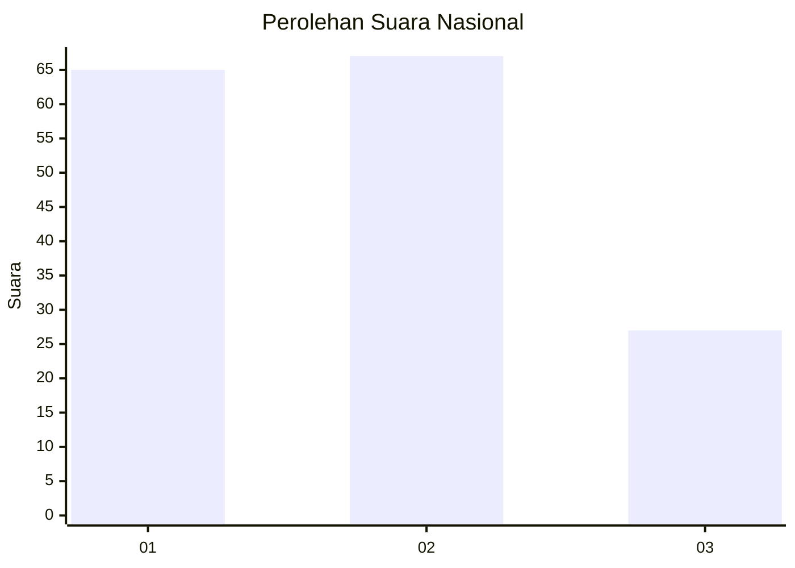
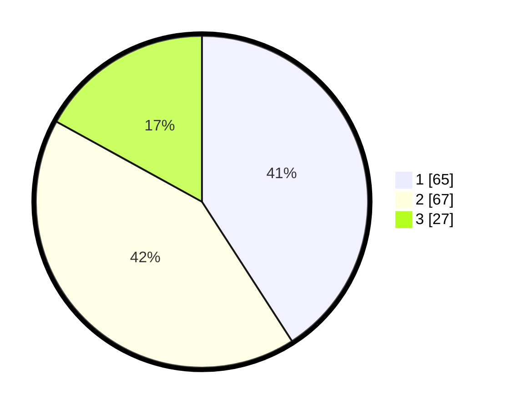

# Hasil

## Grafik

## Tabel

| No. | Nama Paslon    | Suara | Suara (raw) | Persentase |
|:--- |:-------------- | -----:| -----------:| ----------:|
| 1   | ANIES MUHAIMIN | 65    | [65][p-1]   | 40,88      |
| 2   | PRABOWO GIBRAN | 67    | [67][p-2]   | 42,14      |
| 3   | GANJAR MAHFUD  | 27    | [27][p-3]   | 16,98      |

[p-1]: https://github.com/gigit-pemilu/pemilu-2024/blob/main/pilpres/hitung-suara/sub/34-di-yogyakarta/sub/04-sleman/sub/17-cangkringan/sub/2001-argomulyo/sub/015-tps/sub/paslon-1.txt
[p-2]: https://github.com/gigit-pemilu/pemilu-2024/blob/main/pilpres/hitung-suara/sub/34-di-yogyakarta/sub/04-sleman/sub/17-cangkringan/sub/2001-argomulyo/sub/015-tps/sub/paslon-2.txt
[p-3]: https://github.com/gigit-pemilu/pemilu-2024/blob/main/pilpres/hitung-suara/sub/34-di-yogyakarta/sub/04-sleman/sub/17-cangkringan/sub/2001-argomulyo/sub/015-tps/sub/paslon-3.txt

## Foto C Plano

https://sirekap-obj-formc.kpu.go.id/bcf5/pemilu/ppwp/34/04/17/20/01/3404172001015-20240215-074112--9b90cd7c-1171-4b50-b11a-a1b6b0cb2802.jpg

https://sirekap-obj-formc.kpu.go.id/bcf5/pemilu/ppwp/34/04/17/20/01/3404172001015-20240215-004426--355bc3e4-5d4f-4f8a-9578-7ed4b1ce9660.jpg

https://sirekap-obj-formc.kpu.go.id/bcf5/pemilu/ppwp/34/04/17/20/01/3404172001015-20240215-004539--2d306187-381c-4618-ac4e-b2aa38c40ba6.jpg

## Metadata

| Key        | Value               |
| ---------- | ------------------- |
| Time Stamp | 2024-02-16 21:01:00 |

