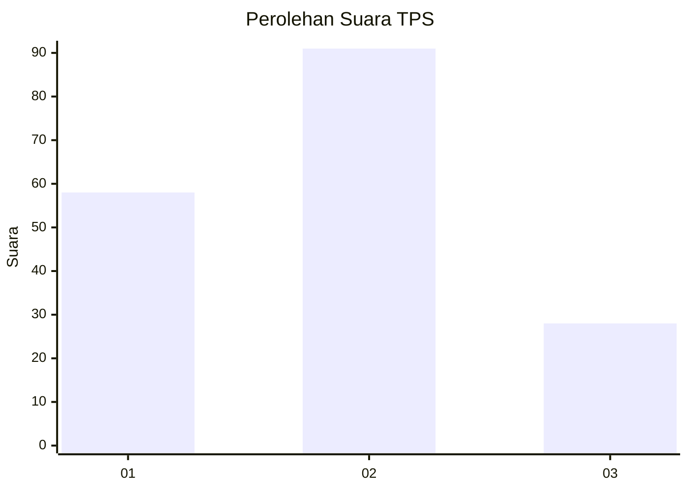
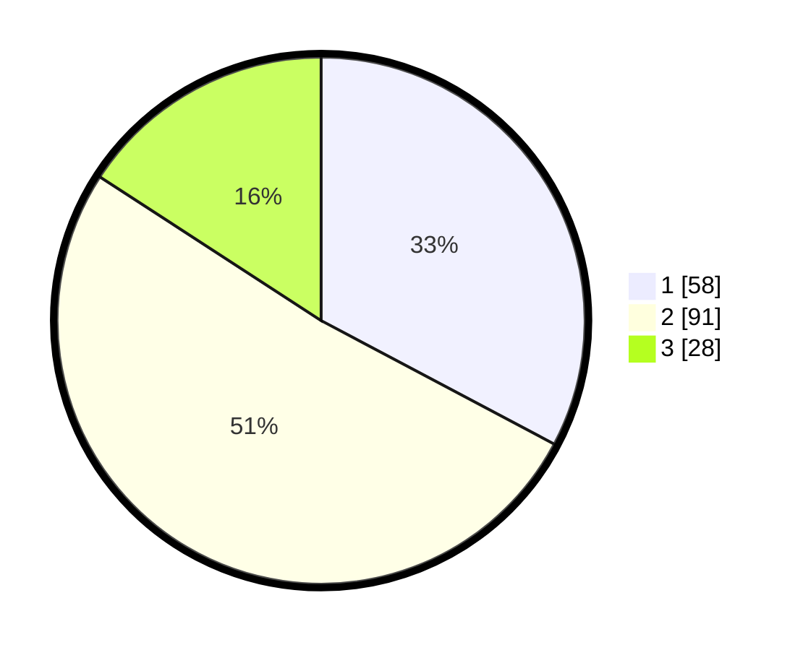

# Hasil

## Grafik

## Tabel

| No. | Nama Paslon    | Suara | Suara (raw) | Persentase |
|:--- |:-------------- | -----:| -----------:| ----------:|
| 1   | ANIES MUHAIMIN | 58    | [58][p-1]   | 32,77      |
| 2   | PRABOWO GIBRAN | 91    | [91][p-2]   | 51,41      |
| 3   | GANJAR MAHFUD  | 28    | [28][p-3]   | 15,82      |

[p-1]: https://github.com/gigit-pemilu/pemilu-2024-34-di-yogyakarta/blob/main/pilpres/hitung-suara/sub/34-di-yogyakarta/sub/04-sleman/sub/17-cangkringan/sub/2001-argomulyo/sub/017-tps/sub/paslon-1.txt
[p-2]: https://github.com/gigit-pemilu/pemilu-2024-34-di-yogyakarta/blob/main/pilpres/hitung-suara/sub/34-di-yogyakarta/sub/04-sleman/sub/17-cangkringan/sub/2001-argomulyo/sub/017-tps/sub/paslon-2.txt
[p-3]: https://github.com/gigit-pemilu/pemilu-2024-34-di-yogyakarta/blob/main/pilpres/hitung-suara/sub/34-di-yogyakarta/sub/04-sleman/sub/17-cangkringan/sub/2001-argomulyo/sub/017-tps/sub/paslon-3.txt

## Foto C Plano

https://sirekap-obj-formc.kpu.go.id/7186/pemilu/ppwp/34/04/17/20/01/3404172001017-20240214-210137--c3c19f7e-f233-4c01-82d8-d19b1d2a501b.jpg

https://sirekap-obj-formc.kpu.go.id/7186/pemilu/ppwp/34/04/17/20/01/3404172001017-20240214-211023--f05a499b-9bbe-4ea3-b1d9-431ba1c05b81.jpg

https://sirekap-obj-formc.kpu.go.id/7186/pemilu/ppwp/34/04/17/20/01/3404172001017-20240214-211516--affda418-bf4c-4158-9135-81208ef0fa8b.jpg

## Metadata

| Key        | Value               |
| ---------- | ------------------- |
| Time Stamp | 2024-02-15 15:30:25 |

