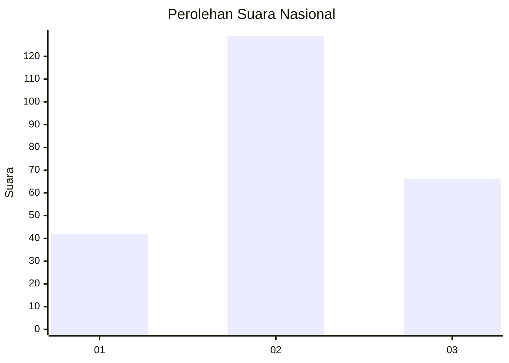
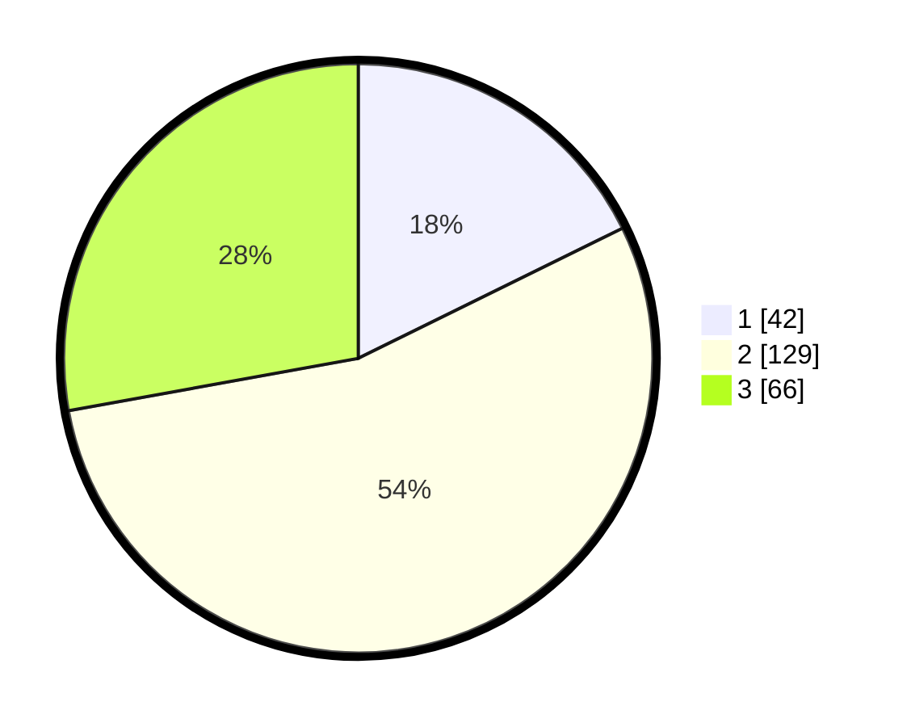

# Hasil

## Grafik

## Tabel

| No. | Nama Paslon    | Suara | Suara (raw) | Persentase |
|:--- |:-------------- | -----:| -----------:| ----------:|
| 1   | ANIES MUHAIMIN | 42    | [42][p-1]   | 17,72      |
| 2   | PRABOWO GIBRAN | 129   | [129][p-2]  | 54,43      |
| 3   | GANJAR MAHFUD  | 66    | [66][p-3]   | 27,85      |

[p-1]: https://github.com/gigit-pemilu/pemilu-2024/blob/main/pilpres/hitung-suara/sub/34-di-yogyakarta/sub/04-sleman/sub/17-cangkringan/sub/2001-argomulyo/sub/019-tps/sub/paslon-1.txt
[p-2]: https://github.com/gigit-pemilu/pemilu-2024/blob/main/pilpres/hitung-suara/sub/34-di-yogyakarta/sub/04-sleman/sub/17-cangkringan/sub/2001-argomulyo/sub/019-tps/sub/paslon-2.txt
[p-3]: https://github.com/gigit-pemilu/pemilu-2024/blob/main/pilpres/hitung-suara/sub/34-di-yogyakarta/sub/04-sleman/sub/17-cangkringan/sub/2001-argomulyo/sub/019-tps/sub/paslon-3.txt

## Foto C Plano

https://sirekap-obj-formc.kpu.go.id/881a/pemilu/ppwp/34/04/17/20/01/3404172001019-20240214-220952--7e719e26-e742-4d03-89cc-2d1e4d9a0245.jpg

https://sirekap-obj-formc.kpu.go.id/881a/pemilu/ppwp/34/04/17/20/01/3404172001019-20240214-215638--05d92f02-bb3d-488d-9e7e-2a8f8fde9eb0.jpg

https://sirekap-obj-formc.kpu.go.id/881a/pemilu/ppwp/34/04/17/20/01/3404172001019-20240214-220424--8ddee536-c52d-454d-8a5c-87871a87dbae.jpg

## Metadata

| Key        | Value               |
| ---------- | ------------------- |
| Time Stamp | 2024-02-15 20:30:46 |

