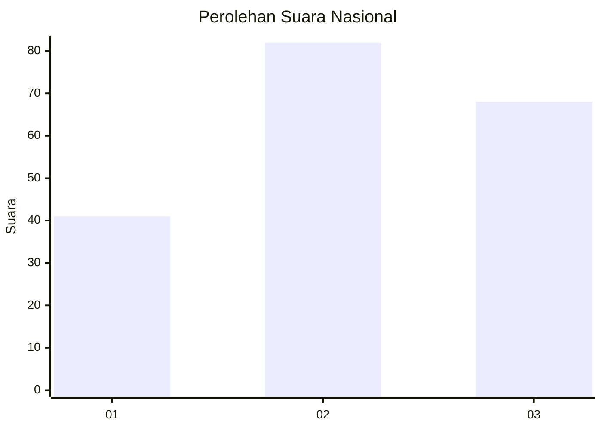
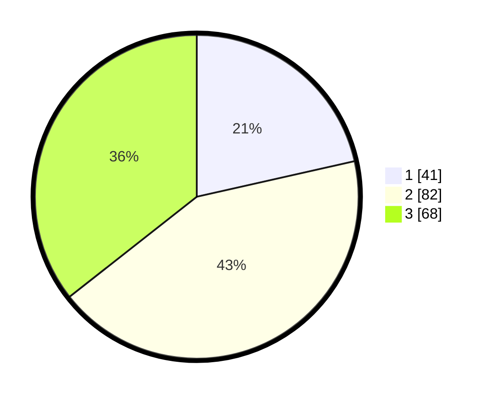

# Hasil

## Grafik

## Tabel

| No. | Nama Paslon    | Suara | Suara (raw) | Persentase |
|:--- |:-------------- | -----:| -----------:| ----------:|
| 1   | ANIES MUHAIMIN | 41    | [41][p-1]   | 21,47      |
| 2   | PRABOWO GIBRAN | 82    | [82][p-2]   | 42,93      |
| 3   | GANJAR MAHFUD  | 68    | [68][p-3]   | 35,60      |

[p-1]: https://github.com/gigit-pemilu/pemilu-2024/blob/main/pilpres/hitung-suara/sub/34-di-yogyakarta/sub/04-sleman/sub/17-cangkringan/sub/2001-argomulyo/sub/024-tps/sub/paslon-1.txt
[p-2]: https://github.com/gigit-pemilu/pemilu-2024/blob/main/pilpres/hitung-suara/sub/34-di-yogyakarta/sub/04-sleman/sub/17-cangkringan/sub/2001-argomulyo/sub/024-tps/sub/paslon-2.txt
[p-3]: https://github.com/gigit-pemilu/pemilu-2024/blob/main/pilpres/hitung-suara/sub/34-di-yogyakarta/sub/04-sleman/sub/17-cangkringan/sub/2001-argomulyo/sub/024-tps/sub/paslon-3.txt

## Foto C Plano

https://sirekap-obj-formc.kpu.go.id/f5be/pemilu/ppwp/34/04/17/20/01/3404172001024-20240214-192239--6d5c4333-b42a-4cf8-9dd9-d679cb530b15.jpg

https://sirekap-obj-formc.kpu.go.id/f5be/pemilu/ppwp/34/04/17/20/01/3404172001024-20240214-210110--0c5e8ada-82fa-44ec-841c-9a809e41d098.jpg

https://sirekap-obj-formc.kpu.go.id/f5be/pemilu/ppwp/34/04/17/20/01/3404172001024-20240214-210230--b744b69e-ea3a-4fe6-a77f-c4adfe87835f.jpg

## Metadata

| Key        | Value               |
| ---------- | ------------------- |
| Time Stamp | 2024-02-24 22:31:28 |

