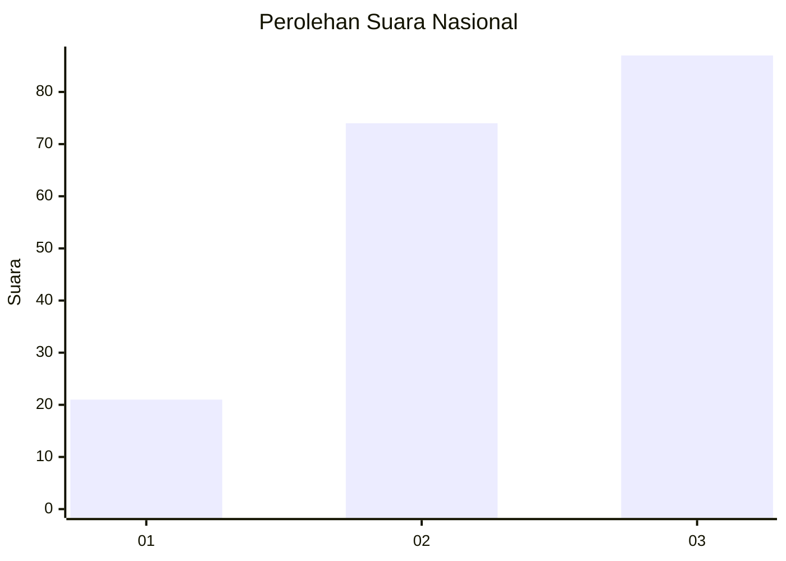
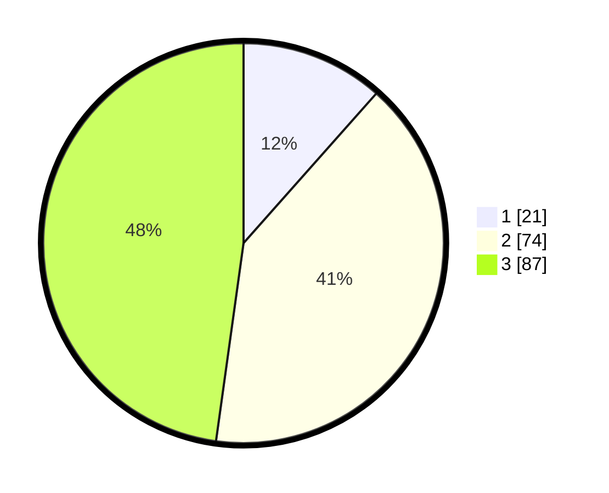

# Hasil

## Grafik

## Tabel

| No. | Nama Paslon    | Suara | Suara (raw) | Persentase |
|:--- |:-------------- | -----:| -----------:| ----------:|
| 1   | ANIES MUHAIMIN | 21    | [21][p-1]   | 11,54      |
| 2   | PRABOWO GIBRAN | 74    | [74][p-2]   | 40,66      |
| 3   | GANJAR MAHFUD  | 87    | [87][p-3]   | 47,80      |

[p-1]: https://github.com/gigit-pemilu/pemilu-2024/blob/main/pilpres/hitung-suara/sub/34-di-yogyakarta/sub/04-sleman/sub/17-cangkringan/sub/2002-wukirsari/sub/004-tps/sub/paslon-1.txt
[p-2]: https://github.com/gigit-pemilu/pemilu-2024/blob/main/pilpres/hitung-suara/sub/34-di-yogyakarta/sub/04-sleman/sub/17-cangkringan/sub/2002-wukirsari/sub/004-tps/sub/paslon-2.txt
[p-3]: https://github.com/gigit-pemilu/pemilu-2024/blob/main/pilpres/hitung-suara/sub/34-di-yogyakarta/sub/04-sleman/sub/17-cangkringan/sub/2002-wukirsari/sub/004-tps/sub/paslon-3.txt

## Foto C Plano

https://sirekap-obj-formc.kpu.go.id/af7d/pemilu/ppwp/34/04/17/20/02/3404172002004-20240214-204004--d8a46710-2819-4a3a-b2ed-ed0e957449e0.jpg

https://sirekap-obj-formc.kpu.go.id/af7d/pemilu/ppwp/34/04/17/20/02/3404172002004-20240214-204052--52156154-b94d-4dc6-acdf-274cd0b872e6.jpg

https://sirekap-obj-formc.kpu.go.id/af7d/pemilu/ppwp/34/04/17/20/02/3404172002004-20240214-204127--4c2946ce-3f0a-44e4-aa80-13cb794a1e04.jpg

## Metadata

| Key        | Value               |
| ---------- | ------------------- |
| Time Stamp | 2024-02-16 12:51:22 |

