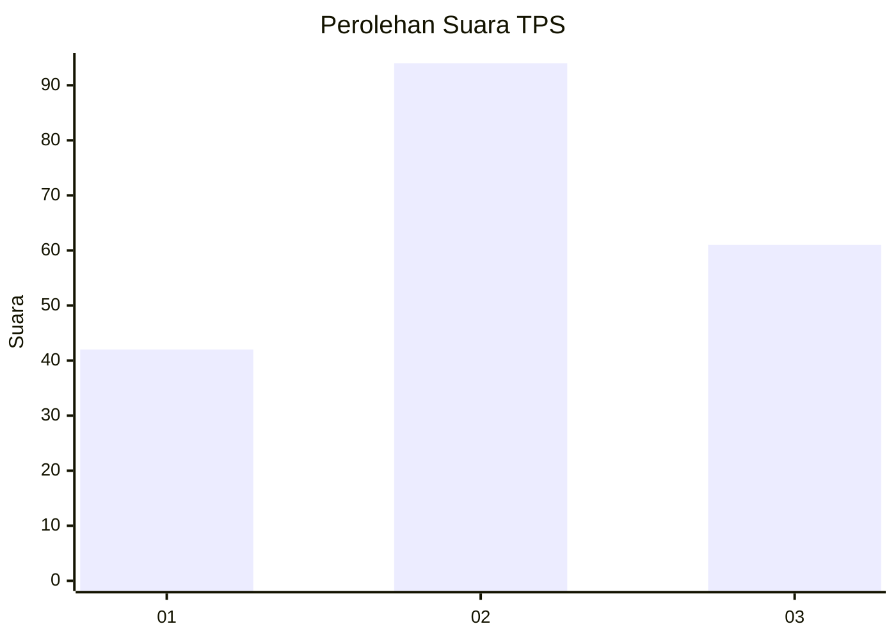
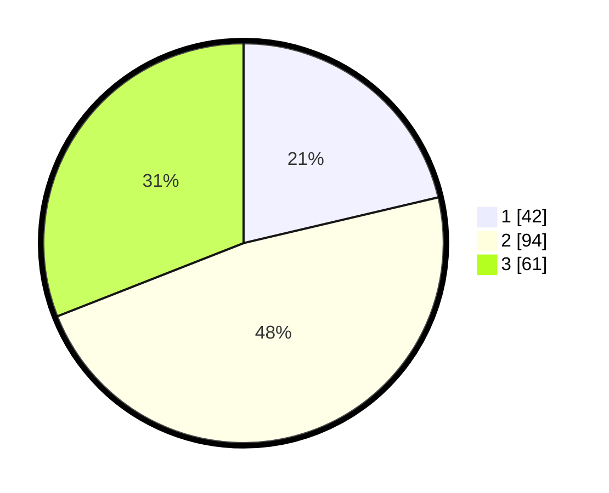

# Hasil

## Grafik

## Tabel

| No. | Nama Paslon    | Suara | Suara (raw) | Persentase |
|:--- |:-------------- | -----:| -----------:| ----------:|
| 1   | ANIES MUHAIMIN | 42    | [42][p-1]   | 21,32      |
| 2   | PRABOWO GIBRAN | 94    | [94][p-2]   | 47,72      |
| 3   | GANJAR MAHFUD  | 61    | [61][p-3]   | 30,96      |

[p-1]: https://github.com/gigit-pemilu/pemilu-2024-34-di-yogyakarta/blob/main/pilpres/hitung-suara/sub/34-di-yogyakarta/sub/04-sleman/sub/17-cangkringan/sub/2002-wukirsari/sub/009-tps/sub/paslon-1.txt
[p-2]: https://github.com/gigit-pemilu/pemilu-2024-34-di-yogyakarta/blob/main/pilpres/hitung-suara/sub/34-di-yogyakarta/sub/04-sleman/sub/17-cangkringan/sub/2002-wukirsari/sub/009-tps/sub/paslon-2.txt
[p-3]: https://github.com/gigit-pemilu/pemilu-2024-34-di-yogyakarta/blob/main/pilpres/hitung-suara/sub/34-di-yogyakarta/sub/04-sleman/sub/17-cangkringan/sub/2002-wukirsari/sub/009-tps/sub/paslon-3.txt

## Foto C Plano

https://sirekap-obj-formc.kpu.go.id/4a70/pemilu/ppwp/34/04/17/20/02/3404172002009-20240214-215444--a2b3b118-75a8-46ce-a8f8-d6d457c9ee10.jpg

https://sirekap-obj-formc.kpu.go.id/4a70/pemilu/ppwp/34/04/17/20/02/3404172002009-20240214-215455--b4a6cc16-0141-4926-ac1d-d755baf9fa5f.jpg

https://sirekap-obj-formc.kpu.go.id/4a70/pemilu/ppwp/34/04/17/20/02/3404172002009-20240214-215502--39c15502-c039-461d-a8b0-3c34478551a8.jpg

## Metadata

| Key        | Value               |
| ---------- | ------------------- |
| Time Stamp | 2024-02-16 21:01:00 |

