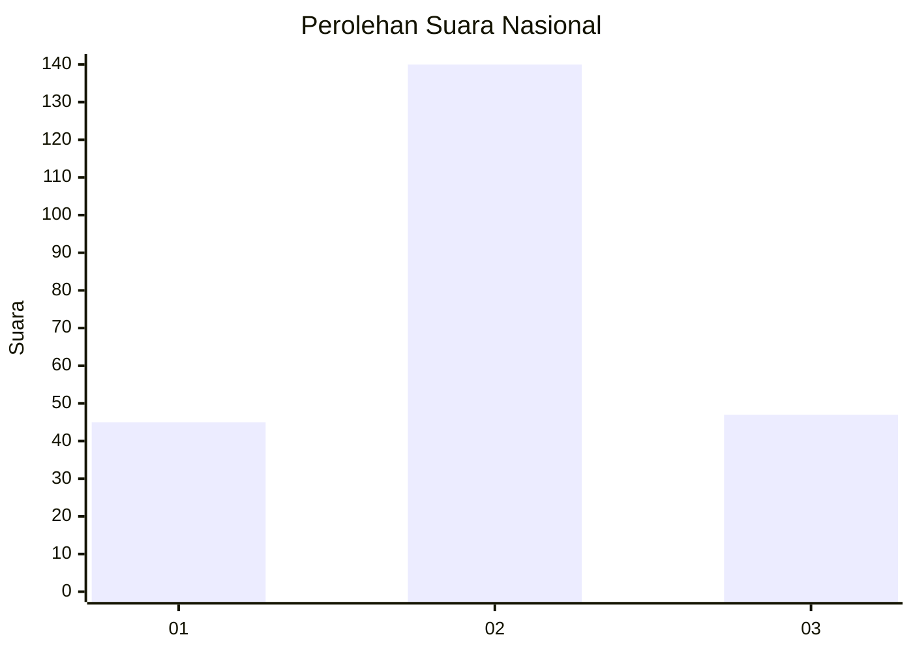
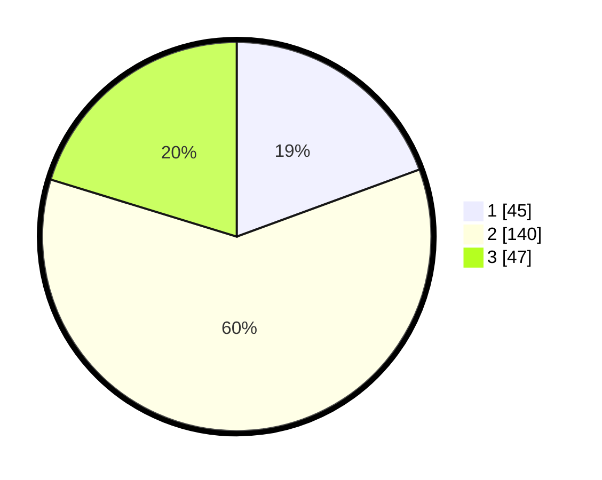

# Hasil

## Grafik

## Tabel

| No. | Nama Paslon    | Suara | Suara (raw) | Persentase |
|:--- |:-------------- | -----:| -----------:| ----------:|
| 1   | ANIES MUHAIMIN | 45    | [45][p-1]   | 19,40      |
| 2   | PRABOWO GIBRAN | 140   | [140][p-2]  | 60,34      |
| 3   | GANJAR MAHFUD  | 47    | [47][p-3]   | 20,26      |

[p-1]: https://github.com/gigit-pemilu/pemilu-2024/blob/main/pilpres/hitung-suara/sub/34-di-yogyakarta/sub/04-sleman/sub/17-cangkringan/sub/2002-wukirsari/sub/011-tps/sub/paslon-1.txt
[p-2]: https://github.com/gigit-pemilu/pemilu-2024/blob/main/pilpres/hitung-suara/sub/34-di-yogyakarta/sub/04-sleman/sub/17-cangkringan/sub/2002-wukirsari/sub/011-tps/sub/paslon-2.txt
[p-3]: https://github.com/gigit-pemilu/pemilu-2024/blob/main/pilpres/hitung-suara/sub/34-di-yogyakarta/sub/04-sleman/sub/17-cangkringan/sub/2002-wukirsari/sub/011-tps/sub/paslon-3.txt

## Foto C Plano

https://sirekap-obj-formc.kpu.go.id/de91/pemilu/ppwp/34/04/17/20/02/3404172002011-20240214-220100--6058e0e5-1a9f-4fa8-a83e-6be3a70505f4.jpg

https://sirekap-obj-formc.kpu.go.id/de91/pemilu/ppwp/34/04/17/20/02/3404172002011-20240214-220106--02eede5e-4256-4c90-b2d9-4930560a4d6b.jpg

https://sirekap-obj-formc.kpu.go.id/de91/pemilu/ppwp/34/04/17/20/02/3404172002011-20240214-220112--e4611f7a-ed5a-4cf1-9930-0a88c54db78e.jpg

## Metadata

| Key        | Value               |
| ---------- | ------------------- |
| Time Stamp | 2024-02-16 21:01:00 |

