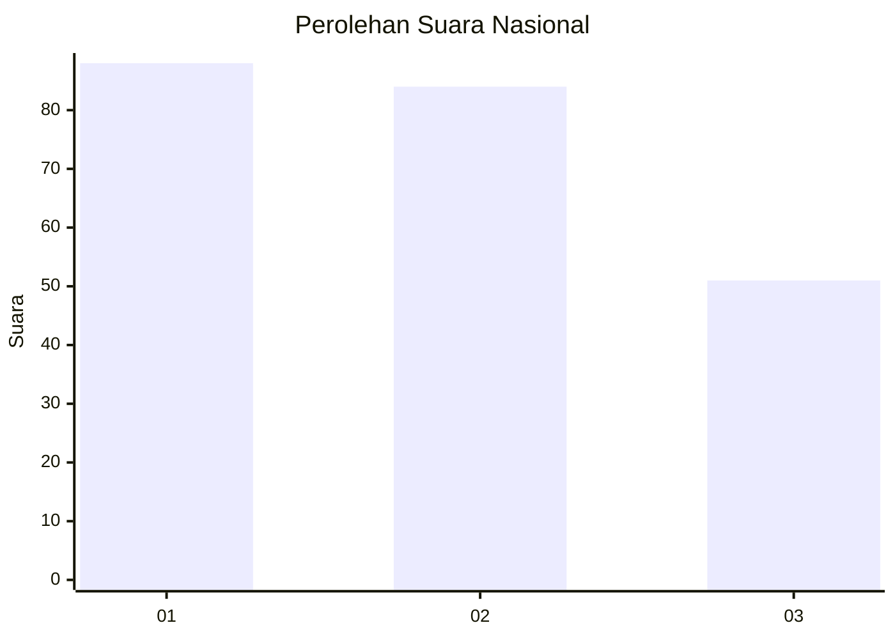
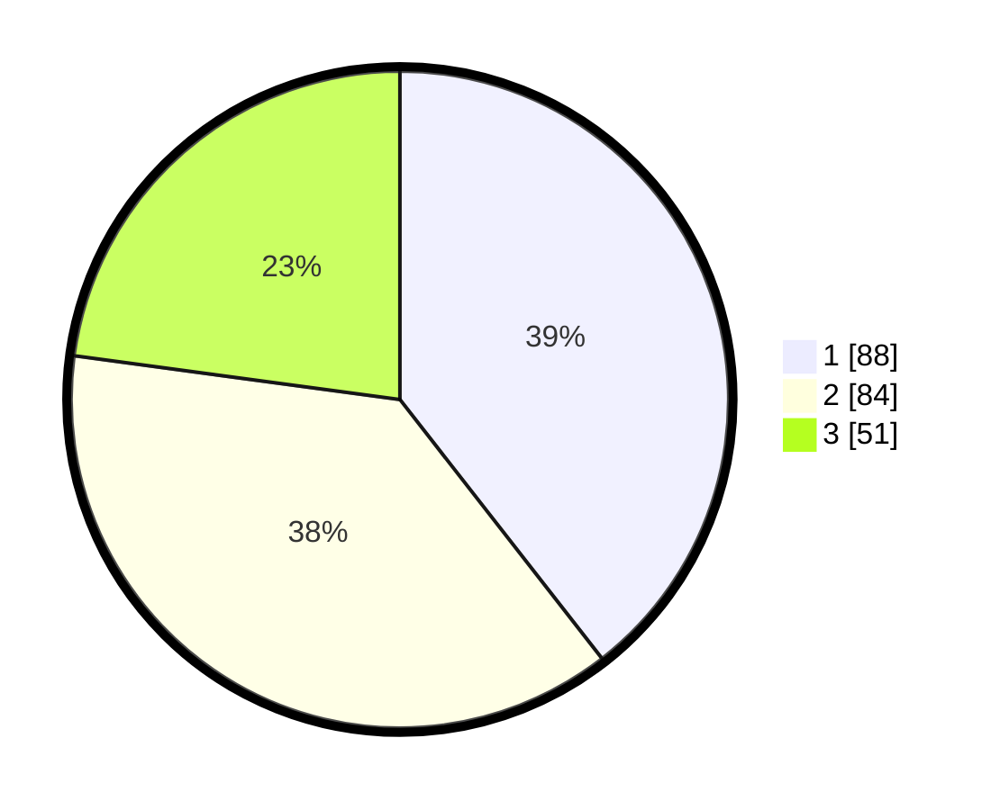

# Hasil

## Grafik

## Tabel

| No. | Nama Paslon    | Suara | Suara (raw) | Persentase |
|:--- |:-------------- | -----:| -----------:| ----------:|
| 1   | ANIES MUHAIMIN | 88    | [88][p-1]   | 39,46      |
| 2   | PRABOWO GIBRAN | 84    | [84][p-2]   | 37,67      |
| 3   | GANJAR MAHFUD  | 51    | [51][p-3]   | 22,87      |

[p-1]: https://github.com/gigit-pemilu/pemilu-2024/blob/main/pilpres/hitung-suara/sub/34-di-yogyakarta/sub/04-sleman/sub/17-cangkringan/sub/2002-wukirsari/sub/016-tps/sub/paslon-1.txt
[p-2]: https://github.com/gigit-pemilu/pemilu-2024/blob/main/pilpres/hitung-suara/sub/34-di-yogyakarta/sub/04-sleman/sub/17-cangkringan/sub/2002-wukirsari/sub/016-tps/sub/paslon-2.txt
[p-3]: https://github.com/gigit-pemilu/pemilu-2024/blob/main/pilpres/hitung-suara/sub/34-di-yogyakarta/sub/04-sleman/sub/17-cangkringan/sub/2002-wukirsari/sub/016-tps/sub/paslon-3.txt

## Foto C Plano

https://sirekap-obj-formc.kpu.go.id/a3d7/pemilu/ppwp/34/04/17/20/02/3404172002016-20240215-015228--269349b2-2b77-404a-aaf5-fc739e25f9e8.jpg

https://sirekap-obj-formc.kpu.go.id/a3d7/pemilu/ppwp/34/04/17/20/02/3404172002016-20240215-015448--863ea288-6524-4524-bf38-30c7ee2940b0.jpg

https://sirekap-obj-formc.kpu.go.id/a3d7/pemilu/ppwp/34/04/17/20/02/3404172002016-20240215-015546--937017a9-503b-4e9e-8ef5-b8b680a116fe.jpg

## Metadata

| Key        | Value               |
| ---------- | ------------------- |
| Time Stamp | 2024-02-15 12:00:28 |

