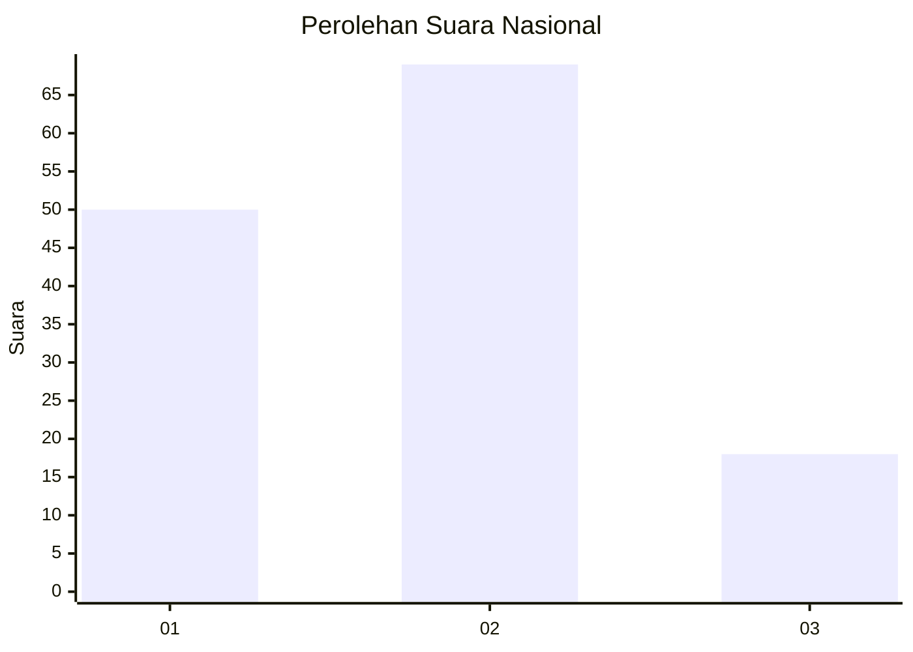
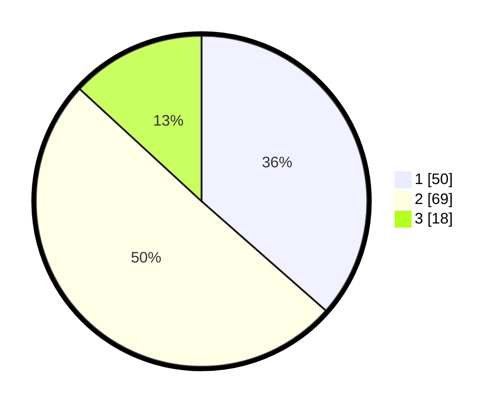

# Hasil

## Grafik

## Tabel

| No. | Nama Paslon    | Suara | Suara (raw) | Persentase |
|:--- |:-------------- | -----:| -----------:| ----------:|
| 1   | ANIES MUHAIMIN | 50    | [50][p-1]   | 36,50      |
| 2   | PRABOWO GIBRAN | 69    | [69][p-2]   | 50,36      |
| 3   | GANJAR MAHFUD  | 18    | [18][p-3]   | 13,14      |

[p-1]: https://github.com/gigit-pemilu/pemilu-2024/blob/main/pilpres/hitung-suara/sub/34-di-yogyakarta/sub/04-sleman/sub/17-cangkringan/sub/2002-wukirsari/sub/021-tps/sub/paslon-1.txt
[p-2]: https://github.com/gigit-pemilu/pemilu-2024/blob/main/pilpres/hitung-suara/sub/34-di-yogyakarta/sub/04-sleman/sub/17-cangkringan/sub/2002-wukirsari/sub/021-tps/sub/paslon-2.txt
[p-3]: https://github.com/gigit-pemilu/pemilu-2024/blob/main/pilpres/hitung-suara/sub/34-di-yogyakarta/sub/04-sleman/sub/17-cangkringan/sub/2002-wukirsari/sub/021-tps/sub/paslon-3.txt

## Foto C Plano

https://sirekap-obj-formc.kpu.go.id/5455/pemilu/ppwp/34/04/17/20/02/3404172002021-20240215-114200--a2d51526-c39d-4080-abf2-9ae80bddb01e.jpg

https://sirekap-obj-formc.kpu.go.id/5455/pemilu/ppwp/34/04/17/20/02/3404172002021-20240215-114347--5cb16ce3-5efc-448b-8dde-86a3aff4a408.jpg

https://sirekap-obj-formc.kpu.go.id/5455/pemilu/ppwp/34/04/17/20/02/3404172002021-20240214-141500--7bb8ea11-f177-4295-a07f-0f39d2f4505f.jpg

## Metadata

| Key        | Value               |
| ---------- | ------------------- |
| Time Stamp | 2024-02-15 21:30:27 |

