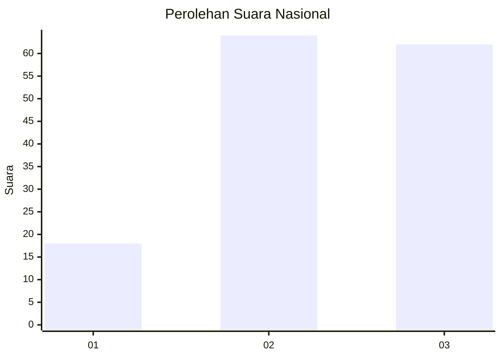
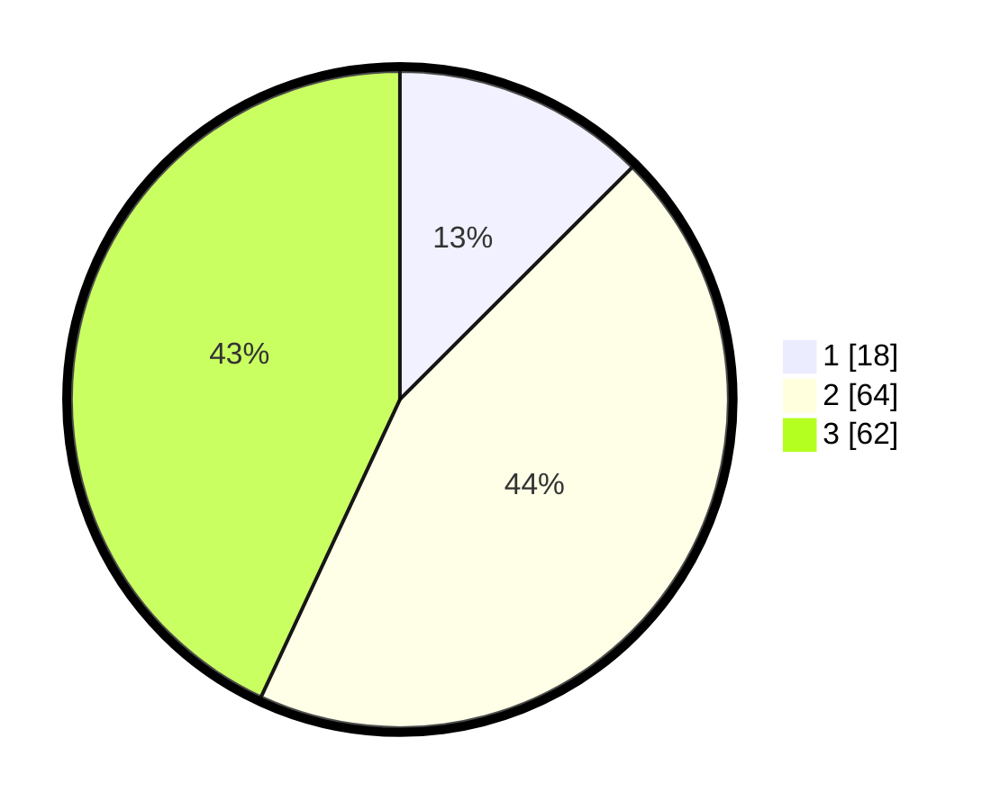

# Hasil

## Grafik

## Tabel

| No. | Nama Paslon    | Suara | Suara (raw) | Persentase |
|:--- |:-------------- | -----:| -----------:| ----------:|
| 1   | ANIES MUHAIMIN | 18    | [18][p-1]   | 12,50      |
| 2   | PRABOWO GIBRAN | 64    | [64][p-2]   | 44,44      |
| 3   | GANJAR MAHFUD  | 62    | [62][p-3]   | 43,06      |

[p-1]: https://github.com/gigit-pemilu/pemilu-2024/blob/main/pilpres/hitung-suara/sub/34-di-yogyakarta/sub/04-sleman/sub/17-cangkringan/sub/2002-wukirsari/sub/022-tps/sub/paslon-1.txt
[p-2]: https://github.com/gigit-pemilu/pemilu-2024/blob/main/pilpres/hitung-suara/sub/34-di-yogyakarta/sub/04-sleman/sub/17-cangkringan/sub/2002-wukirsari/sub/022-tps/sub/paslon-2.txt
[p-3]: https://github.com/gigit-pemilu/pemilu-2024/blob/main/pilpres/hitung-suara/sub/34-di-yogyakarta/sub/04-sleman/sub/17-cangkringan/sub/2002-wukirsari/sub/022-tps/sub/paslon-3.txt

## Foto C Plano

https://sirekap-obj-formc.kpu.go.id/de32/pemilu/ppwp/34/04/17/20/02/3404172002022-20240215-011718--9fb56646-a40c-499d-8152-47efd41129f3.jpg

https://sirekap-obj-formc.kpu.go.id/de32/pemilu/ppwp/34/04/17/20/02/3404172002022-20240215-011811--b5f69d58-b3a1-4e6e-ba00-160066759075.jpg

https://sirekap-obj-formc.kpu.go.id/de32/pemilu/ppwp/34/04/17/20/02/3404172002022-20240215-011908--a037bb5e-3869-4866-92c4-bde2247e044e.jpg

## Metadata

| Key        | Value               |
| ---------- | ------------------- |
| Time Stamp | 2024-02-15 12:00:28 |

