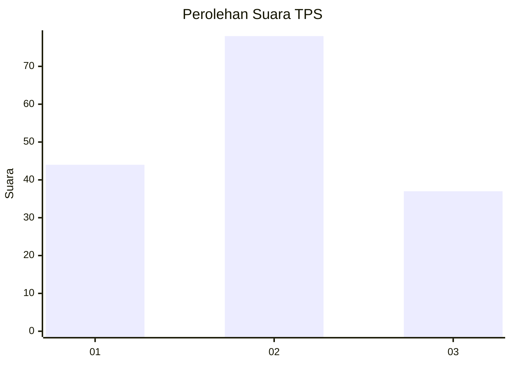
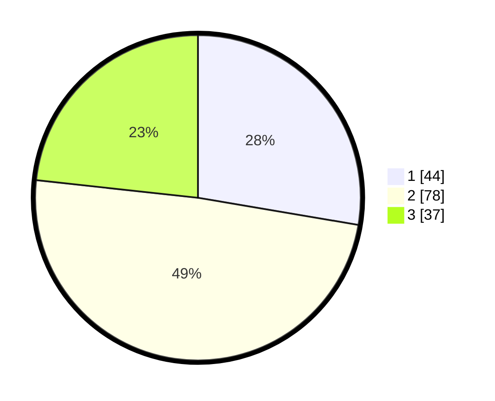

# Hasil

## Grafik

## Tabel

| No. | Nama Paslon    | Suara | Suara (raw) | Persentase |
|:--- |:-------------- | -----:| -----------:| ----------:|
| 1   | ANIES MUHAIMIN | 44    | [44][p-1]   | 27,67      |
| 2   | PRABOWO GIBRAN | 78    | [78][p-2]   | 49,06      |
| 3   | GANJAR MAHFUD  | 37    | [37][p-3]   | 23,27      |

[p-1]: https://github.com/gigit-pemilu/pemilu-2024-34-di-yogyakarta/blob/main/pilpres/hitung-suara/sub/34-di-yogyakarta/sub/04-sleman/sub/17-cangkringan/sub/2002-wukirsari/sub/024-tps/sub/paslon-1.txt
[p-2]: https://github.com/gigit-pemilu/pemilu-2024-34-di-yogyakarta/blob/main/pilpres/hitung-suara/sub/34-di-yogyakarta/sub/04-sleman/sub/17-cangkringan/sub/2002-wukirsari/sub/024-tps/sub/paslon-2.txt
[p-3]: https://github.com/gigit-pemilu/pemilu-2024-34-di-yogyakarta/blob/main/pilpres/hitung-suara/sub/34-di-yogyakarta/sub/04-sleman/sub/17-cangkringan/sub/2002-wukirsari/sub/024-tps/sub/paslon-3.txt

## Foto C Plano

https://sirekap-obj-formc.kpu.go.id/4aff/pemilu/ppwp/34/04/17/20/02/3404172002024-20240214-230122--701828bd-329d-4848-ad3a-46698e7ef928.jpg

https://sirekap-obj-formc.kpu.go.id/4aff/pemilu/ppwp/34/04/17/20/02/3404172002024-20240214-141154--a04aa012-9107-4cc5-b834-1aba19943928.jpg

https://sirekap-obj-formc.kpu.go.id/4aff/pemilu/ppwp/34/04/17/20/02/3404172002024-20240214-230129--a60554a3-bc7b-4a35-9bcc-07ce75bcaca3.jpg

## Metadata

| Key        | Value               |
| ---------- | ------------------- |
| Time Stamp | 2024-02-15 12:00:28 |

