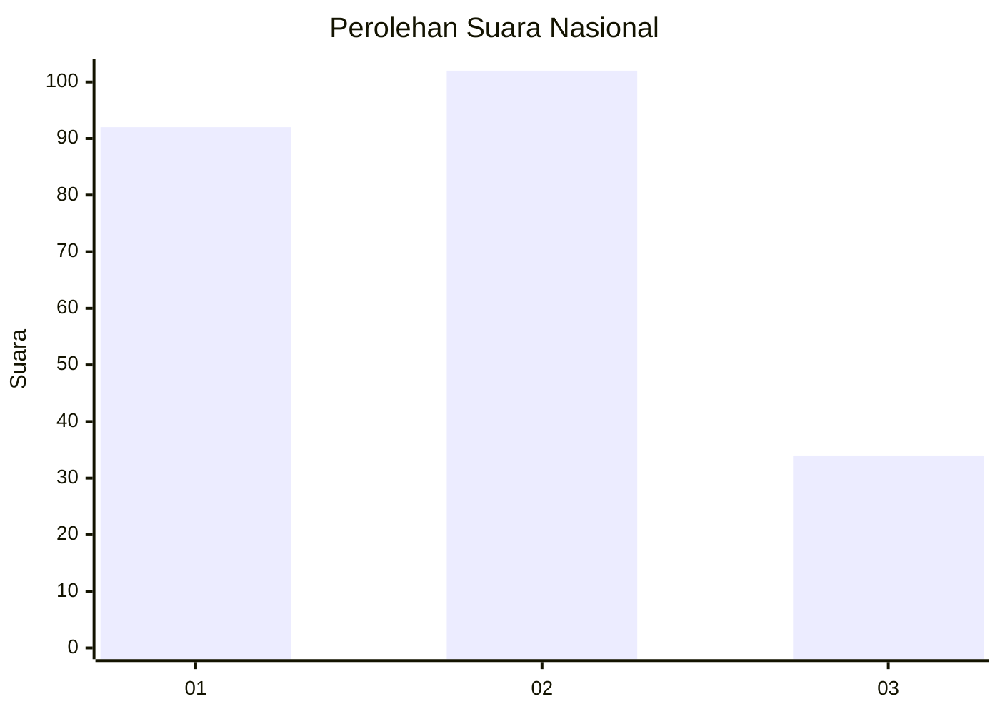
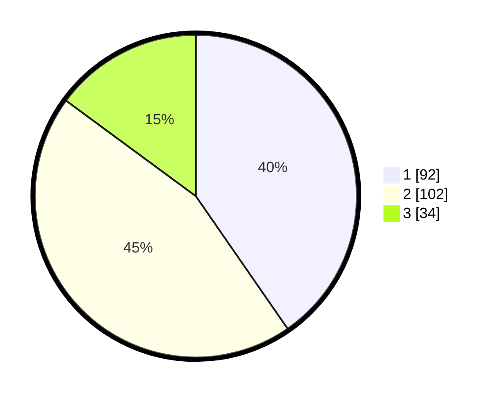

# Hasil

## Grafik

## Tabel

| No. | Nama Paslon    | Suara | Suara (raw) | Persentase |
|:--- |:-------------- | -----:| -----------:| ----------:|
| 1   | ANIES MUHAIMIN | 92    | [92][p-1]   | 40,35      |
| 2   | PRABOWO GIBRAN | 102   | [102][p-2]  | 44,74      |
| 3   | GANJAR MAHFUD  | 34    | [34][p-3]   | 14,91      |

[p-1]: https://github.com/gigit-pemilu/pemilu-2024/blob/main/pilpres/hitung-suara/sub/34-di-yogyakarta/sub/04-sleman/sub/17-cangkringan/sub/2002-wukirsari/sub/026-tps/sub/paslon-1.txt
[p-2]: https://github.com/gigit-pemilu/pemilu-2024/blob/main/pilpres/hitung-suara/sub/34-di-yogyakarta/sub/04-sleman/sub/17-cangkringan/sub/2002-wukirsari/sub/026-tps/sub/paslon-2.txt
[p-3]: https://github.com/gigit-pemilu/pemilu-2024/blob/main/pilpres/hitung-suara/sub/34-di-yogyakarta/sub/04-sleman/sub/17-cangkringan/sub/2002-wukirsari/sub/026-tps/sub/paslon-3.txt

## Foto C Plano

https://sirekap-obj-formc.kpu.go.id/3774/pemilu/ppwp/34/04/17/20/02/3404172002026-20240215-000256--f1072e6c-3c5c-42a9-8a08-afaba96e69b8.jpg

https://sirekap-obj-formc.kpu.go.id/3774/pemilu/ppwp/34/04/17/20/02/3404172002026-20240215-021822--624629e3-ae5d-4ae2-916d-3e2175a1844a.jpg

https://sirekap-obj-formc.kpu.go.id/3774/pemilu/ppwp/34/04/17/20/02/3404172002026-20240215-000626--be73a05f-0f0f-4c45-8e0b-1c9d2716126c.jpg

## Metadata

| Key        | Value               |
| ---------- | ------------------- |
| Time Stamp | 2024-02-15 12:00:28 |

