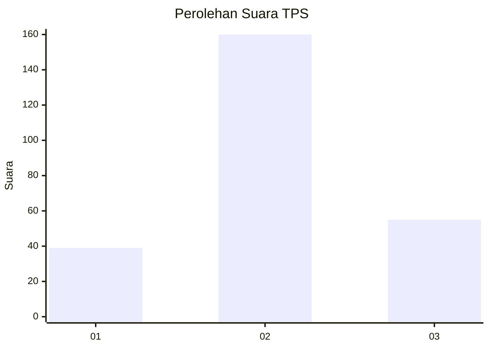
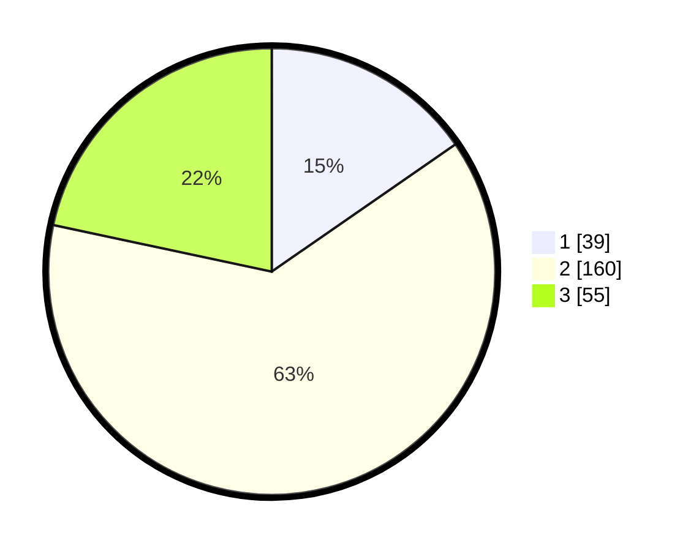

# Hasil

## Grafik

## Tabel

| No. | Nama Paslon    | Suara | Suara (raw) | Persentase |
|:--- |:-------------- | -----:| -----------:| ----------:|
| 1   | ANIES MUHAIMIN | 39    | [39][p-1]   | 15,35      |
| 2   | PRABOWO GIBRAN | 160   | [160][p-2]  | 62,99      |
| 3   | GANJAR MAHFUD  | 55    | [55][p-3]   | 21,65      |

[p-1]: https://github.com/gigit-pemilu/pemilu-2024-34-di-yogyakarta/blob/main/pilpres/hitung-suara/sub/34-di-yogyakarta/sub/04-sleman/sub/17-cangkringan/sub/2002-wukirsari/sub/028-tps/sub/paslon-1.txt
[p-2]: https://github.com/gigit-pemilu/pemilu-2024-34-di-yogyakarta/blob/main/pilpres/hitung-suara/sub/34-di-yogyakarta/sub/04-sleman/sub/17-cangkringan/sub/2002-wukirsari/sub/028-tps/sub/paslon-2.txt
[p-3]: https://github.com/gigit-pemilu/pemilu-2024-34-di-yogyakarta/blob/main/pilpres/hitung-suara/sub/34-di-yogyakarta/sub/04-sleman/sub/17-cangkringan/sub/2002-wukirsari/sub/028-tps/sub/paslon-3.txt

## Foto C Plano

https://sirekap-obj-formc.kpu.go.id/9a43/pemilu/ppwp/34/04/17/20/02/3404172002028-20240214-211819--3f1fa547-ccc1-4751-be60-4066c6b3df1d.jpg

https://sirekap-obj-formc.kpu.go.id/9a43/pemilu/ppwp/34/04/17/20/02/3404172002028-20240214-212434--f1a03732-dc6f-49d8-ad30-ee97add54f5b.jpg

https://sirekap-obj-formc.kpu.go.id/9a43/pemilu/ppwp/34/04/17/20/02/3404172002028-20240214-212928--510c6935-086c-48f2-bd66-22e3489f1739.jpg

## Metadata

| Key        | Value               |
| ---------- | ------------------- |
| Time Stamp | 2024-02-15 20:30:46 |

