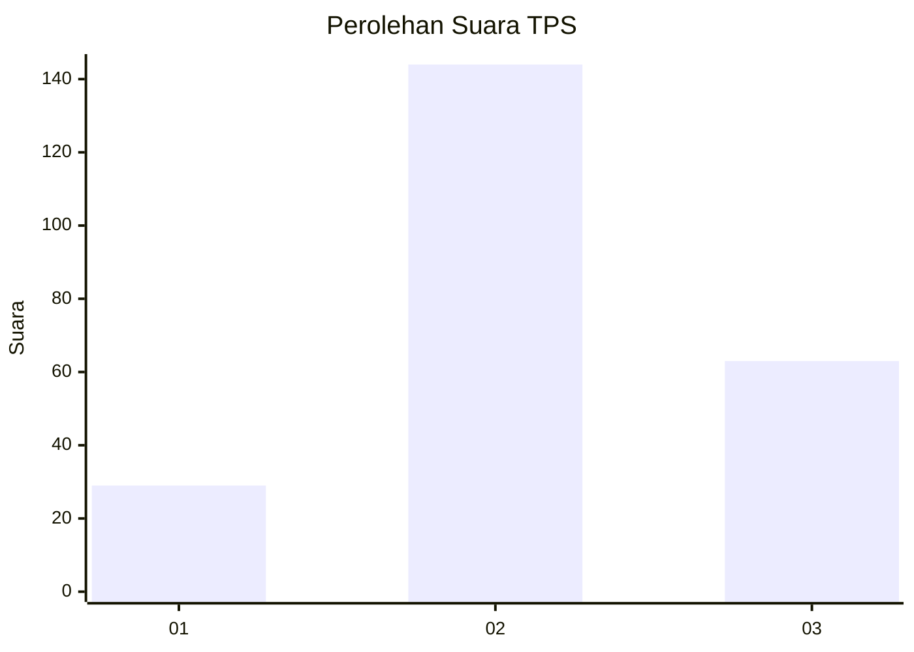
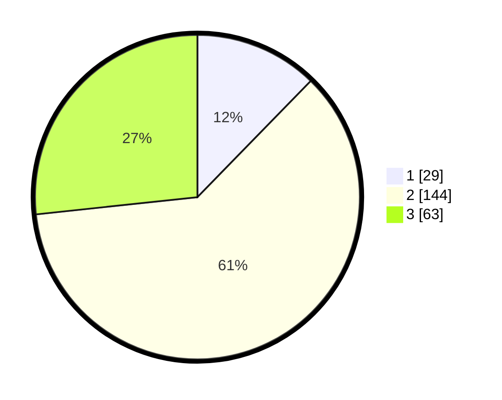

# Hasil

## Grafik

## Tabel

| No. | Nama Paslon    | Suara | Suara (raw) | Persentase |
|:--- |:-------------- | -----:| -----------:| ----------:|
| 1   | ANIES MUHAIMIN | 29    | [29][p-1]   | 12,29      |
| 2   | PRABOWO GIBRAN | 144   | [144][p-2]  | 61,02      |
| 3   | GANJAR MAHFUD  | 63    | [63][p-3]   | 26,69      |

[p-1]: https://github.com/gigit-pemilu/pemilu-2024-34-di-yogyakarta/blob/main/pilpres/hitung-suara/sub/34-di-yogyakarta/sub/04-sleman/sub/17-cangkringan/sub/2002-wukirsari/sub/031-tps/sub/paslon-1.txt
[p-2]: https://github.com/gigit-pemilu/pemilu-2024-34-di-yogyakarta/blob/main/pilpres/hitung-suara/sub/34-di-yogyakarta/sub/04-sleman/sub/17-cangkringan/sub/2002-wukirsari/sub/031-tps/sub/paslon-2.txt
[p-3]: https://github.com/gigit-pemilu/pemilu-2024-34-di-yogyakarta/blob/main/pilpres/hitung-suara/sub/34-di-yogyakarta/sub/04-sleman/sub/17-cangkringan/sub/2002-wukirsari/sub/031-tps/sub/paslon-3.txt

## Foto C Plano

https://sirekap-obj-formc.kpu.go.id/42a0/pemilu/ppwp/34/04/17/20/02/3404172002031-20240214-202815--93cf9ced-1b98-4257-92e3-2f6a487f1053.jpg

https://sirekap-obj-formc.kpu.go.id/42a0/pemilu/ppwp/34/04/17/20/02/3404172002031-20240214-203003--9f195c5c-de5b-4b1f-a23c-7b349106364e.jpg

https://sirekap-obj-formc.kpu.go.id/42a0/pemilu/ppwp/34/04/17/20/02/3404172002031-20240214-203126--684a9fe8-af5d-4aff-9cb6-868b1caa862d.jpg

## Metadata

| Key        | Value               |
| ---------- | ------------------- |
| Time Stamp | 2024-02-15 20:30:46 |

