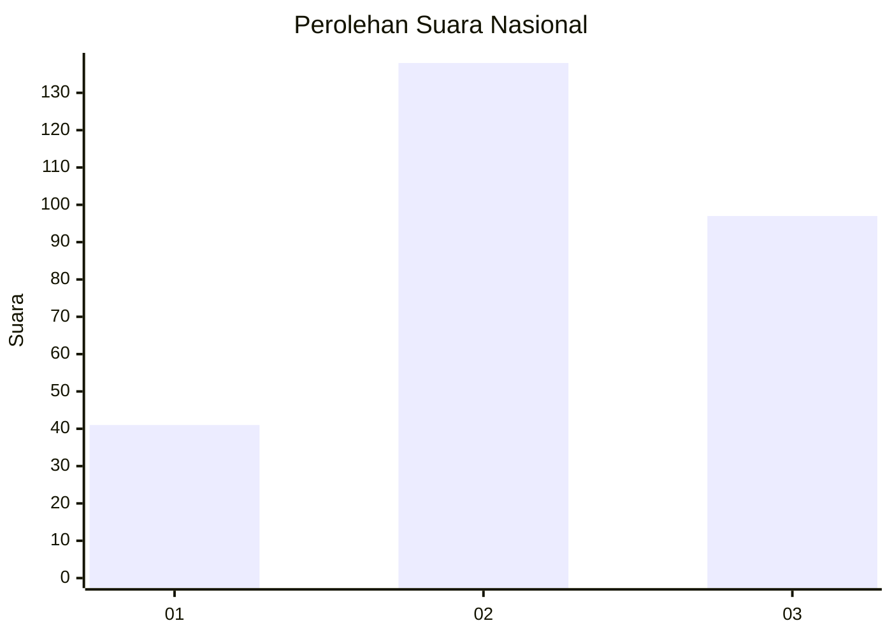
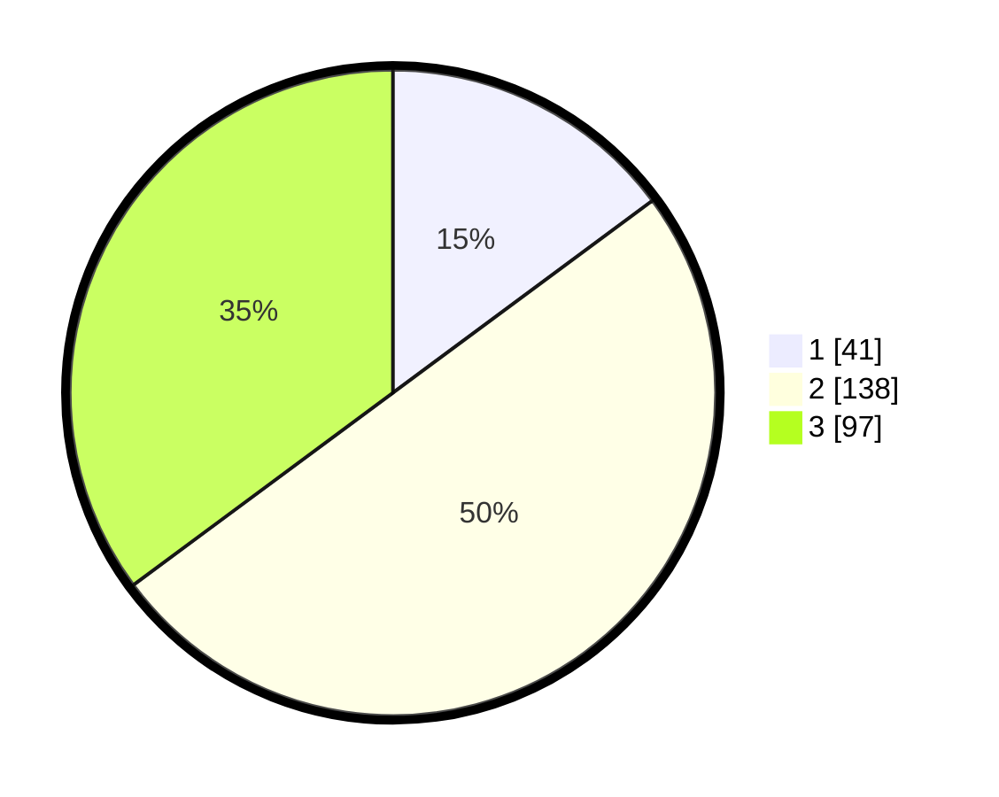

# Hasil

## Grafik

## Tabel

| No. | Nama Paslon    | Suara | Suara (raw) | Persentase |
|:--- |:-------------- | -----:| -----------:| ----------:|
| 1   | ANIES MUHAIMIN | 41    | [41][p-1]   | 14,86      |
| 2   | PRABOWO GIBRAN | 138   | [138][p-2]  | 50,00      |
| 3   | GANJAR MAHFUD  | 97    | [97][p-3]   | 35,14      |

[p-1]: https://github.com/gigit-pemilu/pemilu-2024/blob/main/pilpres/hitung-suara/sub/34-di-yogyakarta/sub/04-sleman/sub/17-cangkringan/sub/2004-kepuharjo/sub/004-tps/sub/paslon-1.txt
[p-2]: https://github.com/gigit-pemilu/pemilu-2024/blob/main/pilpres/hitung-suara/sub/34-di-yogyakarta/sub/04-sleman/sub/17-cangkringan/sub/2004-kepuharjo/sub/004-tps/sub/paslon-2.txt
[p-3]: https://github.com/gigit-pemilu/pemilu-2024/blob/main/pilpres/hitung-suara/sub/34-di-yogyakarta/sub/04-sleman/sub/17-cangkringan/sub/2004-kepuharjo/sub/004-tps/sub/paslon-3.txt

## Foto C Plano

https://sirekap-obj-formc.kpu.go.id/76a5/pemilu/ppwp/34/04/17/20/04/3404172004004-20240214-185717--636a91ad-7f0e-4245-9a6a-7282af62a003.jpg

https://sirekap-obj-formc.kpu.go.id/76a5/pemilu/ppwp/34/04/17/20/04/3404172004004-20240214-185820--c7d96943-7a4b-4022-a53d-9f4f2c35d5fc.jpg

https://sirekap-obj-formc.kpu.go.id/76a5/pemilu/ppwp/34/04/17/20/04/3404172004004-20240214-185959--6209d841-a5a0-4f4e-83f2-82094086829e.jpg

## Metadata

| Key        | Value               |
| ---------- | ------------------- |
| Time Stamp | 2024-02-16 12:51:22 |

