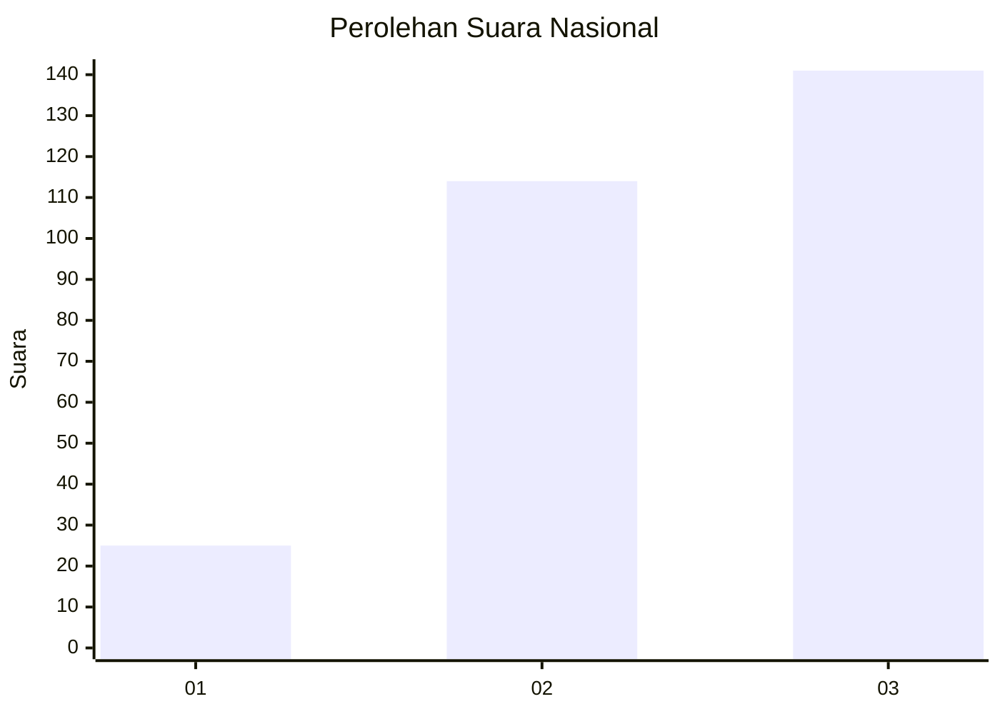
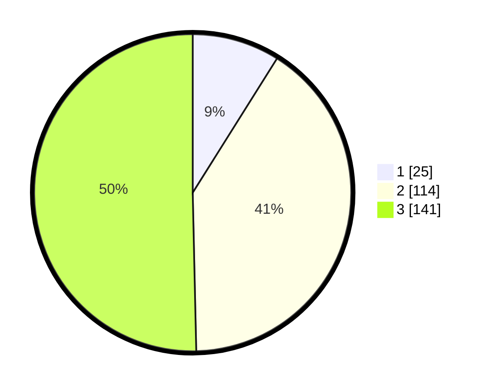

# Hasil

## Grafik

## Tabel

| No. | Nama Paslon    | Suara | Suara (raw) | Persentase |
|:--- |:-------------- | -----:| -----------:| ----------:|
| 1   | ANIES MUHAIMIN | 25    | [25][p-1]   | 8,93       |
| 2   | PRABOWO GIBRAN | 114   | [114][p-2]  | 40,71      |
| 3   | GANJAR MAHFUD  | 141   | [141][p-3]  | 50,36      |

[p-1]: https://github.com/gigit-pemilu/pemilu-2024/blob/main/pilpres/hitung-suara/sub/34-di-yogyakarta/sub/04-sleman/sub/17-cangkringan/sub/2004-kepuharjo/sub/005-tps/sub/paslon-1.txt
[p-2]: https://github.com/gigit-pemilu/pemilu-2024/blob/main/pilpres/hitung-suara/sub/34-di-yogyakarta/sub/04-sleman/sub/17-cangkringan/sub/2004-kepuharjo/sub/005-tps/sub/paslon-2.txt
[p-3]: https://github.com/gigit-pemilu/pemilu-2024/blob/main/pilpres/hitung-suara/sub/34-di-yogyakarta/sub/04-sleman/sub/17-cangkringan/sub/2004-kepuharjo/sub/005-tps/sub/paslon-3.txt

## Foto C Plano

https://sirekap-obj-formc.kpu.go.id/f425/pemilu/ppwp/34/04/17/20/04/3404172004005-20240214-202801--d67eab71-9c91-4d5c-835c-2cf2b7ef3c39.jpg

https://sirekap-obj-formc.kpu.go.id/f425/pemilu/ppwp/34/04/17/20/04/3404172004005-20240214-202821--48c90ee0-4268-47e0-877c-48a2ad7af05b.jpg

https://sirekap-obj-formc.kpu.go.id/f425/pemilu/ppwp/34/04/17/20/04/3404172004005-20240214-203126--edaa3803-4cca-4869-a9b1-4a6dc8211536.jpg

## Metadata

| Key        | Value               |
| ---------- | ------------------- |
| Time Stamp | 2024-02-16 21:01:00 |

