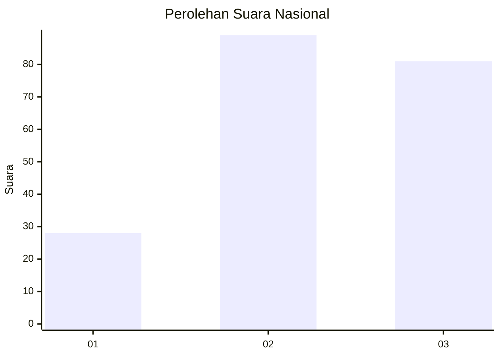
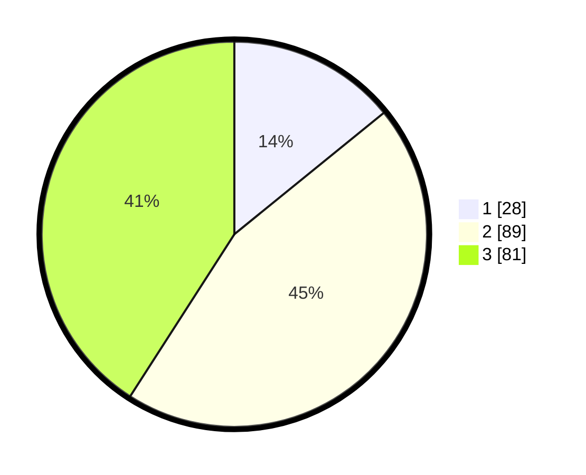

# Hasil

## Grafik

## Tabel

| No. | Nama Paslon    | Suara | Suara (raw) | Persentase |
|:--- |:-------------- | -----:| -----------:| ----------:|
| 1   | ANIES MUHAIMIN | 28    | [28][p-1]   | 14,14      |
| 2   | PRABOWO GIBRAN | 89    | [89][p-2]   | 44,95      |
| 3   | GANJAR MAHFUD  | 81    | [81][p-3]   | 40,91      |

[p-1]: https://github.com/gigit-pemilu/pemilu-2024/blob/main/pilpres/hitung-suara/sub/34-di-yogyakarta/sub/04-sleman/sub/17-cangkringan/sub/2004-kepuharjo/sub/007-tps/sub/paslon-1.txt
[p-2]: https://github.com/gigit-pemilu/pemilu-2024/blob/main/pilpres/hitung-suara/sub/34-di-yogyakarta/sub/04-sleman/sub/17-cangkringan/sub/2004-kepuharjo/sub/007-tps/sub/paslon-2.txt
[p-3]: https://github.com/gigit-pemilu/pemilu-2024/blob/main/pilpres/hitung-suara/sub/34-di-yogyakarta/sub/04-sleman/sub/17-cangkringan/sub/2004-kepuharjo/sub/007-tps/sub/paslon-3.txt

## Foto C Plano

https://sirekap-obj-formc.kpu.go.id/a6ab/pemilu/ppwp/34/04/17/20/04/3404172004007-20240214-235354--b7440782-13c4-4870-89c2-a1e7760ab287.jpg

https://sirekap-obj-formc.kpu.go.id/a6ab/pemilu/ppwp/34/04/17/20/04/3404172004007-20240214-235641--36669cb2-3043-4f54-bfed-a3730dad49cc.jpg

https://sirekap-obj-formc.kpu.go.id/a6ab/pemilu/ppwp/34/04/17/20/04/3404172004007-20240214-235739--479f8c90-e854-4a4a-99c7-f7da6fbcab3c.jpg

## Metadata

| Key        | Value               |
| ---------- | ------------------- |
| Time Stamp | 2024-02-15 20:30:46 |

