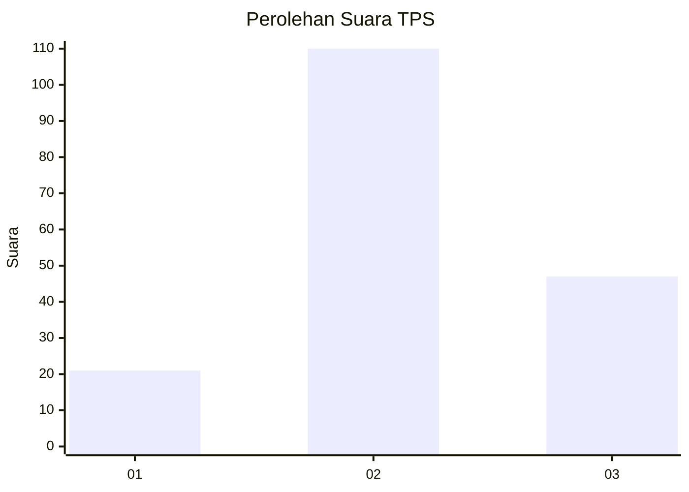
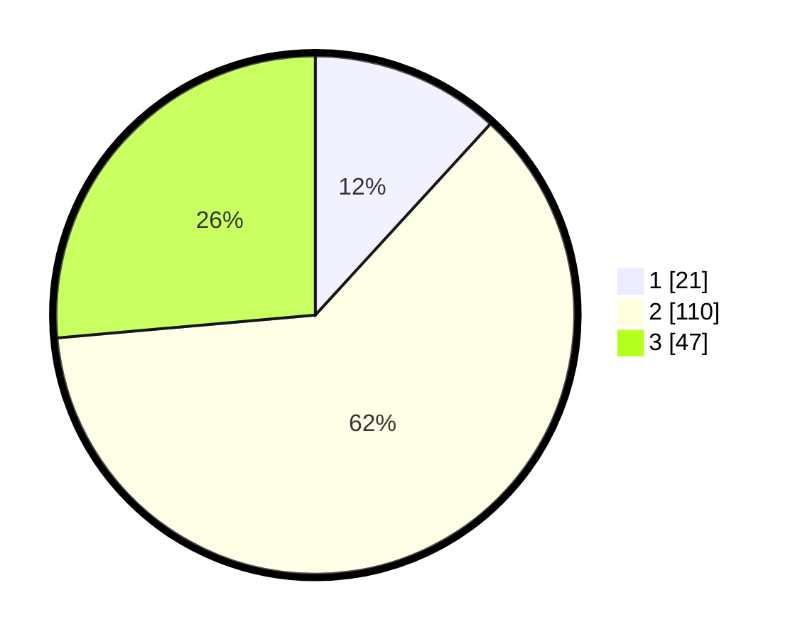

# Hasil

## Grafik

## Tabel

| No. | Nama Paslon    | Suara | Suara (raw) | Persentase |
|:--- |:-------------- | -----:| -----------:| ----------:|
| 1   | ANIES MUHAIMIN | 21    | [21][p-1]   | 11,80      |
| 2   | PRABOWO GIBRAN | 110   | [110][p-2]  | 61,80      |
| 3   | GANJAR MAHFUD  | 47    | [47][p-3]   | 26,40      |

[p-1]: https://github.com/gigit-pemilu/pemilu-2024-34-di-yogyakarta/blob/main/pilpres/hitung-suara/sub/34-di-yogyakarta/sub/04-sleman/sub/17-cangkringan/sub/2005-umbulharjo/sub/001-tps/sub/paslon-1.txt
[p-2]: https://github.com/gigit-pemilu/pemilu-2024-34-di-yogyakarta/blob/main/pilpres/hitung-suara/sub/34-di-yogyakarta/sub/04-sleman/sub/17-cangkringan/sub/2005-umbulharjo/sub/001-tps/sub/paslon-2.txt
[p-3]: https://github.com/gigit-pemilu/pemilu-2024-34-di-yogyakarta/blob/main/pilpres/hitung-suara/sub/34-di-yogyakarta/sub/04-sleman/sub/17-cangkringan/sub/2005-umbulharjo/sub/001-tps/sub/paslon-3.txt

## Foto C Plano

https://sirekap-obj-formc.kpu.go.id/b67f/pemilu/ppwp/34/04/17/20/05/3404172005001-20240214-204639--ab9be760-485e-4cb4-a401-6e0fb5b6b385.jpg

https://sirekap-obj-formc.kpu.go.id/b67f/pemilu/ppwp/34/04/17/20/05/3404172005001-20240214-204649--f660bc29-8a56-4440-8316-2fe2bf683b2d.jpg

https://sirekap-obj-formc.kpu.go.id/b67f/pemilu/ppwp/34/04/17/20/05/3404172005001-20240214-204659--5c43c6e7-f2a7-430a-9c9e-cb57a24e27fb.jpg

## Metadata

| Key        | Value               |
| ---------- | ------------------- |
| Time Stamp | 2024-02-15 02:10:27 |

