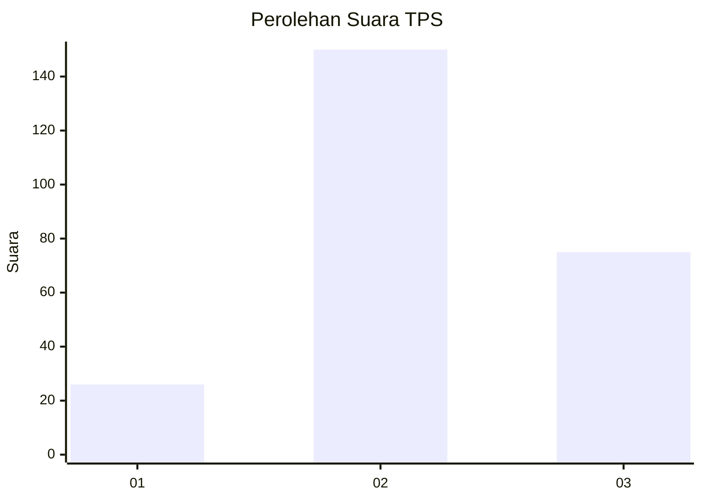
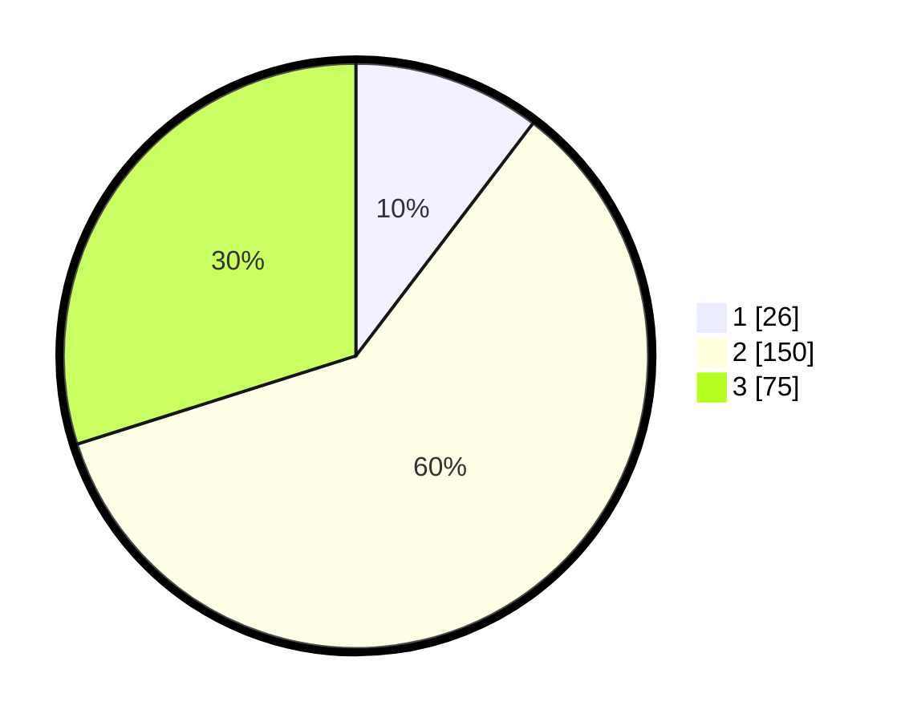

# Hasil

## Grafik

## Tabel

| No. | Nama Paslon    | Suara | Suara (raw) | Persentase |
|:--- |:-------------- | -----:| -----------:| ----------:|
| 1   | ANIES MUHAIMIN | 26    | [26][p-1]   | 10,36      |
| 2   | PRABOWO GIBRAN | 150   | [150][p-2]  | 59,76      |
| 3   | GANJAR MAHFUD  | 75    | [75][p-3]   | 29,88      |

[p-1]: https://github.com/gigit-pemilu/pemilu-2024-34-di-yogyakarta/blob/main/pilpres/hitung-suara/sub/34-di-yogyakarta/sub/04-sleman/sub/17-cangkringan/sub/2005-umbulharjo/sub/002-tps/sub/paslon-1.txt
[p-2]: https://github.com/gigit-pemilu/pemilu-2024-34-di-yogyakarta/blob/main/pilpres/hitung-suara/sub/34-di-yogyakarta/sub/04-sleman/sub/17-cangkringan/sub/2005-umbulharjo/sub/002-tps/sub/paslon-2.txt
[p-3]: https://github.com/gigit-pemilu/pemilu-2024-34-di-yogyakarta/blob/main/pilpres/hitung-suara/sub/34-di-yogyakarta/sub/04-sleman/sub/17-cangkringan/sub/2005-umbulharjo/sub/002-tps/sub/paslon-3.txt

## Foto C Plano

https://sirekap-obj-formc.kpu.go.id/b83f/pemilu/ppwp/34/04/17/20/05/3404172005002-20240214-203249--8f9de329-eb31-4e1c-9052-676bc3dbea94.jpg

https://sirekap-obj-formc.kpu.go.id/b83f/pemilu/ppwp/34/04/17/20/05/3404172005002-20240214-203708--ec623049-0daa-4ca8-a88c-204e5b486102.jpg

https://sirekap-obj-formc.kpu.go.id/b83f/pemilu/ppwp/34/04/17/20/05/3404172005002-20240214-203716--2a1de528-c4f8-4fb7-99ac-14e0df4fd461.jpg

## Metadata

| Key        | Value               |
| ---------- | ------------------- |
| Time Stamp | 2024-02-15 01:47:43 |

