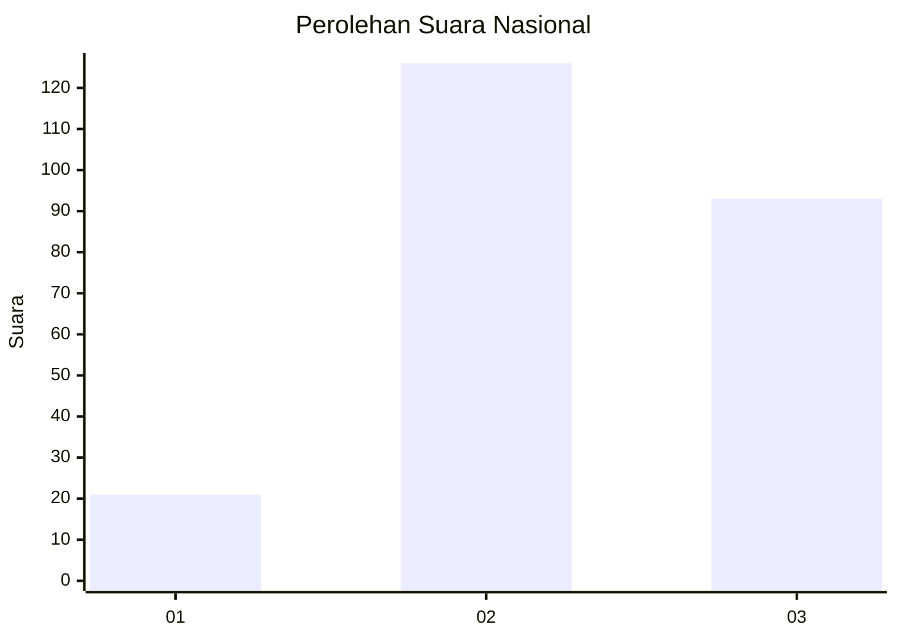
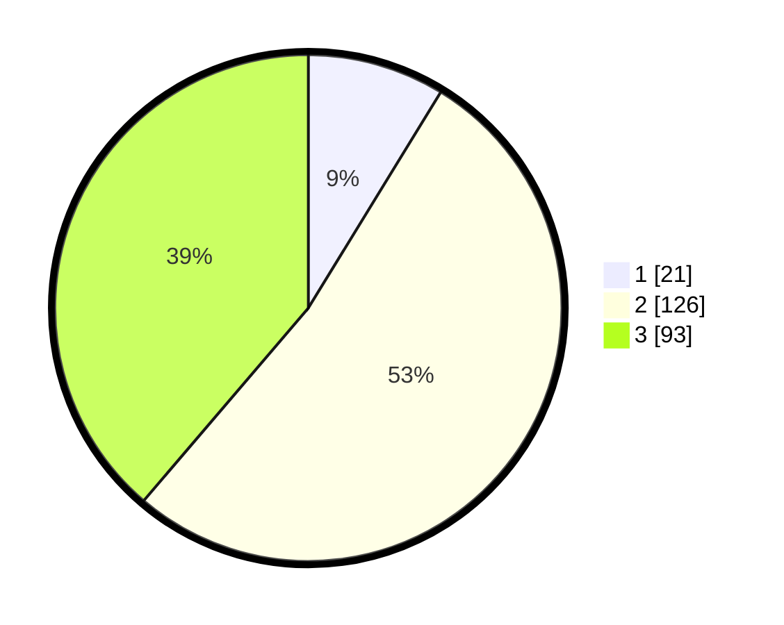

# Hasil

## Grafik

## Tabel

| No. | Nama Paslon    | Suara | Suara (raw) | Persentase |
|:--- |:-------------- | -----:| -----------:| ----------:|
| 1   | ANIES MUHAIMIN | 21    | [21][p-1]   | 8,75       |
| 2   | PRABOWO GIBRAN | 126   | [126][p-2]  | 52,50      |
| 3   | GANJAR MAHFUD  | 93    | [93][p-3]   | 38,75      |

[p-1]: https://github.com/gigit-pemilu/pemilu-2024/blob/main/pilpres/hitung-suara/sub/34-di-yogyakarta/sub/04-sleman/sub/17-cangkringan/sub/2005-umbulharjo/sub/005-tps/sub/paslon-1.txt
[p-2]: https://github.com/gigit-pemilu/pemilu-2024/blob/main/pilpres/hitung-suara/sub/34-di-yogyakarta/sub/04-sleman/sub/17-cangkringan/sub/2005-umbulharjo/sub/005-tps/sub/paslon-2.txt
[p-3]: https://github.com/gigit-pemilu/pemilu-2024/blob/main/pilpres/hitung-suara/sub/34-di-yogyakarta/sub/04-sleman/sub/17-cangkringan/sub/2005-umbulharjo/sub/005-tps/sub/paslon-3.txt

## Foto C Plano

https://sirekap-obj-formc.kpu.go.id/3bff/pemilu/ppwp/34/04/17/20/05/3404172005005-20240214-211353--3c99d5c9-b2a5-4c6e-8a54-336474259689.jpg

https://sirekap-obj-formc.kpu.go.id/3bff/pemilu/ppwp/34/04/17/20/05/3404172005005-20240214-211616--6d62c3bd-925e-4786-ad5e-d3ba8b9c8913.jpg

## Metadata

| Key        | Value               |
| ---------- | ------------------- |
| Time Stamp | 2024-02-24 22:31:28 |

