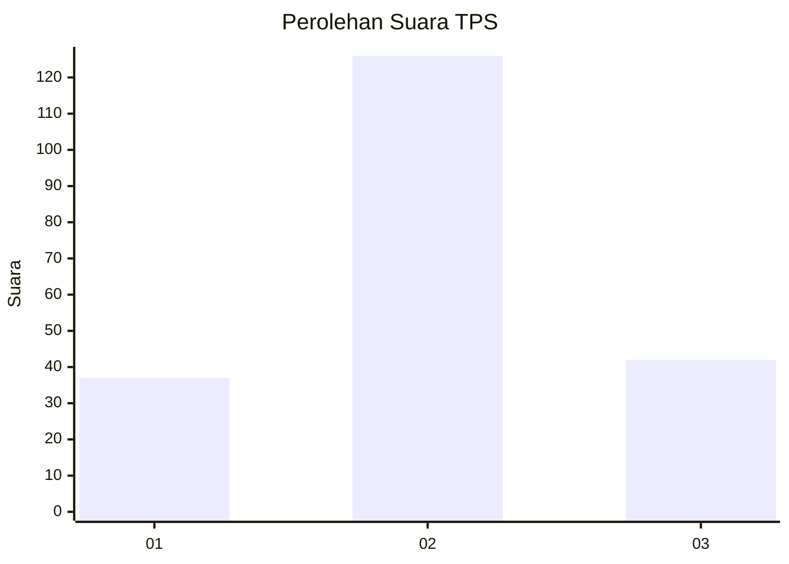
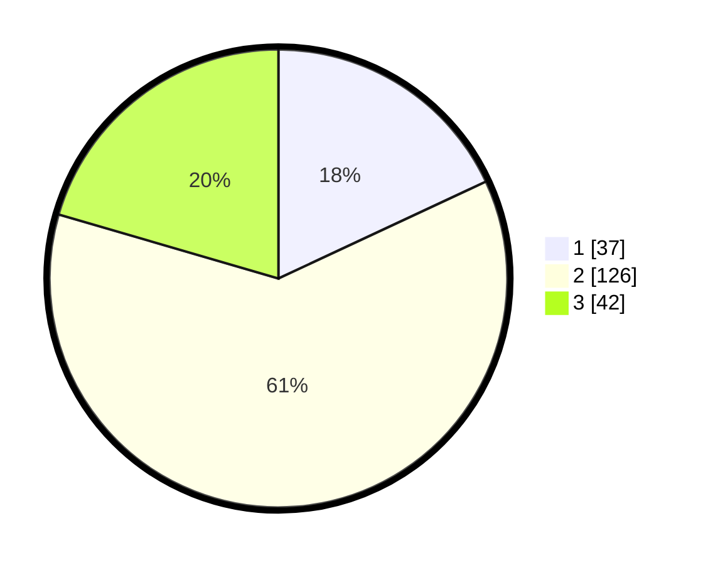

# Hasil

## Grafik

## Tabel

| No. | Nama Paslon    | Suara | Suara (raw) | Persentase |
|:--- |:-------------- | -----:| -----------:| ----------:|
| 1   | ANIES MUHAIMIN | 37    | [37][p-1]   | 18,05      |
| 2   | PRABOWO GIBRAN | 126   | [126][p-2]  | 61,46      |
| 3   | GANJAR MAHFUD  | 42    | [42][p-3]   | 20,49      |

[p-1]: https://github.com/gigit-pemilu/pemilu-2024-34-di-yogyakarta/blob/main/pilpres/hitung-suara/sub/34-di-yogyakarta/sub/04-sleman/sub/17-cangkringan/sub/2005-umbulharjo/sub/010-tps/sub/paslon-1.txt
[p-2]: https://github.com/gigit-pemilu/pemilu-2024-34-di-yogyakarta/blob/main/pilpres/hitung-suara/sub/34-di-yogyakarta/sub/04-sleman/sub/17-cangkringan/sub/2005-umbulharjo/sub/010-tps/sub/paslon-2.txt
[p-3]: https://github.com/gigit-pemilu/pemilu-2024-34-di-yogyakarta/blob/main/pilpres/hitung-suara/sub/34-di-yogyakarta/sub/04-sleman/sub/17-cangkringan/sub/2005-umbulharjo/sub/010-tps/sub/paslon-3.txt

## Foto C Plano

https://sirekap-obj-formc.kpu.go.id/7e29/pemilu/ppwp/34/04/17/20/05/3404172005010-20240214-223319--5cc28ee7-ca00-4966-9dad-9b0891503d31.jpg

https://sirekap-obj-formc.kpu.go.id/7e29/pemilu/ppwp/34/04/17/20/05/3404172005010-20240214-223325--b7614ebb-4411-41a8-968d-d92115bcedeb.jpg

https://sirekap-obj-formc.kpu.go.id/7e29/pemilu/ppwp/34/04/17/20/05/3404172005010-20240214-223331--ddf6684b-469d-4ce9-8a5e-afefaa66b7c9.jpg

## Metadata

| Key        | Value               |
| ---------- | ------------------- |
| Time Stamp | 2024-02-15 12:00:28 |

