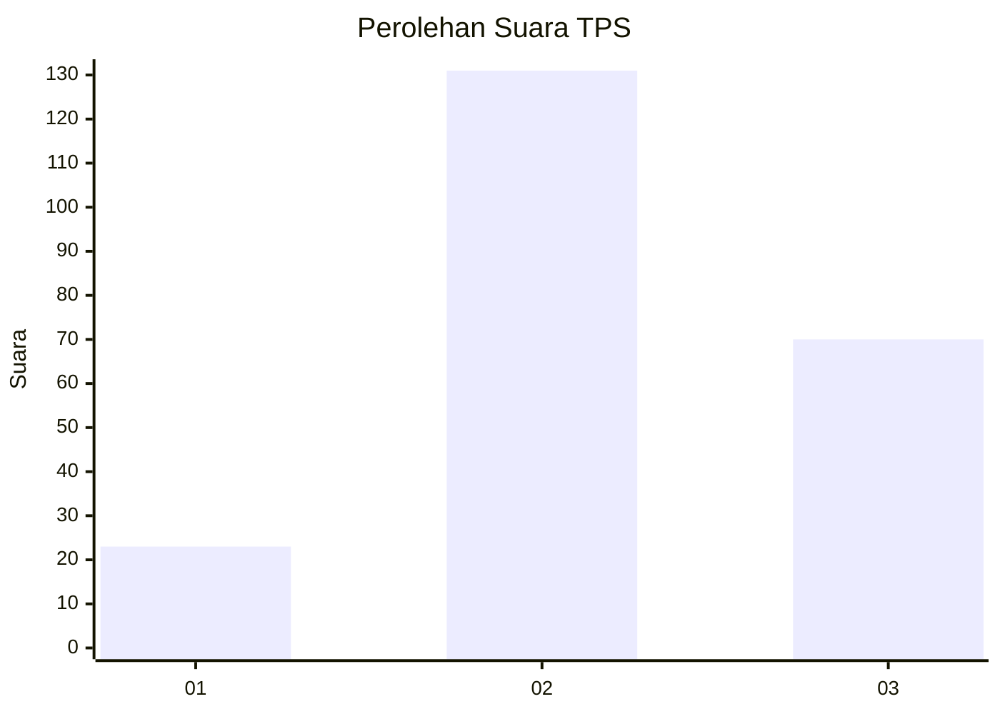
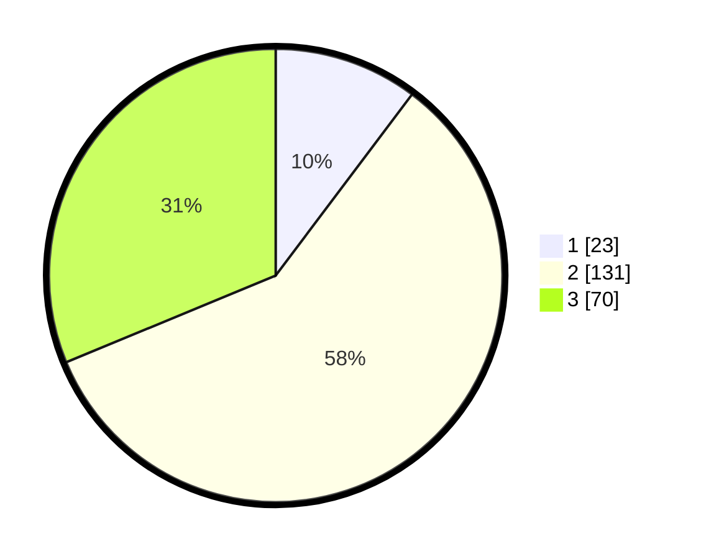

# Hasil

## Grafik

## Tabel

| No. | Nama Paslon    | Suara | Suara (raw) | Persentase |
|:--- |:-------------- | -----:| -----------:| ----------:|
| 1   | ANIES MUHAIMIN | 23    | [23][p-1]   | 10,27      |
| 2   | PRABOWO GIBRAN | 131   | [131][p-2]  | 58,48      |
| 3   | GANJAR MAHFUD  | 70    | [70][p-3]   | 31,25      |

[p-1]: https://github.com/gigit-pemilu/pemilu-2024-34-di-yogyakarta/blob/main/pilpres/hitung-suara/sub/34-di-yogyakarta/sub/04-sleman/sub/17-cangkringan/sub/2005-umbulharjo/sub/012-tps/sub/paslon-1.txt
[p-2]: https://github.com/gigit-pemilu/pemilu-2024-34-di-yogyakarta/blob/main/pilpres/hitung-suara/sub/34-di-yogyakarta/sub/04-sleman/sub/17-cangkringan/sub/2005-umbulharjo/sub/012-tps/sub/paslon-2.txt
[p-3]: https://github.com/gigit-pemilu/pemilu-2024-34-di-yogyakarta/blob/main/pilpres/hitung-suara/sub/34-di-yogyakarta/sub/04-sleman/sub/17-cangkringan/sub/2005-umbulharjo/sub/012-tps/sub/paslon-3.txt

## Foto C Plano

https://sirekap-obj-formc.kpu.go.id/4f99/pemilu/ppwp/34/04/17/20/05/3404172005012-20240214-190104--217e019f-b2a2-4c9e-b685-f18ec5b9cce2.jpg

https://sirekap-obj-formc.kpu.go.id/4f99/pemilu/ppwp/34/04/17/20/05/3404172005012-20240214-185931--9c88592f-fd2e-4147-8ede-50d05b53a266.jpg

https://sirekap-obj-formc.kpu.go.id/4f99/pemilu/ppwp/34/04/17/20/05/3404172005012-20240214-190014--fde90097-cf93-4dd1-b331-f7dd68c9bcdc.jpg

## Metadata

| Key        | Value               |
| ---------- | ------------------- |
| Time Stamp | 2024-02-15 00:41:44 |

