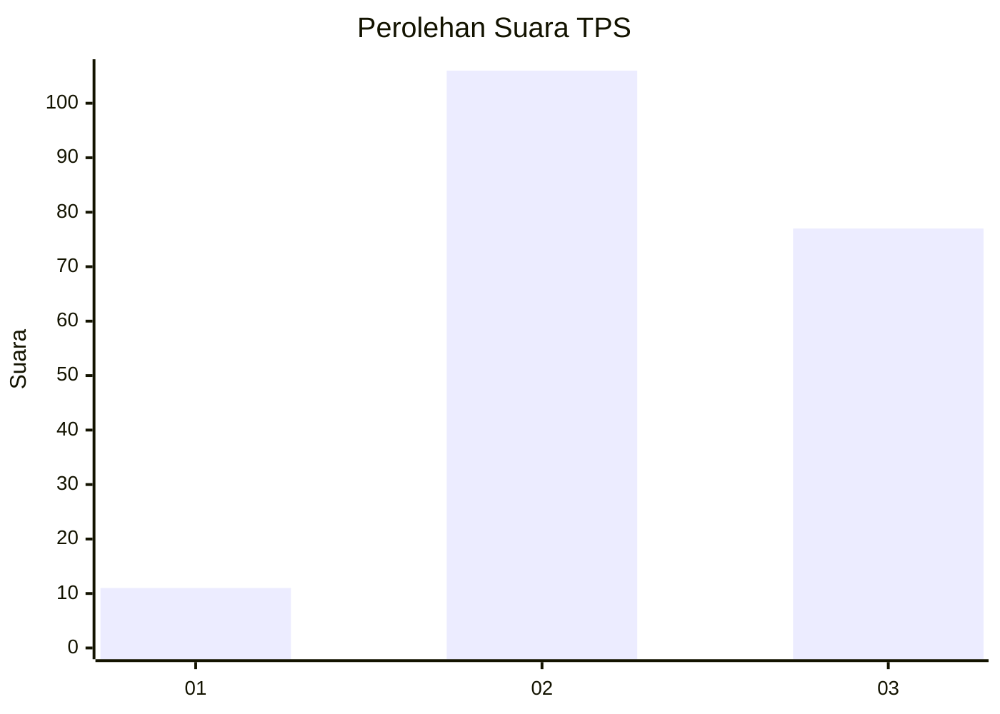
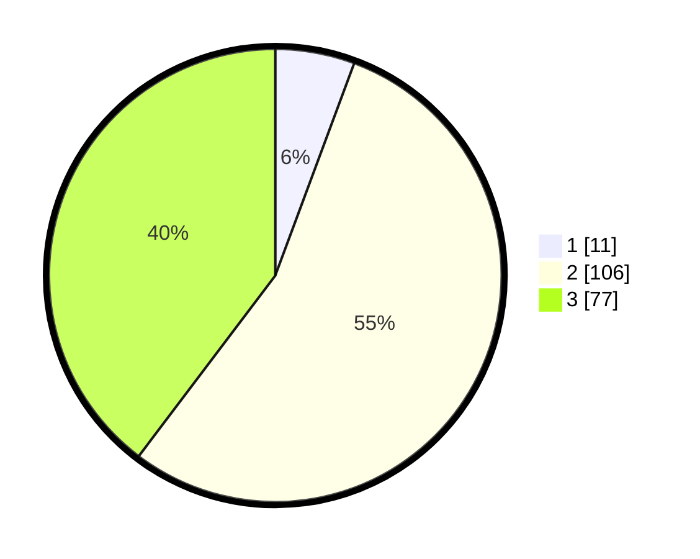

# Hasil

## Grafik

## Tabel

| No. | Nama Paslon    | Suara | Suara (raw) | Persentase |
|:--- |:-------------- | -----:| -----------:| ----------:|
| 1   | ANIES MUHAIMIN | 11    | [11][p-1]   | 5,67       |
| 2   | PRABOWO GIBRAN | 106   | [106][p-2]  | 54,64      |
| 3   | GANJAR MAHFUD  | 77    | [77][p-3]   | 39,69      |

[p-1]: https://github.com/gigit-pemilu/pemilu-2024-34-di-yogyakarta/blob/main/pilpres/hitung-suara/sub/34-di-yogyakarta/sub/04-sleman/sub/17-cangkringan/sub/2005-umbulharjo/sub/013-tps/sub/paslon-1.txt
[p-2]: https://github.com/gigit-pemilu/pemilu-2024-34-di-yogyakarta/blob/main/pilpres/hitung-suara/sub/34-di-yogyakarta/sub/04-sleman/sub/17-cangkringan/sub/2005-umbulharjo/sub/013-tps/sub/paslon-2.txt
[p-3]: https://github.com/gigit-pemilu/pemilu-2024-34-di-yogyakarta/blob/main/pilpres/hitung-suara/sub/34-di-yogyakarta/sub/04-sleman/sub/17-cangkringan/sub/2005-umbulharjo/sub/013-tps/sub/paslon-3.txt

## Foto C Plano

https://sirekap-obj-formc.kpu.go.id/1890/pemilu/ppwp/34/04/17/20/05/3404172005013-20240214-220130--0a7d0f29-f03e-432c-82ad-86e7e8cf54b5.jpg

https://sirekap-obj-formc.kpu.go.id/1890/pemilu/ppwp/34/04/17/20/05/3404172005013-20240214-220300--60205cd7-aa28-466c-abc6-6be6321fc238.jpg

https://sirekap-obj-formc.kpu.go.id/1890/pemilu/ppwp/34/04/17/20/05/3404172005013-20240214-220737--eafd3abe-99ce-41c7-88bb-f5f514ff7918.jpg

## Metadata

| Key        | Value               |
| ---------- | ------------------- |
| Time Stamp | 2024-02-15 12:00:28 |

