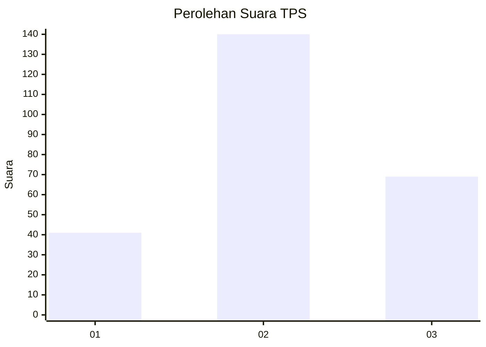
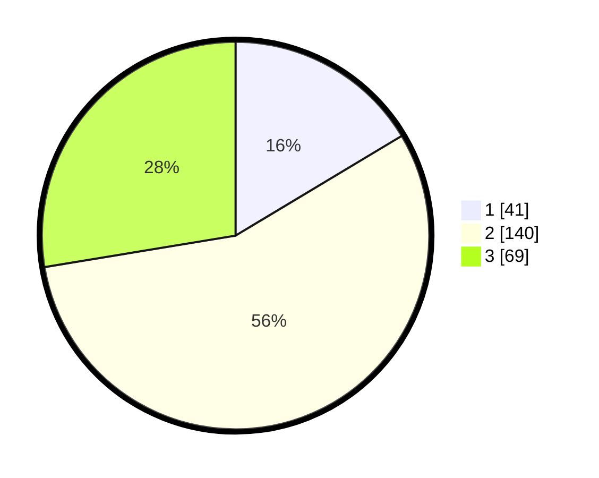

# Hasil

## Grafik

## Tabel

| No. | Nama Paslon    | Suara | Suara (raw) | Persentase |
|:--- |:-------------- | -----:| -----------:| ----------:|
| 1   | ANIES MUHAIMIN | 41    | [41][p-1]   | 16,40      |
| 2   | PRABOWO GIBRAN | 140   | [140][p-2]  | 56,00      |
| 3   | GANJAR MAHFUD  | 69    | [69][p-3]   | 27,60      |

[p-1]: https://github.com/gigit-pemilu/pemilu-2024-34-di-yogyakarta/blob/main/pilpres/hitung-suara/sub/34-di-yogyakarta/sub/04-sleman/sub/17-cangkringan/sub/2005-umbulharjo/sub/014-tps/sub/paslon-1.txt
[p-2]: https://github.com/gigit-pemilu/pemilu-2024-34-di-yogyakarta/blob/main/pilpres/hitung-suara/sub/34-di-yogyakarta/sub/04-sleman/sub/17-cangkringan/sub/2005-umbulharjo/sub/014-tps/sub/paslon-2.txt
[p-3]: https://github.com/gigit-pemilu/pemilu-2024-34-di-yogyakarta/blob/main/pilpres/hitung-suara/sub/34-di-yogyakarta/sub/04-sleman/sub/17-cangkringan/sub/2005-umbulharjo/sub/014-tps/sub/paslon-3.txt

## Foto C Plano

https://sirekap-obj-formc.kpu.go.id/ce41/pemilu/ppwp/34/04/17/20/05/3404172005014-20240215-013054--323bcc4b-8636-44cc-994c-f5cf84fd5fdd.jpg

https://sirekap-obj-formc.kpu.go.id/ce41/pemilu/ppwp/34/04/17/20/05/3404172005014-20240215-014023--8bbec6ee-3f73-49de-93b1-4f0857d45082.jpg

https://sirekap-obj-formc.kpu.go.id/ce41/pemilu/ppwp/34/04/17/20/05/3404172005014-20240215-014058--bcb4ea69-9399-45e8-8203-f8745e55ee57.jpg

## Metadata

| Key        | Value               |
| ---------- | ------------------- |
| Time Stamp | 2024-02-21 13:00:00 |

