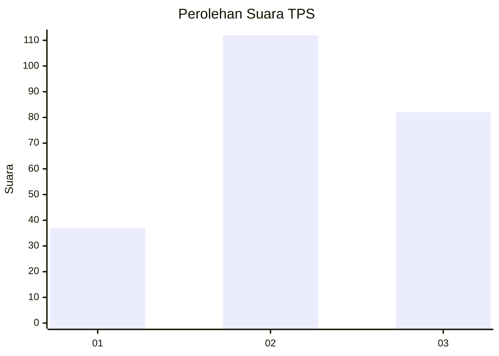
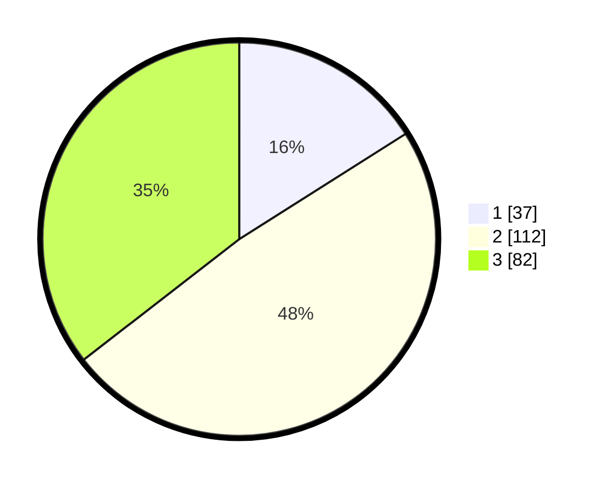

# Hasil

## Grafik

## Tabel

| No. | Nama Paslon    | Suara | Suara (raw) | Persentase |
|:--- |:-------------- | -----:| -----------:| ----------:|
| 1   | ANIES MUHAIMIN | 37    | [37][p-1]   | 16,02      |
| 2   | PRABOWO GIBRAN | 112   | [112][p-2]  | 48,48      |
| 3   | GANJAR MAHFUD  | 82    | [82][p-3]   | 35,50      |

[p-1]: https://github.com/gigit-pemilu/pemilu-2024-34-di-yogyakarta/blob/main/pilpres/hitung-suara/sub/34-di-yogyakarta/sub/71-kota-yogyakarta/sub/01-tegalrejo/sub/1001-kricak/sub/001-tps/sub/paslon-1.txt
[p-2]: https://github.com/gigit-pemilu/pemilu-2024-34-di-yogyakarta/blob/main/pilpres/hitung-suara/sub/34-di-yogyakarta/sub/71-kota-yogyakarta/sub/01-tegalrejo/sub/1001-kricak/sub/001-tps/sub/paslon-2.txt
[p-3]: https://github.com/gigit-pemilu/pemilu-2024-34-di-yogyakarta/blob/main/pilpres/hitung-suara/sub/34-di-yogyakarta/sub/71-kota-yogyakarta/sub/01-tegalrejo/sub/1001-kricak/sub/001-tps/sub/paslon-3.txt

## Foto C Plano

https://sirekap-obj-formc.kpu.go.id/99c1/pemilu/ppwp/34/71/01/10/01/3471011001001-20240216-153804--352bf6da-e443-4549-92ea-07c496106302.jpg

https://sirekap-obj-formc.kpu.go.id/99c1/pemilu/ppwp/34/71/01/10/01/3471011001001-20240216-153806--5b65e304-d886-4669-86d2-52e9fe0628e2.jpg

https://sirekap-obj-formc.kpu.go.id/99c1/pemilu/ppwp/34/71/01/10/01/3471011001001-20240216-153805--a953e7fe-4b65-4058-96e2-edf6367847b7.jpg

## Metadata

| Key        | Value               |
| ---------- | ------------------- |
| Time Stamp | 2024-02-16 21:01:00 |

## DATA PEMILIH TETAP

Jumlah pemilih dalam DPT: **272**.
 * L: **140**.
 * P: **132**.

## DATA PENGGUNA HAK PILIH

Jumlah pengguna hak pilih dalam DPT: **230**.
 * L: **116**.
 * P: **114**.

Jumlah pengguna hak pilih dalam DPTb: **6**.
 * L: **5**.
 * P: **1**.

Jumlah pengguna hak pilih dalam DPK: **0**.
 * L: **0**.
 * P: **0**.

Jumlah pengguna hak pilih: **236**.
 * L: **121**.
 * P: **115**.

## JUMLAH SUARA SAH DAN TIDAK SAH

JUMLAH SELURUH SUARA SAH: **231**.

JUMLAH SUARA TIDAK SAH: **5**.

JUMLAH SELURUH SUARA SAH DAN SUARA TIDAK SAH: **236**.

