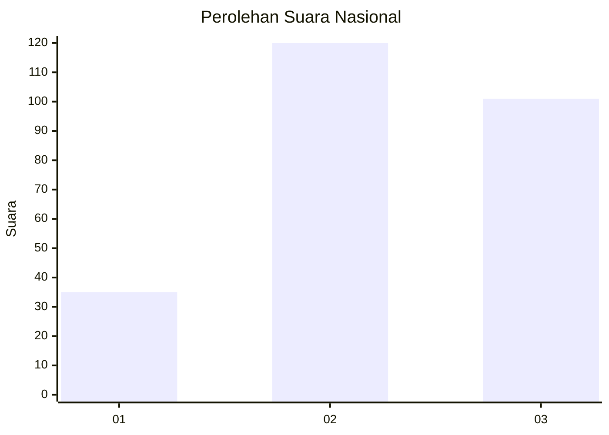
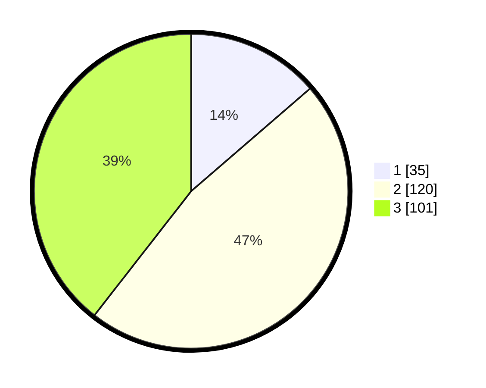

# Hasil

## Grafik

## Tabel

| No. | Nama Paslon    | Suara | Suara (raw) | Persentase |
|:--- |:-------------- | -----:| -----------:| ----------:|
| 1   | ANIES MUHAIMIN | 35    | [35][p-1]   | 13,67      |
| 2   | PRABOWO GIBRAN | 120   | [120][p-2]  | 46,88      |
| 3   | GANJAR MAHFUD  | 101   | [101][p-3]  | 39,45      |

[p-1]: https://github.com/gigit-pemilu/pemilu-2024/blob/main/pilpres/hitung-suara/sub/34-di-yogyakarta/sub/71-kota-yogyakarta/sub/01-tegalrejo/sub/1001-kricak/sub/002-tps/sub/paslon-1.txt
[p-2]: https://github.com/gigit-pemilu/pemilu-2024/blob/main/pilpres/hitung-suara/sub/34-di-yogyakarta/sub/71-kota-yogyakarta/sub/01-tegalrejo/sub/1001-kricak/sub/002-tps/sub/paslon-2.txt
[p-3]: https://github.com/gigit-pemilu/pemilu-2024/blob/main/pilpres/hitung-suara/sub/34-di-yogyakarta/sub/71-kota-yogyakarta/sub/01-tegalrejo/sub/1001-kricak/sub/002-tps/sub/paslon-3.txt

## Foto C Plano

https://sirekap-obj-formc.kpu.go.id/0e77/pemilu/ppwp/34/71/01/10/01/3471011001002-20240216-193432--e8156fa9-bf93-48d9-a765-b44416f4f1ce.jpg

https://sirekap-obj-formc.kpu.go.id/0e77/pemilu/ppwp/34/71/01/10/01/3471011001002-20240216-193434--e66afb7a-6770-4c9f-81a2-57a655d1f2c9.jpg

https://sirekap-obj-formc.kpu.go.id/0e77/pemilu/ppwp/34/71/01/10/01/3471011001002-20240216-193433--9d3ae599-83f4-4dd0-adac-636d6724e4da.jpg

## Metadata

| Key        | Value               |
| ---------- | ------------------- |
| Time Stamp | 2024-02-17 10:00:02 |

## DATA PEMILIH TETAP

Jumlah pemilih dalam DPT: **281**.
 * L: **138**.
 * P: **143**.

## DATA PENGGUNA HAK PILIH

Jumlah pengguna hak pilih dalam DPT: **242**.
 * L: **117**.
 * P: **125**.

Jumlah pengguna hak pilih dalam DPTb: **11**.
 * L: **3**.
 * P: **8**.

Jumlah pengguna hak pilih dalam DPK: **4**.
 * L: **1**.
 * P: **3**.

Jumlah pengguna hak pilih: **257**.
 * L: **121**.
 * P: **136**.

## JUMLAH SUARA SAH DAN TIDAK SAH

JUMLAH SELURUH SUARA SAH: **256**.

JUMLAH SUARA TIDAK SAH: **1**.

JUMLAH SELURUH SUARA SAH DAN SUARA TIDAK SAH: **257**.

