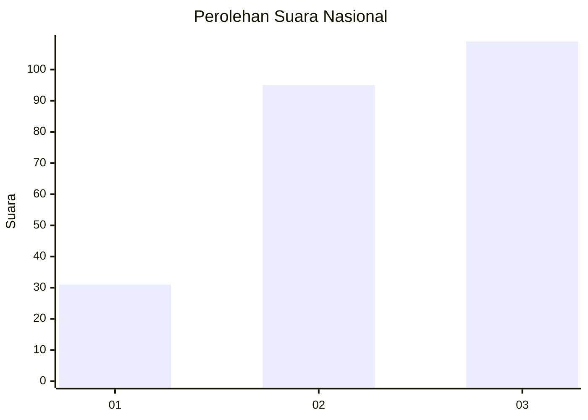
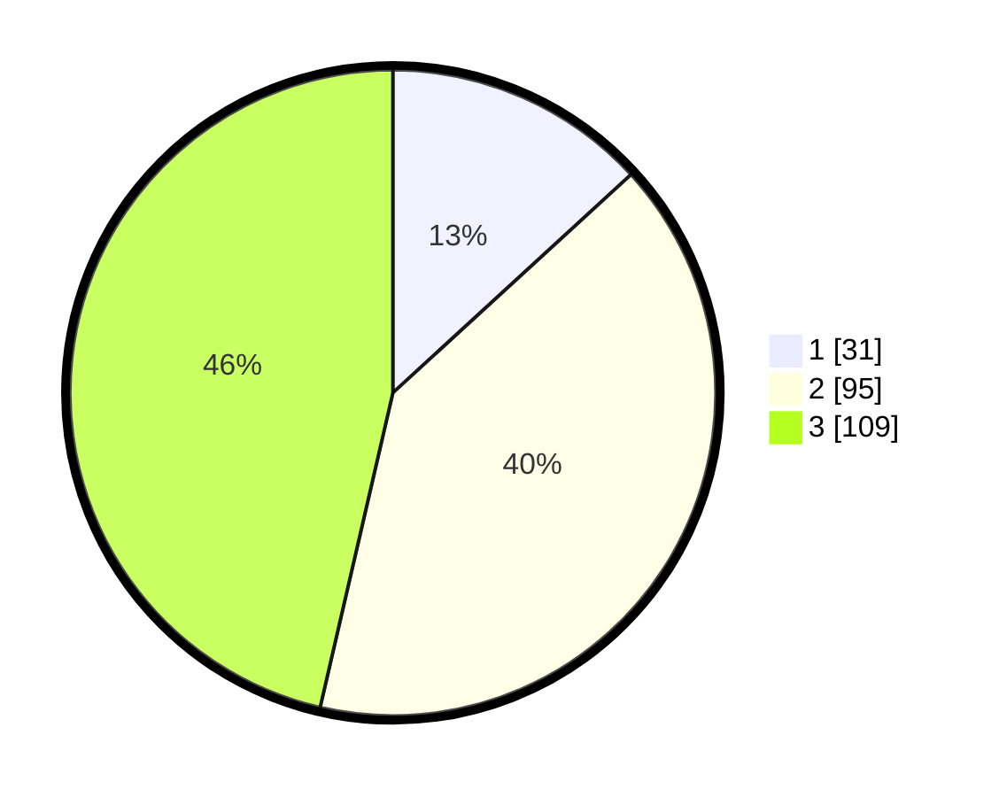

# Hasil

## Grafik

## Tabel

| No. | Nama Paslon    | Suara | Suara (raw) | Persentase |
|:--- |:-------------- | -----:| -----------:| ----------:|
| 1   | ANIES MUHAIMIN | 31    | [31][p-1]   | 13,19      |
| 2   | PRABOWO GIBRAN | 95    | [95][p-2]   | 40,43      |
| 3   | GANJAR MAHFUD  | 109   | [109][p-3]  | 46,38      |

[p-1]: https://github.com/gigit-pemilu/pemilu-2024/blob/main/pilpres/hitung-suara/sub/34-di-yogyakarta/sub/71-kota-yogyakarta/sub/01-tegalrejo/sub/1001-kricak/sub/003-tps/sub/paslon-1.txt
[p-2]: https://github.com/gigit-pemilu/pemilu-2024/blob/main/pilpres/hitung-suara/sub/34-di-yogyakarta/sub/71-kota-yogyakarta/sub/01-tegalrejo/sub/1001-kricak/sub/003-tps/sub/paslon-2.txt
[p-3]: https://github.com/gigit-pemilu/pemilu-2024/blob/main/pilpres/hitung-suara/sub/34-di-yogyakarta/sub/71-kota-yogyakarta/sub/01-tegalrejo/sub/1001-kricak/sub/003-tps/sub/paslon-3.txt

## Foto C Plano

https://sirekap-obj-formc.kpu.go.id/ff9f/pemilu/ppwp/34/71/01/10/01/3471011001003-20240214-192959--13126d79-fba5-468a-9408-ead78f922d82.jpg

https://sirekap-obj-formc.kpu.go.id/ff9f/pemilu/ppwp/34/71/01/10/01/3471011001003-20240214-193027--580efbcd-8580-4fd8-a616-10da997d8c6b.jpg

https://sirekap-obj-formc.kpu.go.id/ff9f/pemilu/ppwp/34/71/01/10/01/3471011001003-20240214-193044--a128c7ad-dae2-4087-bef1-c1ee2eb98853.jpg

## Metadata

| Key        | Value               |
| ---------- | ------------------- |
| Time Stamp | 2024-02-15 00:41:44 |

## DATA PEMILIH TETAP

Jumlah pemilih dalam DPT: **268**.
 * L: **127**.
 * P: **141**.

## DATA PENGGUNA HAK PILIH

Jumlah pengguna hak pilih dalam DPT: **226**.
 * L: **105**.
 * P: **121**.

Jumlah pengguna hak pilih dalam DPTb: **10**.
 * L: **4**.
 * P: **6**.

Jumlah pengguna hak pilih dalam DPK: **0**.
 * L: **0**.
 * P: **0**.

Jumlah pengguna hak pilih: **236**.
 * L: **109**.
 * P: **127**.

## JUMLAH SUARA SAH DAN TIDAK SAH

JUMLAH SELURUH SUARA SAH: **235**.

JUMLAH SUARA TIDAK SAH: **1**.

JUMLAH SELURUH SUARA SAH DAN SUARA TIDAK SAH: **236**.

