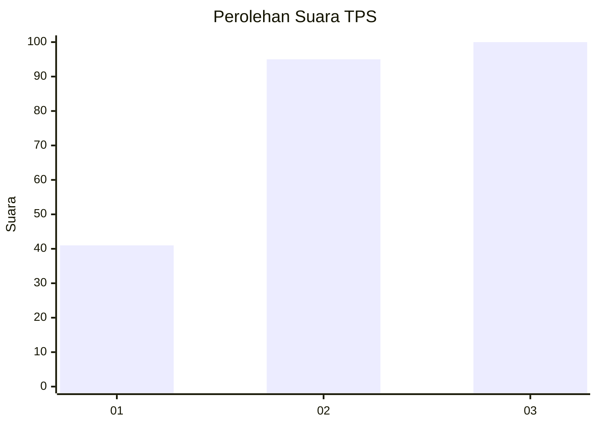
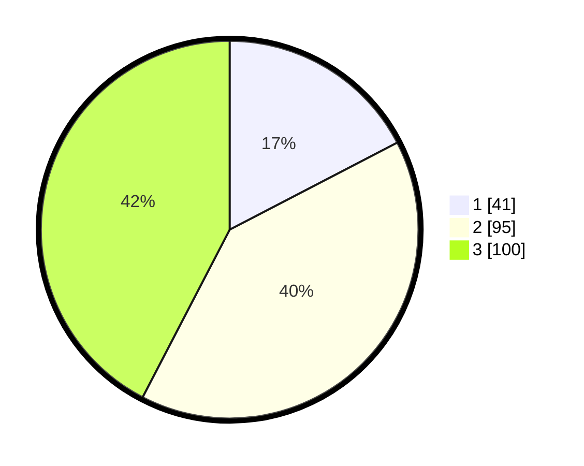

# Hasil

## Grafik

## Tabel

| No. | Nama Paslon    | Suara | Suara (raw) | Persentase |
|:--- |:-------------- | -----:| -----------:| ----------:|
| 1   | ANIES MUHAIMIN | 41    | [41][p-1]   | 17,37      |
| 2   | PRABOWO GIBRAN | 95    | [95][p-2]   | 40,25      |
| 3   | GANJAR MAHFUD  | 100   | [100][p-3]  | 42,37      |

[p-1]: https://github.com/gigit-pemilu/pemilu-2024-34-di-yogyakarta/blob/main/pilpres/hitung-suara/sub/34-di-yogyakarta/sub/71-kota-yogyakarta/sub/01-tegalrejo/sub/1001-kricak/sub/004-tps/sub/paslon-1.txt
[p-2]: https://github.com/gigit-pemilu/pemilu-2024-34-di-yogyakarta/blob/main/pilpres/hitung-suara/sub/34-di-yogyakarta/sub/71-kota-yogyakarta/sub/01-tegalrejo/sub/1001-kricak/sub/004-tps/sub/paslon-2.txt
[p-3]: https://github.com/gigit-pemilu/pemilu-2024-34-di-yogyakarta/blob/main/pilpres/hitung-suara/sub/34-di-yogyakarta/sub/71-kota-yogyakarta/sub/01-tegalrejo/sub/1001-kricak/sub/004-tps/sub/paslon-3.txt

## Foto C Plano

https://sirekap-obj-formc.kpu.go.id/7c8a/pemilu/ppwp/34/71/01/10/01/3471011001004-20240216-210824--dcbda812-3c23-4914-81a3-e4025280eb95.jpg

https://sirekap-obj-formc.kpu.go.id/7c8a/pemilu/ppwp/34/71/01/10/01/3471011001004-20240216-210826--b81d36bd-a405-4b1e-96a0-1c06e632e03d.jpg

https://sirekap-obj-formc.kpu.go.id/7c8a/pemilu/ppwp/34/71/01/10/01/3471011001004-20240216-210825--211c9e9a-9335-439f-b719-db5af27538b4.jpg

## Metadata

| Key        | Value               |
| ---------- | ------------------- |
| Time Stamp | 2024-02-17 10:00:02 |

## DATA PEMILIH TETAP

Jumlah pemilih dalam DPT: **271**.
 * L: **124**.
 * P: **147**.

## DATA PENGGUNA HAK PILIH

Jumlah pengguna hak pilih dalam DPT: **225**.
 * L: **102**.
 * P: **123**.

Jumlah pengguna hak pilih dalam DPTb: **12**.
 * L: **6**.
 * P: **6**.

Jumlah pengguna hak pilih dalam DPK: **4**.
 * L: **1**.
 * P: **3**.

Jumlah pengguna hak pilih: **241**.
 * L: **109**.
 * P: **132**.

## JUMLAH SUARA SAH DAN TIDAK SAH

JUMLAH SELURUH SUARA SAH: **236**.

JUMLAH SUARA TIDAK SAH: **5**.

JUMLAH SELURUH SUARA SAH DAN SUARA TIDAK SAH: **241**.

