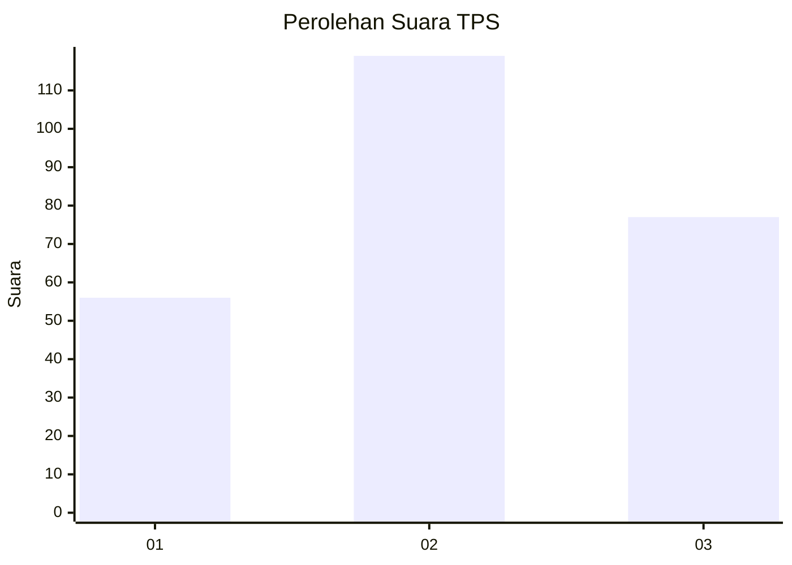
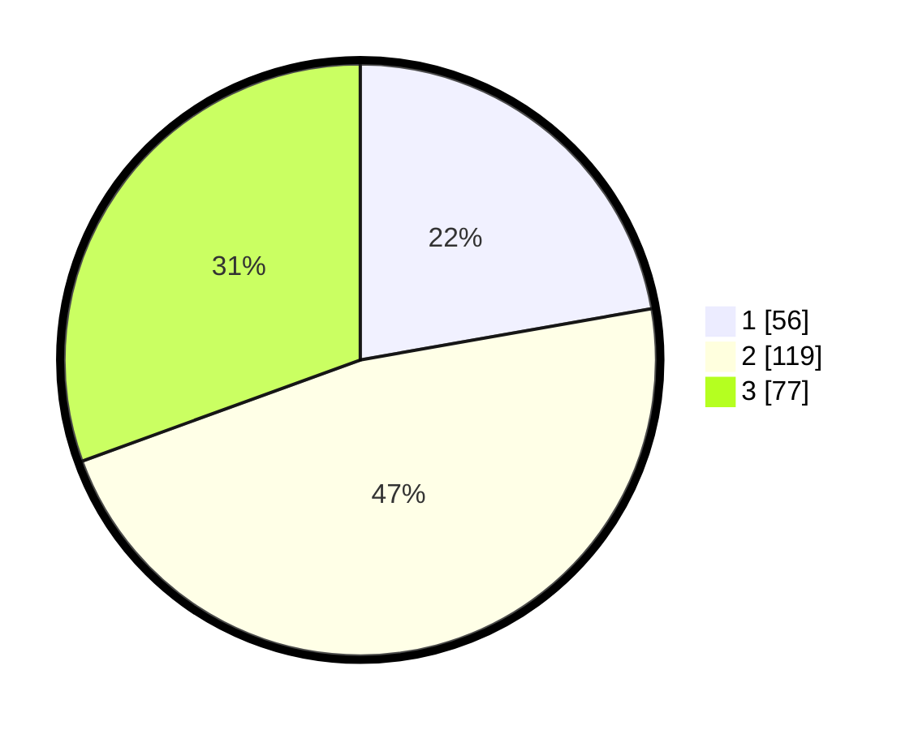

# Hasil

## Grafik

## Tabel

| No. | Nama Paslon    | Suara | Suara (raw) | Persentase |
|:--- |:-------------- | -----:| -----------:| ----------:|
| 1   | ANIES MUHAIMIN | 56    | [56][p-1]   | 22,22      |
| 2   | PRABOWO GIBRAN | 119   | [119][p-2]  | 47,22      |
| 3   | GANJAR MAHFUD  | 77    | [77][p-3]   | 30,56      |

[p-1]: https://github.com/gigit-pemilu/pemilu-2024-34-di-yogyakarta/blob/main/pilpres/hitung-suara/sub/34-di-yogyakarta/sub/71-kota-yogyakarta/sub/01-tegalrejo/sub/1001-kricak/sub/005-tps/sub/paslon-1.txt
[p-2]: https://github.com/gigit-pemilu/pemilu-2024-34-di-yogyakarta/blob/main/pilpres/hitung-suara/sub/34-di-yogyakarta/sub/71-kota-yogyakarta/sub/01-tegalrejo/sub/1001-kricak/sub/005-tps/sub/paslon-2.txt
[p-3]: https://github.com/gigit-pemilu/pemilu-2024-34-di-yogyakarta/blob/main/pilpres/hitung-suara/sub/34-di-yogyakarta/sub/71-kota-yogyakarta/sub/01-tegalrejo/sub/1001-kricak/sub/005-tps/sub/paslon-3.txt

## Foto C Plano

https://sirekap-obj-formc.kpu.go.id/7ee1/pemilu/ppwp/34/71/01/10/01/3471011001005-20240216-211244--4cf51121-c195-4b44-967e-46a4db60e370.jpg

https://sirekap-obj-formc.kpu.go.id/7ee1/pemilu/ppwp/34/71/01/10/01/3471011001005-20240216-211245--aa1c1b9d-8c37-428f-bbca-fa9c3daf2c75.jpg

https://sirekap-obj-formc.kpu.go.id/7ee1/pemilu/ppwp/34/71/01/10/01/3471011001005-20240216-211245--e1a7b577-9d55-40cd-b91b-6333cc2e8b00.jpg

## Metadata

| Key        | Value               |
| ---------- | ------------------- |
| Time Stamp | 2024-02-17 10:00:02 |

## DATA PEMILIH TETAP

Jumlah pemilih dalam DPT: **270**.
 * L: **130**.
 * P: **140**.

## DATA PENGGUNA HAK PILIH

Jumlah pengguna hak pilih dalam DPT: **242**.
 * L: **117**.
 * P: **125**.

Jumlah pengguna hak pilih dalam DPTb: **8**.
 * L: **5**.
 * P: **3**.

Jumlah pengguna hak pilih dalam DPK: **5**.
 * L: **2**.
 * P: **3**.

Jumlah pengguna hak pilih: **255**.
 * L: **124**.
 * P: **131**.

## JUMLAH SUARA SAH DAN TIDAK SAH

JUMLAH SELURUH SUARA SAH: **252**.

JUMLAH SUARA TIDAK SAH: **3**.

JUMLAH SELURUH SUARA SAH DAN SUARA TIDAK SAH: **255**.

