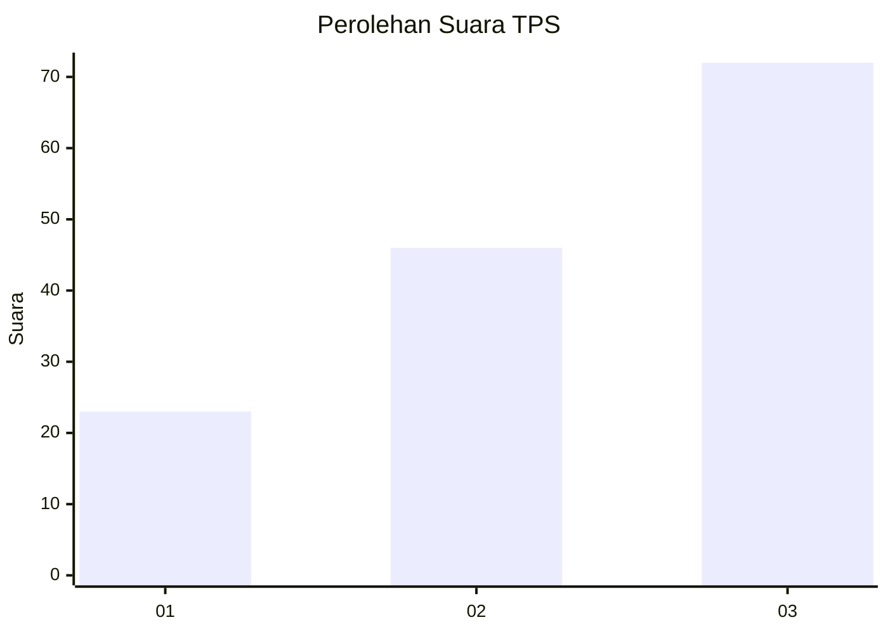
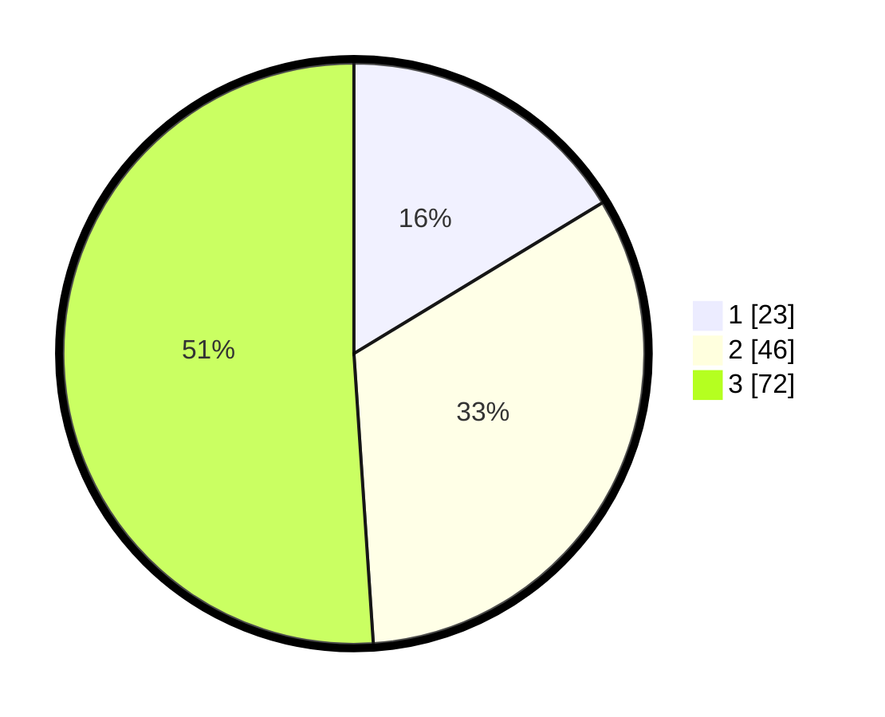

# Hasil

## Grafik

## Tabel

| No. | Nama Paslon    | Suara | Suara (raw) | Persentase |
|:--- |:-------------- | -----:| -----------:| ----------:|
| 1   | ANIES MUHAIMIN | 23    | [23][p-1]   | 16,31      |
| 2   | PRABOWO GIBRAN | 46    | [46][p-2]   | 32,62      |
| 3   | GANJAR MAHFUD  | 72    | [72][p-3]   | 51,06      |

[p-1]: https://github.com/gigit-pemilu/pemilu-2024-34-di-yogyakarta/blob/main/pilpres/hitung-suara/sub/34-di-yogyakarta/sub/71-kota-yogyakarta/sub/01-tegalrejo/sub/1002-karangwaru/sub/025-tps/sub/paslon-1.txt
[p-2]: https://github.com/gigit-pemilu/pemilu-2024-34-di-yogyakarta/blob/main/pilpres/hitung-suara/sub/34-di-yogyakarta/sub/71-kota-yogyakarta/sub/01-tegalrejo/sub/1002-karangwaru/sub/025-tps/sub/paslon-2.txt
[p-3]: https://github.com/gigit-pemilu/pemilu-2024-34-di-yogyakarta/blob/main/pilpres/hitung-suara/sub/34-di-yogyakarta/sub/71-kota-yogyakarta/sub/01-tegalrejo/sub/1002-karangwaru/sub/025-tps/sub/paslon-3.txt

## Foto C Plano

https://sirekap-obj-formc.kpu.go.id/44d9/pemilu/ppwp/34/71/01/10/02/3471011002025-20240216-170846--81e0f1a2-962d-4e1f-8dbe-5b2937c41323.jpg

https://sirekap-obj-formc.kpu.go.id/44d9/pemilu/ppwp/34/71/01/10/02/3471011002025-20240216-170847--58ef60f8-1d4c-457d-b5af-10f14e1a092c.jpg

https://sirekap-obj-formc.kpu.go.id/44d9/pemilu/ppwp/34/71/01/10/02/3471011002025-20240216-170846--c8d78eca-403d-401a-98fd-247fc79d39c2.jpg

## Metadata

| Key        | Value               |
| ---------- | ------------------- |
| Time Stamp | 2024-02-16 21:01:00 |

## DATA PEMILIH TETAP

Jumlah pemilih dalam DPT: **174**.
 * L: **81**.
 * P: **93**.

## DATA PENGGUNA HAK PILIH

Jumlah pengguna hak pilih dalam DPT: **138**.
 * L: **62**.
 * P: **76**.

Jumlah pengguna hak pilih dalam DPTb: **13**.
 * L: **3**.
 * P: **10**.

Jumlah pengguna hak pilih dalam DPK: **1**.
 * L: **1**.
 * P: **0**.

Jumlah pengguna hak pilih: **152**.
 * L: **66**.
 * P: **86**.

## JUMLAH SUARA SAH DAN TIDAK SAH

JUMLAH SELURUH SUARA SAH: **146**.

JUMLAH SUARA TIDAK SAH: **6**.

JUMLAH SELURUH SUARA SAH DAN SUARA TIDAK SAH: **152**.

