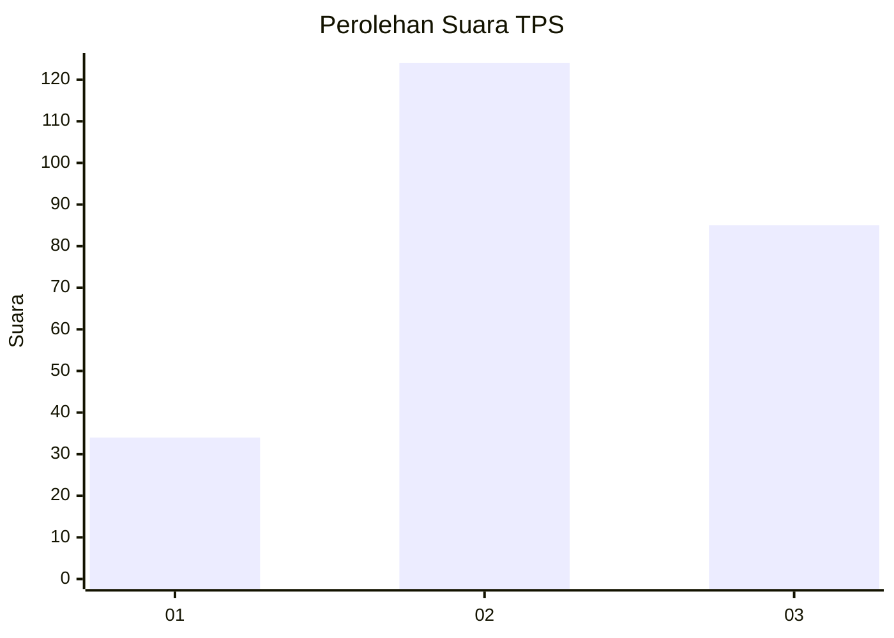
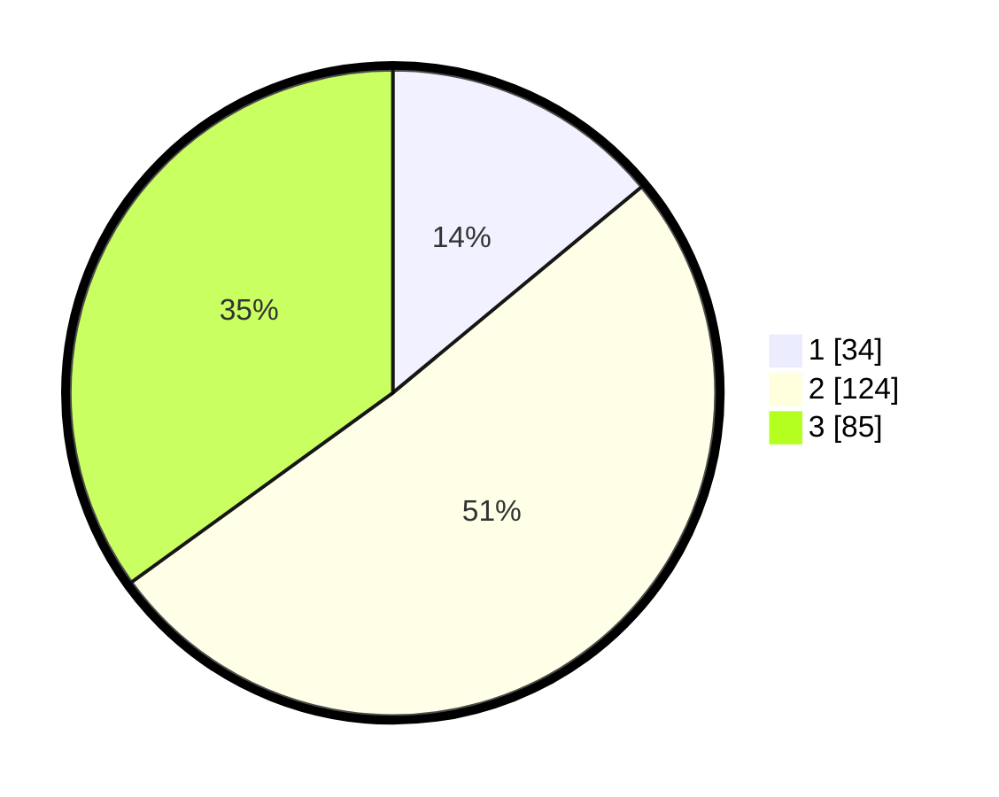

# Hasil

## Grafik

## Tabel

| No. | Nama Paslon    | Suara | Suara (raw) | Persentase |
|:--- |:-------------- | -----:| -----------:| ----------:|
| 1   | ANIES MUHAIMIN | 34    | [34][p-1]   | 13,99      |
| 2   | PRABOWO GIBRAN | 124   | [124][p-2]  | 51,03      |
| 3   | GANJAR MAHFUD  | 85    | [85][p-3]   | 34,98      |

[p-1]: https://github.com/gigit-pemilu/pemilu-2024-34-di-yogyakarta/blob/main/pilpres/hitung-suara/sub/34-di-yogyakarta/sub/71-kota-yogyakarta/sub/01-tegalrejo/sub/1004-bener/sub/007-tps/sub/paslon-1.txt
[p-2]: https://github.com/gigit-pemilu/pemilu-2024-34-di-yogyakarta/blob/main/pilpres/hitung-suara/sub/34-di-yogyakarta/sub/71-kota-yogyakarta/sub/01-tegalrejo/sub/1004-bener/sub/007-tps/sub/paslon-2.txt
[p-3]: https://github.com/gigit-pemilu/pemilu-2024-34-di-yogyakarta/blob/main/pilpres/hitung-suara/sub/34-di-yogyakarta/sub/71-kota-yogyakarta/sub/01-tegalrejo/sub/1004-bener/sub/007-tps/sub/paslon-3.txt

## Foto C Plano

https://sirekap-obj-formc.kpu.go.id/1c8d/pemilu/ppwp/34/71/01/10/04/3471011004007-20240216-205925--ab964b7d-9ac2-46fa-9b45-4add255be0c1.jpg

https://sirekap-obj-formc.kpu.go.id/1c8d/pemilu/ppwp/34/71/01/10/04/3471011004007-20240216-205927--a3516ea2-97c1-4ee2-87c3-99cec6d26474.jpg

https://sirekap-obj-formc.kpu.go.id/1c8d/pemilu/ppwp/34/71/01/10/04/3471011004007-20240216-205926--2f271eb5-8503-4b8a-a8be-a027decf0775.jpg

## Metadata

| Key        | Value               |
| ---------- | ------------------- |
| Time Stamp | 2024-02-17 12:00:00 |

## DATA PEMILIH TETAP

Jumlah pemilih dalam DPT: **259**.
 * L: **120**.
 * P: **139**.

## DATA PENGGUNA HAK PILIH

Jumlah pengguna hak pilih dalam DPT: **236**.
 * L: **106**.
 * P: **130**.

Jumlah pengguna hak pilih dalam DPTb: **9**.
 * L: **0**.
 * P: **9**.

Jumlah pengguna hak pilih dalam DPK: **3**.
 * L: **2**.
 * P: **1**.

Jumlah pengguna hak pilih: **248**.
 * L: **107**.
 * P: **141**.

## JUMLAH SUARA SAH DAN TIDAK SAH

JUMLAH SELURUH SUARA SAH: **243**.

JUMLAH SUARA TIDAK SAH: **5**.

JUMLAH SELURUH SUARA SAH DAN SUARA TIDAK SAH: **248**.

