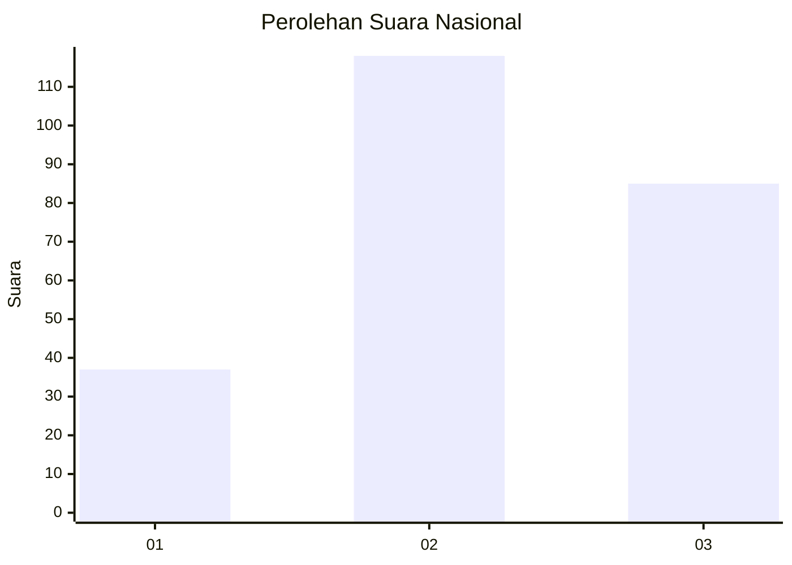
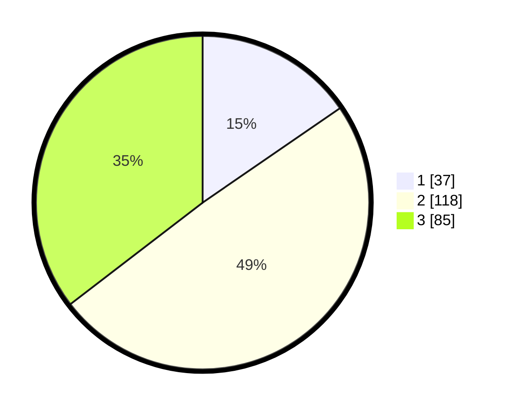

# Hasil

## Grafik

## Tabel

| No. | Nama Paslon    | Suara | Suara (raw) | Persentase |
|:--- |:-------------- | -----:| -----------:| ----------:|
| 1   | ANIES MUHAIMIN | 37    | [37][p-1]   | 15,42      |
| 2   | PRABOWO GIBRAN | 118   | [118][p-2]  | 49,17      |
| 3   | GANJAR MAHFUD  | 85    | [85][p-3]   | 35,42      |

[p-1]: https://github.com/gigit-pemilu/pemilu-2024/blob/main/pilpres/hitung-suara/sub/34-di-yogyakarta/sub/71-kota-yogyakarta/sub/02-jetis/sub/1001-bumijo/sub/003-tps/sub/paslon-1.txt
[p-2]: https://github.com/gigit-pemilu/pemilu-2024/blob/main/pilpres/hitung-suara/sub/34-di-yogyakarta/sub/71-kota-yogyakarta/sub/02-jetis/sub/1001-bumijo/sub/003-tps/sub/paslon-2.txt
[p-3]: https://github.com/gigit-pemilu/pemilu-2024/blob/main/pilpres/hitung-suara/sub/34-di-yogyakarta/sub/71-kota-yogyakarta/sub/02-jetis/sub/1001-bumijo/sub/003-tps/sub/paslon-3.txt

## Foto C Plano

https://sirekap-obj-formc.kpu.go.id/cd65/pemilu/ppwp/34/71/02/10/01/3471021001003-20240214-141036--514e04a9-a89d-4e01-8909-7eb7ee011277.jpg

https://sirekap-obj-formc.kpu.go.id/cd65/pemilu/ppwp/34/71/02/10/01/3471021001003-20240214-155439--ec09f5fb-2d31-403e-a40e-4e5b7e69f082.jpg

https://sirekap-obj-formc.kpu.go.id/cd65/pemilu/ppwp/34/71/02/10/01/3471021001003-20240216-152528--9a3280f3-d961-46eb-9e5c-18a612aff6da.jpg

## Metadata

| Key        | Value               |
| ---------- | ------------------- |
| Time Stamp | 2024-02-16 16:25:10 |

## DATA PEMILIH TETAP

Jumlah pemilih dalam DPT: **253**.
 * L: **118**.
 * P: **135**.

## DATA PENGGUNA HAK PILIH

Jumlah pengguna hak pilih dalam DPT: **254**.
 * L: **101**.
 * P: **124**.

Jumlah pengguna hak pilih dalam DPTb: **14**.
 * L: **9**.
 * P: **5**.

Jumlah pengguna hak pilih dalam DPK: **3**.
 * L: **1**.
 * P: **2**.

Jumlah pengguna hak pilih: **242**.
 * L: **111**.
 * P: **131**.

## JUMLAH SUARA SAH DAN TIDAK SAH

JUMLAH SELURUH SUARA SAH: **240**.

JUMLAH SUARA TIDAK SAH: **2**.

JUMLAH SELURUH SUARA SAH DAN SUARA TIDAK SAH: **242**.

