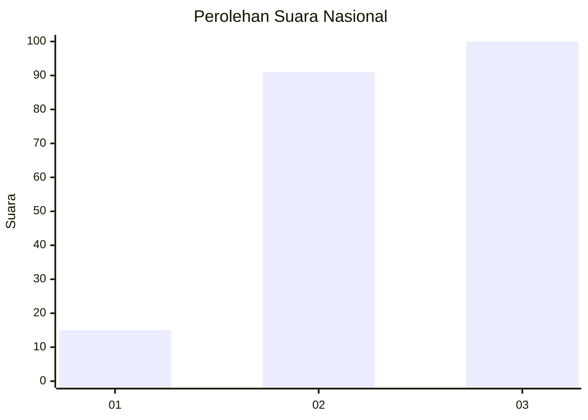
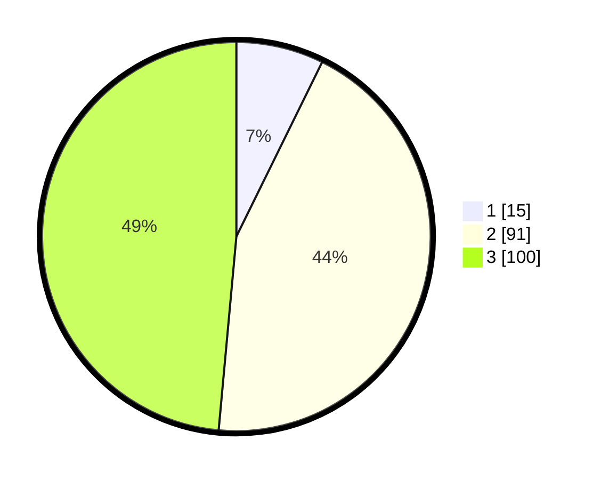

# Hasil

## Grafik

## Tabel

| No. | Nama Paslon    | Suara | Suara (raw) | Persentase |
|:--- |:-------------- | -----:| -----------:| ----------:|
| 1   | ANIES MUHAIMIN | 15    | [15][p-1]   | 7,28       |
| 2   | PRABOWO GIBRAN | 91    | [91][p-2]   | 44,17      |
| 3   | GANJAR MAHFUD  | 100   | [100][p-3]  | 48,54      |

[p-1]: https://github.com/gigit-pemilu/pemilu-2024/blob/main/pilpres/hitung-suara/sub/34-di-yogyakarta/sub/71-kota-yogyakarta/sub/02-jetis/sub/1001-bumijo/sub/005-tps/sub/paslon-1.txt
[p-2]: https://github.com/gigit-pemilu/pemilu-2024/blob/main/pilpres/hitung-suara/sub/34-di-yogyakarta/sub/71-kota-yogyakarta/sub/02-jetis/sub/1001-bumijo/sub/005-tps/sub/paslon-2.txt
[p-3]: https://github.com/gigit-pemilu/pemilu-2024/blob/main/pilpres/hitung-suara/sub/34-di-yogyakarta/sub/71-kota-yogyakarta/sub/02-jetis/sub/1001-bumijo/sub/005-tps/sub/paslon-3.txt

## Foto C Plano

https://sirekap-obj-formc.kpu.go.id/11f5/pemilu/ppwp/34/71/02/10/01/3471021001005-20240214-185320--d7e6c1f7-3822-4210-be50-0ddef4c173c8.jpg

https://sirekap-obj-formc.kpu.go.id/11f5/pemilu/ppwp/34/71/02/10/01/3471021001005-20240214-185904--1ae0380b-06db-489f-b156-f8da405ef334.jpg

https://sirekap-obj-formc.kpu.go.id/11f5/pemilu/ppwp/34/71/02/10/01/3471021001005-20240214-190215--23cb6f46-dca6-424f-b723-a809c200c0b2.jpg

## Metadata

| Key        | Value               |
| ---------- | ------------------- |
| Time Stamp | 2024-02-24 22:31:28 |

## DATA PEMILIH TETAP

Jumlah pemilih dalam DPT: **252**.
 * L: **128**.
 * P: **124**.

## DATA PENGGUNA HAK PILIH

Jumlah pengguna hak pilih dalam DPT: **195**.
 * L: **100**.
 * P: **95**.

Jumlah pengguna hak pilih dalam DPTb: **13**.
 * L: **3**.
 * P: **10**.

Jumlah pengguna hak pilih dalam DPK: **0**.
 * L: **0**.
 * P: **0**.

Jumlah pengguna hak pilih: **208**.
 * L: **103**.
 * P: **105**.

## JUMLAH SUARA SAH DAN TIDAK SAH

JUMLAH SELURUH SUARA SAH: **206**.

JUMLAH SUARA TIDAK SAH: **2**.

JUMLAH SELURUH SUARA SAH DAN SUARA TIDAK SAH: **208**.

