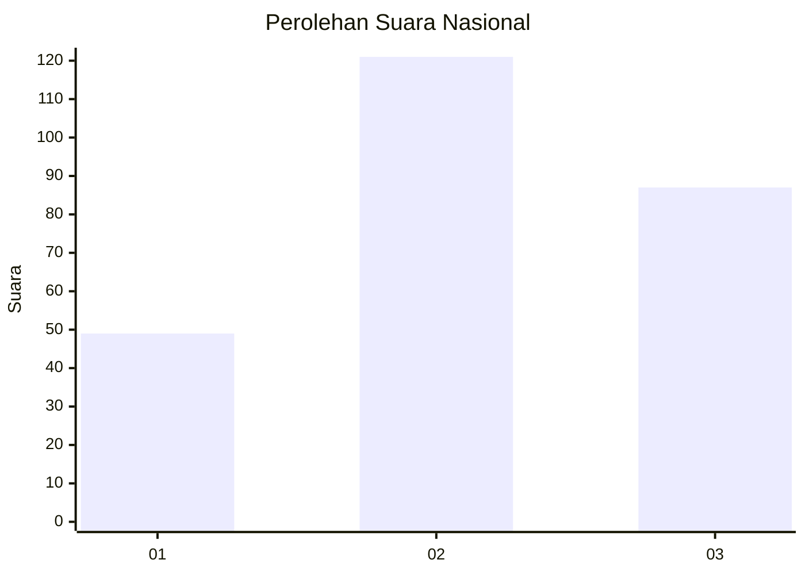
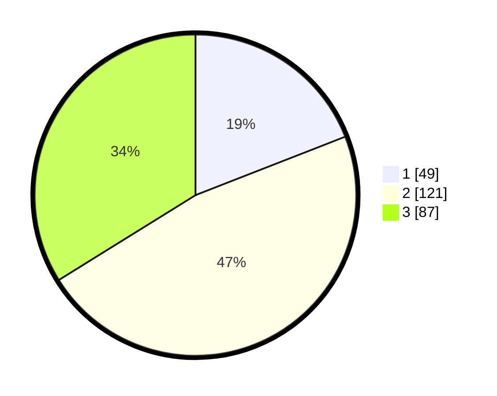

# Hasil

## Grafik

## Tabel

| No. | Nama Paslon    | Suara | Suara (raw) | Persentase |
|:--- |:-------------- | -----:| -----------:| ----------:|
| 1   | ANIES MUHAIMIN | 49    | [49][p-1]   | 19,07      |
| 2   | PRABOWO GIBRAN | 121   | [121][p-2]  | 47,08      |
| 3   | GANJAR MAHFUD  | 87    | [87][p-3]   | 33,85      |

[p-1]: https://github.com/gigit-pemilu/pemilu-2024/blob/main/pilpres/hitung-suara/sub/34-di-yogyakarta/sub/71-kota-yogyakarta/sub/02-jetis/sub/1001-bumijo/sub/011-tps/sub/paslon-1.txt
[p-2]: https://github.com/gigit-pemilu/pemilu-2024/blob/main/pilpres/hitung-suara/sub/34-di-yogyakarta/sub/71-kota-yogyakarta/sub/02-jetis/sub/1001-bumijo/sub/011-tps/sub/paslon-2.txt
[p-3]: https://github.com/gigit-pemilu/pemilu-2024/blob/main/pilpres/hitung-suara/sub/34-di-yogyakarta/sub/71-kota-yogyakarta/sub/02-jetis/sub/1001-bumijo/sub/011-tps/sub/paslon-3.txt

## Foto C Plano

https://sirekap-obj-formc.kpu.go.id/3b3d/pemilu/ppwp/34/71/02/10/01/3471021001011-20240215-001119--fa97d084-81b4-43d4-a097-ed852cc4c8b3.jpg

https://sirekap-obj-formc.kpu.go.id/3b3d/pemilu/ppwp/34/71/02/10/01/3471021001011-20240215-001142--15c6ebdd-fde5-4fed-bd47-507ecdd3dc70.jpg

https://sirekap-obj-formc.kpu.go.id/3b3d/pemilu/ppwp/34/71/02/10/01/3471021001011-20240215-001208--fb2b9b1d-3cb1-415b-aeeb-9ce6e015f570.jpg

## Metadata

| Key        | Value               |
| ---------- | ------------------- |
| Time Stamp | 2024-02-16 09:30:28 |

## DATA PEMILIH TETAP

Jumlah pemilih dalam DPT: **293**.
 * L: **129**.
 * P: **164**.

## DATA PENGGUNA HAK PILIH

Jumlah pengguna hak pilih dalam DPT: **247**.
 * L: **103**.
 * P: **144**.

Jumlah pengguna hak pilih dalam DPTb: **13**.
 * L: **8**.
 * P: **5**.

Jumlah pengguna hak pilih dalam DPK: **1**.
 * L: **1**.
 * P: **0**.

Jumlah pengguna hak pilih: **261**.
 * L: **112**.
 * P: **149**.

## JUMLAH SUARA SAH DAN TIDAK SAH

JUMLAH SELURUH SUARA SAH: **257**.

JUMLAH SUARA TIDAK SAH: **4**.

JUMLAH SELURUH SUARA SAH DAN SUARA TIDAK SAH: **261**.

