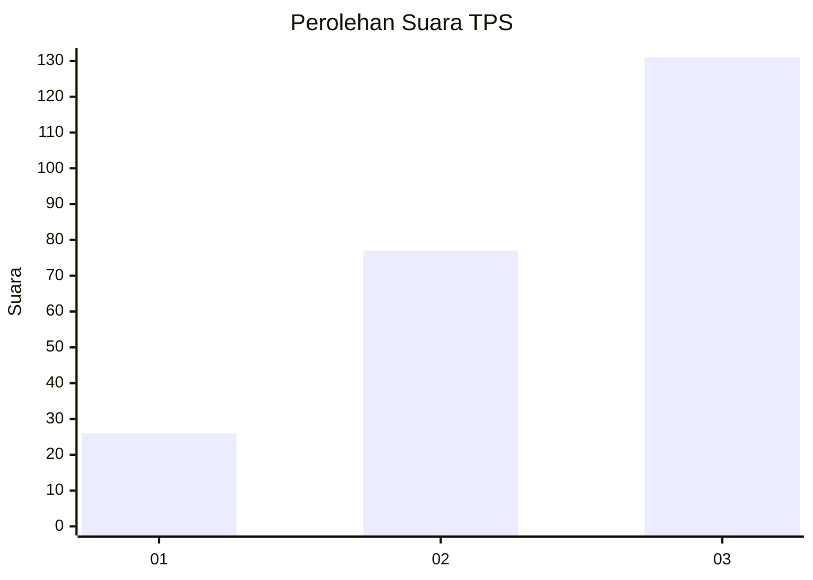
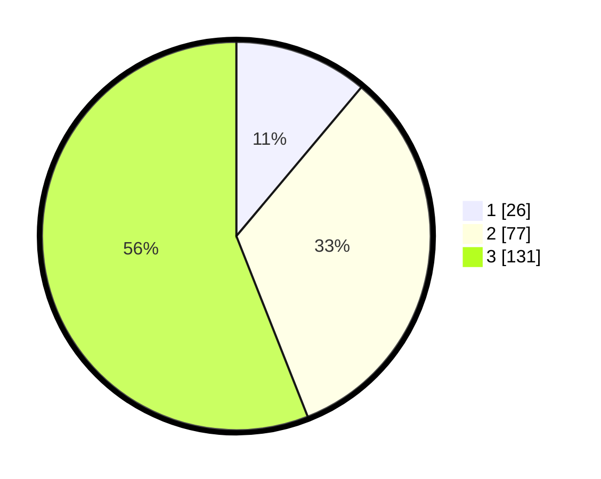

# Hasil

## Grafik

## Tabel

| No. | Nama Paslon    | Suara | Suara (raw) | Persentase |
|:--- |:-------------- | -----:| -----------:| ----------:|
| 1   | ANIES MUHAIMIN | 26    | [26][p-1]   | 11,11      |
| 2   | PRABOWO GIBRAN | 77    | [77][p-2]   | 32,91      |
| 3   | GANJAR MAHFUD  | 131   | [131][p-3]  | 55,98      |

[p-1]: https://github.com/gigit-pemilu/pemilu-2024-34-di-yogyakarta/blob/main/pilpres/hitung-suara/sub/34-di-yogyakarta/sub/71-kota-yogyakarta/sub/02-jetis/sub/1002-cokrodiningratan/sub/002-tps/sub/paslon-1.txt
[p-2]: https://github.com/gigit-pemilu/pemilu-2024-34-di-yogyakarta/blob/main/pilpres/hitung-suara/sub/34-di-yogyakarta/sub/71-kota-yogyakarta/sub/02-jetis/sub/1002-cokrodiningratan/sub/002-tps/sub/paslon-2.txt
[p-3]: https://github.com/gigit-pemilu/pemilu-2024-34-di-yogyakarta/blob/main/pilpres/hitung-suara/sub/34-di-yogyakarta/sub/71-kota-yogyakarta/sub/02-jetis/sub/1002-cokrodiningratan/sub/002-tps/sub/paslon-3.txt

## Foto C Plano

https://sirekap-obj-formc.kpu.go.id/8888/pemilu/ppwp/34/71/02/10/02/3471021002002-20240215-013549--0530f1a2-95af-46b6-a471-69aebad45fa4.jpg

https://sirekap-obj-formc.kpu.go.id/8888/pemilu/ppwp/34/71/02/10/02/3471021002002-20240215-013657--3ae2eea7-190f-4750-a675-eeb3c3ca70ca.jpg

https://sirekap-obj-formc.kpu.go.id/8888/pemilu/ppwp/34/71/02/10/02/3471021002002-20240215-014028--8abe930c-8f36-4e0e-af6c-06bc01c9d75c.jpg

## Metadata

| Key        | Value               |
| ---------- | ------------------- |
| Time Stamp | 2024-02-16 12:51:22 |

## DATA PEMILIH TETAP

Jumlah pemilih dalam DPT: **210**.
 * L: **130**.
 * P: **150**.

## DATA PENGGUNA HAK PILIH

Jumlah pengguna hak pilih dalam DPT: **215**.
 * L: **99**.
 * P: **116**.

Jumlah pengguna hak pilih dalam DPTb: **21**.
 * L: **8**.
 * P: **13**.

Jumlah pengguna hak pilih dalam DPK: **2**.
 * L: **1**.
 * P: **1**.

Jumlah pengguna hak pilih: **238**.
 * L: **108**.
 * P: **130**.

## JUMLAH SUARA SAH DAN TIDAK SAH

JUMLAH SELURUH SUARA SAH: **234**.

JUMLAH SUARA TIDAK SAH: **4**.

JUMLAH SELURUH SUARA SAH DAN SUARA TIDAK SAH: **238**.

