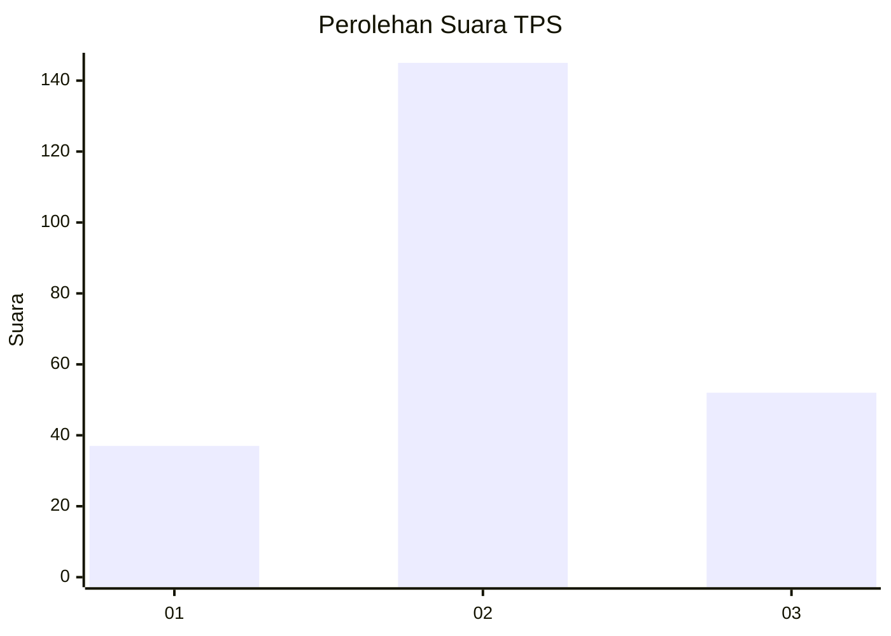
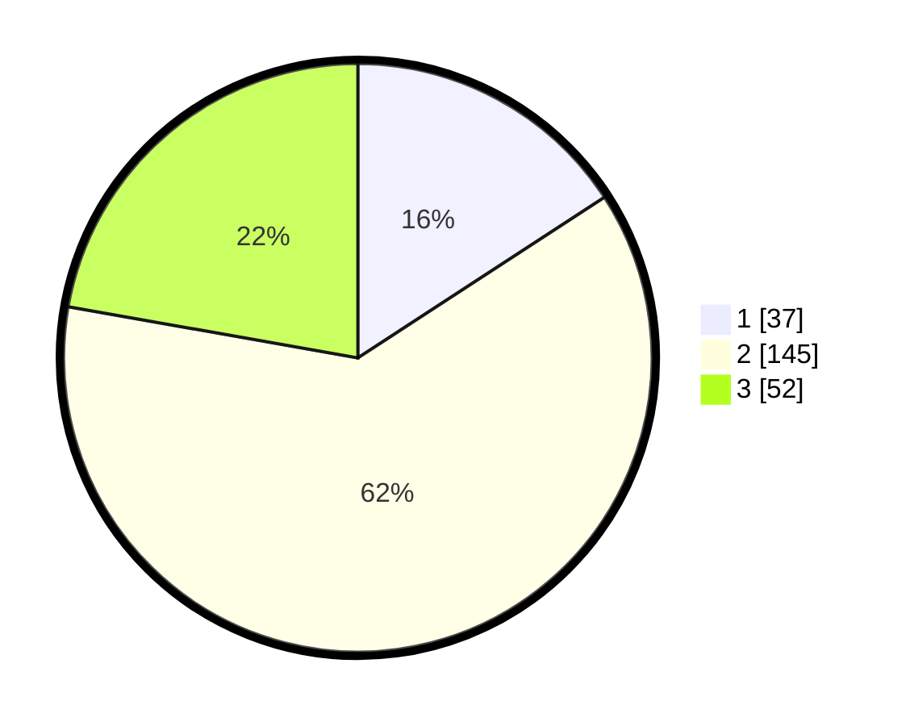

# Hasil

## Grafik

## Tabel

| No. | Nama Paslon    | Suara | Suara (raw) | Persentase |
|:--- |:-------------- | -----:| -----------:| ----------:|
| 1   | ANIES MUHAIMIN | 37    | [37][p-1]   | 15,81      |
| 2   | PRABOWO GIBRAN | 145   | [145][p-2]  | 61,97      |
| 3   | GANJAR MAHFUD  | 52    | [52][p-3]   | 22,22      |

[p-1]: https://github.com/gigit-pemilu/pemilu-2024-34-di-yogyakarta/blob/main/pilpres/hitung-suara/sub/34-di-yogyakarta/sub/71-kota-yogyakarta/sub/02-jetis/sub/1002-cokrodiningratan/sub/022-tps/sub/paslon-1.txt
[p-2]: https://github.com/gigit-pemilu/pemilu-2024-34-di-yogyakarta/blob/main/pilpres/hitung-suara/sub/34-di-yogyakarta/sub/71-kota-yogyakarta/sub/02-jetis/sub/1002-cokrodiningratan/sub/022-tps/sub/paslon-2.txt
[p-3]: https://github.com/gigit-pemilu/pemilu-2024-34-di-yogyakarta/blob/main/pilpres/hitung-suara/sub/34-di-yogyakarta/sub/71-kota-yogyakarta/sub/02-jetis/sub/1002-cokrodiningratan/sub/022-tps/sub/paslon-3.txt

## Foto C Plano

https://sirekap-obj-formc.kpu.go.id/ec56/pemilu/ppwp/34/71/02/10/02/3471021002022-20240214-220220--ae6329d7-02bc-4a03-b508-d4db3ebe88b4.jpg

https://sirekap-obj-formc.kpu.go.id/ec56/pemilu/ppwp/34/71/02/10/02/3471021002022-20240214-215937--224f9b3f-2089-4fb9-bc77-cbfe408c8ee6.jpg

https://sirekap-obj-formc.kpu.go.id/ec56/pemilu/ppwp/34/71/02/10/02/3471021002022-20240214-215658--2c2b39ad-f768-4861-b3ac-5c671f23ae78.jpg

## Metadata

| Key        | Value               |
| ---------- | ------------------- |
| Time Stamp | 2024-02-24 22:31:28 |

