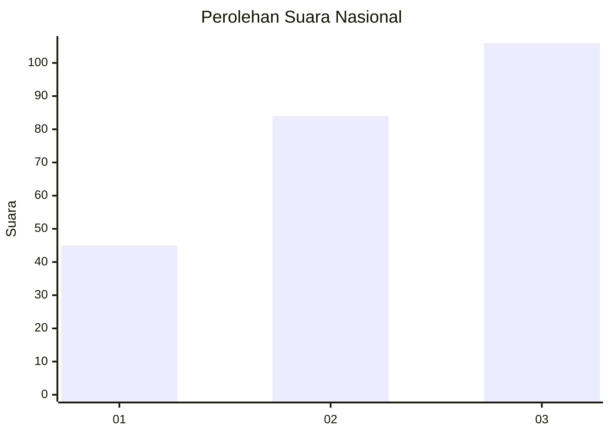
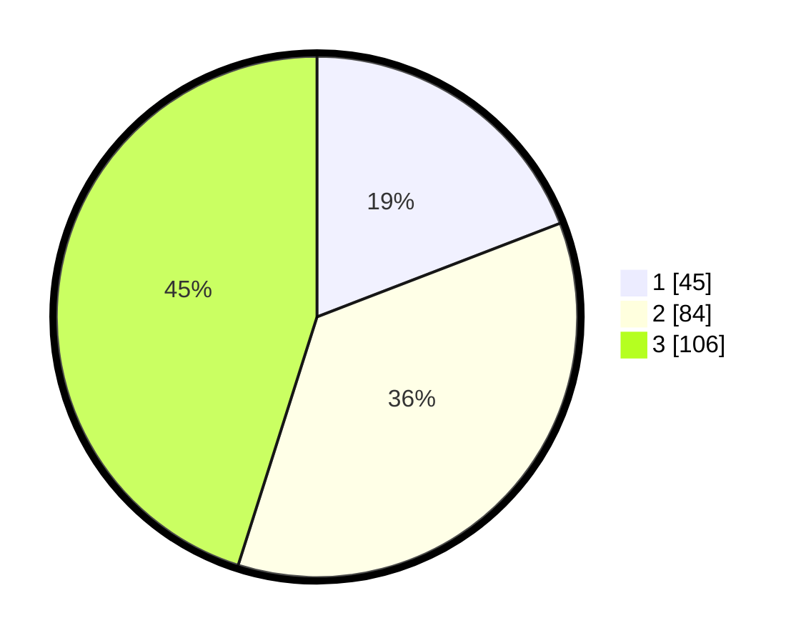

# Hasil

## Grafik

## Tabel

| No. | Nama Paslon    | Suara | Suara (raw) | Persentase |
|:--- |:-------------- | -----:| -----------:| ----------:|
| 1   | ANIES MUHAIMIN | 45    | [45][p-1]   | 19,15      |
| 2   | PRABOWO GIBRAN | 84    | [84][p-2]   | 35,74      |
| 3   | GANJAR MAHFUD  | 106   | [106][p-3]  | 45,11      |

[p-1]: https://github.com/gigit-pemilu/pemilu-2024/blob/main/pilpres/hitung-suara/sub/34-di-yogyakarta/sub/71-kota-yogyakarta/sub/02-jetis/sub/1003-gowongan/sub/002-tps/sub/paslon-1.txt
[p-2]: https://github.com/gigit-pemilu/pemilu-2024/blob/main/pilpres/hitung-suara/sub/34-di-yogyakarta/sub/71-kota-yogyakarta/sub/02-jetis/sub/1003-gowongan/sub/002-tps/sub/paslon-2.txt
[p-3]: https://github.com/gigit-pemilu/pemilu-2024/blob/main/pilpres/hitung-suara/sub/34-di-yogyakarta/sub/71-kota-yogyakarta/sub/02-jetis/sub/1003-gowongan/sub/002-tps/sub/paslon-3.txt

## Foto C Plano

https://sirekap-obj-formc.kpu.go.id/3af3/pemilu/ppwp/34/71/02/10/03/3471021003002-20240215-002412--3980d76d-3ff7-4bc5-822e-75083029d698.jpg

https://sirekap-obj-formc.kpu.go.id/3af3/pemilu/ppwp/34/71/02/10/03/3471021003002-20240215-002526--e87e7bd1-0ecf-490d-9b50-2988134c85b6.jpg

https://sirekap-obj-formc.kpu.go.id/3af3/pemilu/ppwp/34/71/02/10/03/3471021003002-20240214-155626--f6195cc6-abfc-4ce9-af7a-a626c87bd222.jpg

## Metadata

| Key        | Value               |
| ---------- | ------------------- |
| Time Stamp | 2024-02-24 22:31:28 |

## DATA PEMILIH TETAP

Jumlah pemilih dalam DPT: **274**.
 * L: **120**.
 * P: **154**.

## DATA PENGGUNA HAK PILIH

Jumlah pengguna hak pilih dalam DPT: **227**.
 * L: **101**.
 * P: **126**.

Jumlah pengguna hak pilih dalam DPTb: **8**.
 * L: **0**.
 * P: **8**.

Jumlah pengguna hak pilih dalam DPK: **4**.
 * L: **2**.
 * P: **2**.

Jumlah pengguna hak pilih: **239**.
 * L: **103**.
 * P: **136**.

## JUMLAH SUARA SAH DAN TIDAK SAH

JUMLAH SELURUH SUARA SAH: **235**.

JUMLAH SUARA TIDAK SAH: **4**.

JUMLAH SELURUH SUARA SAH DAN SUARA TIDAK SAH: **239**.

