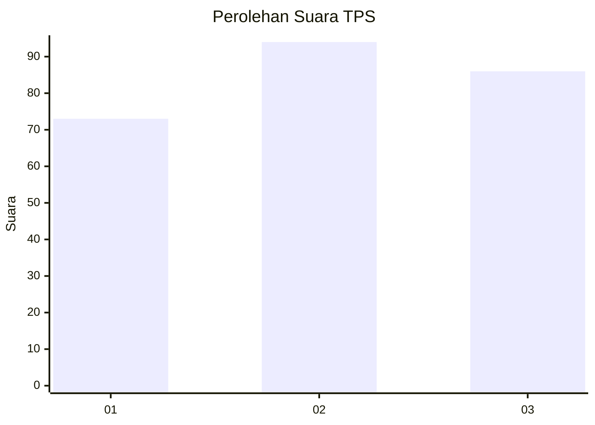
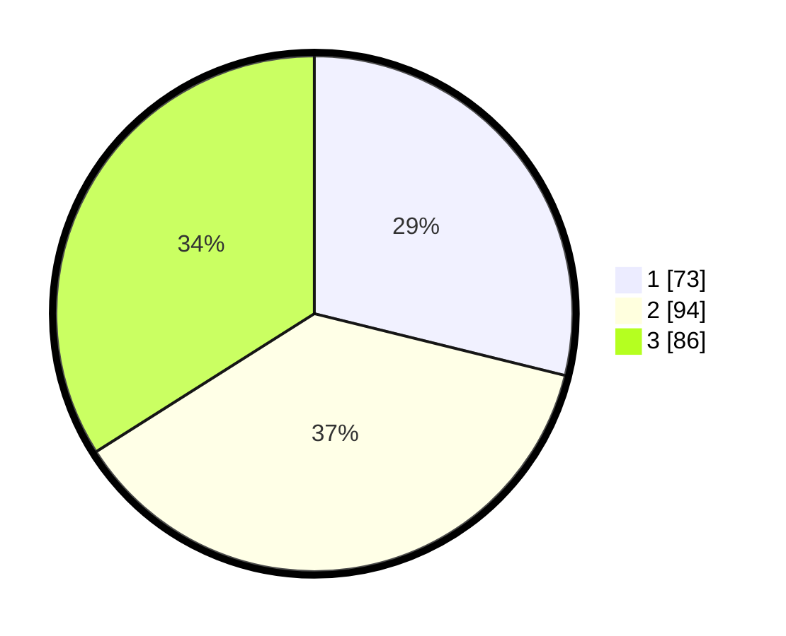

# Hasil

## Grafik

## Tabel

| No. | Nama Paslon    | Suara | Suara (raw) | Persentase |
|:--- |:-------------- | -----:| -----------:| ----------:|
| 1   | ANIES MUHAIMIN | 73    | [73][p-1]   | 28,85      |
| 2   | PRABOWO GIBRAN | 94    | [94][p-2]   | 37,15      |
| 3   | GANJAR MAHFUD  | 86    | [86][p-3]   | 33,99      |

[p-1]: https://github.com/gigit-pemilu/pemilu-2024-34-di-yogyakarta/blob/main/pilpres/hitung-suara/sub/34-di-yogyakarta/sub/71-kota-yogyakarta/sub/03-gondokusuman/sub/1001-demangan/sub/002-tps/sub/paslon-1.txt
[p-2]: https://github.com/gigit-pemilu/pemilu-2024-34-di-yogyakarta/blob/main/pilpres/hitung-suara/sub/34-di-yogyakarta/sub/71-kota-yogyakarta/sub/03-gondokusuman/sub/1001-demangan/sub/002-tps/sub/paslon-2.txt
[p-3]: https://github.com/gigit-pemilu/pemilu-2024-34-di-yogyakarta/blob/main/pilpres/hitung-suara/sub/34-di-yogyakarta/sub/71-kota-yogyakarta/sub/03-gondokusuman/sub/1001-demangan/sub/002-tps/sub/paslon-3.txt

## Foto C Plano

https://sirekap-obj-formc.kpu.go.id/4e2f/pemilu/ppwp/34/71/03/10/01/3471031001002-20240215-060536--ef0eef2b-bb9a-4cea-8e5c-278d41b2ae25.jpg

https://sirekap-obj-formc.kpu.go.id/4e2f/pemilu/ppwp/34/71/03/10/01/3471031001002-20240215-055615--1a948c0c-ecb7-4be7-b264-ef78fdf60bb5.jpg

## Metadata

| Key        | Value               |
| ---------- | ------------------- |
| Time Stamp | 2024-02-24 22:31:28 |

