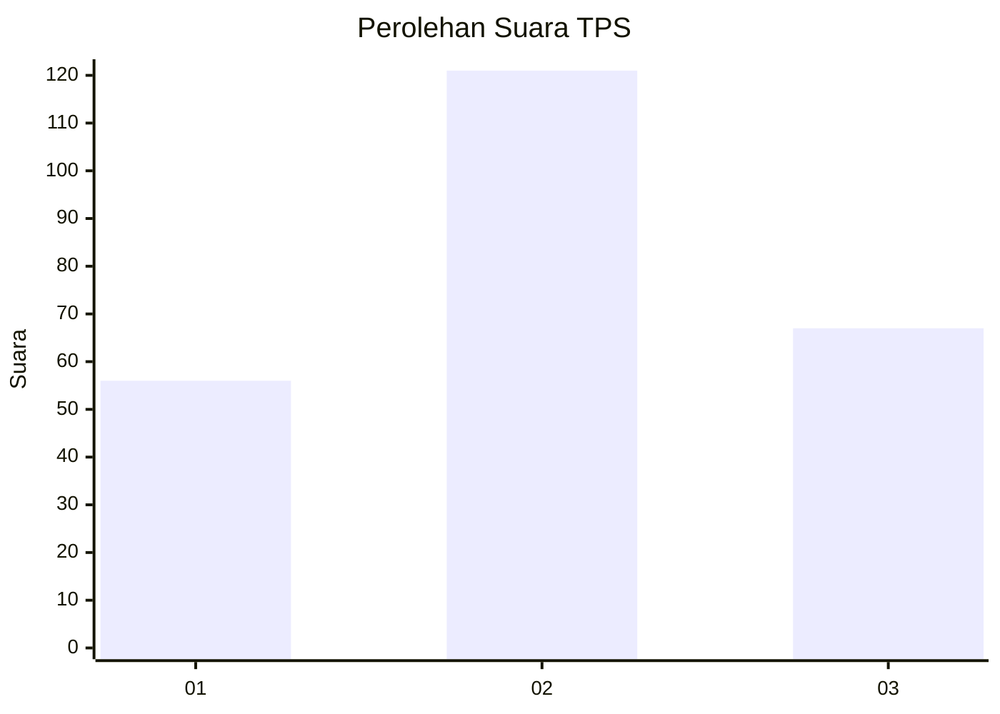
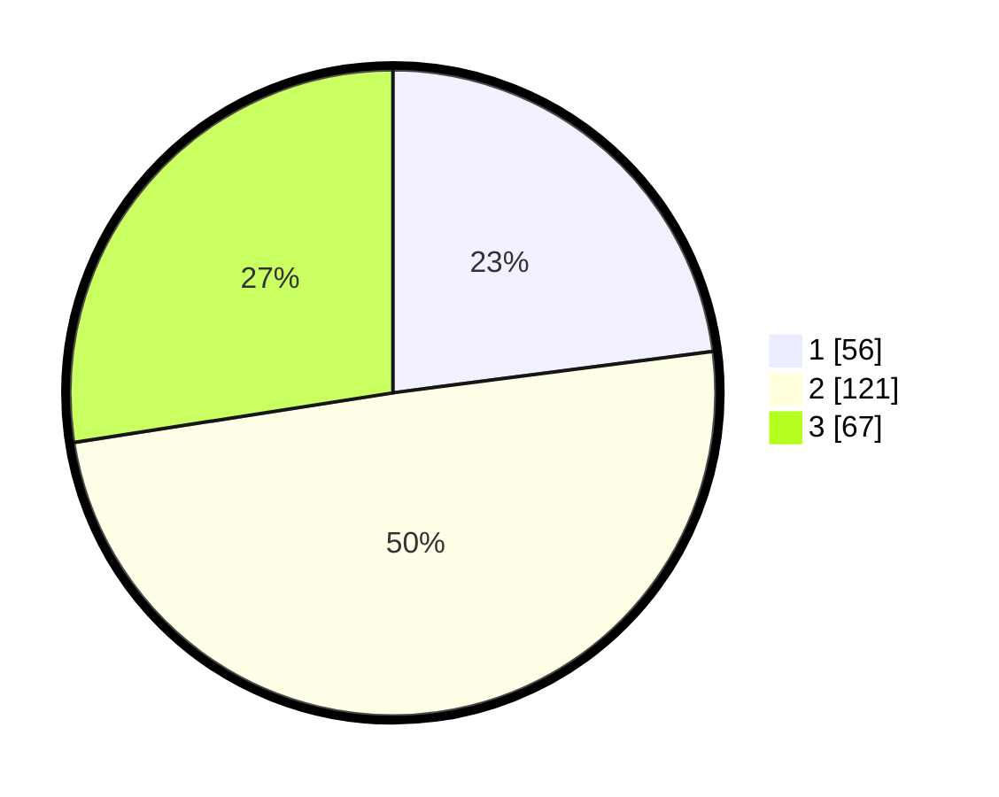

# Hasil

## Grafik

## Tabel

| No. | Nama Paslon    | Suara | Suara (raw) | Persentase |
|:--- |:-------------- | -----:| -----------:| ----------:|
| 1   | ANIES MUHAIMIN | 56    | [56][p-1]   | 22,95      |
| 2   | PRABOWO GIBRAN | 121   | [121][p-2]  | 49,59      |
| 3   | GANJAR MAHFUD  | 67    | [67][p-3]   | 27,46      |

[p-1]: https://github.com/gigit-pemilu/pemilu-2024-34-di-yogyakarta/blob/main/pilpres/hitung-suara/sub/34-di-yogyakarta/sub/71-kota-yogyakarta/sub/03-gondokusuman/sub/1001-demangan/sub/003-tps/sub/paslon-1.txt
[p-2]: https://github.com/gigit-pemilu/pemilu-2024-34-di-yogyakarta/blob/main/pilpres/hitung-suara/sub/34-di-yogyakarta/sub/71-kota-yogyakarta/sub/03-gondokusuman/sub/1001-demangan/sub/003-tps/sub/paslon-2.txt
[p-3]: https://github.com/gigit-pemilu/pemilu-2024-34-di-yogyakarta/blob/main/pilpres/hitung-suara/sub/34-di-yogyakarta/sub/71-kota-yogyakarta/sub/03-gondokusuman/sub/1001-demangan/sub/003-tps/sub/paslon-3.txt

## Foto C Plano

https://sirekap-obj-formc.kpu.go.id/3531/pemilu/ppwp/34/71/03/10/01/3471031001003-20240214-203102--a3f8d23c-2cc6-4b74-8b5c-51d28d697d48.jpg

https://sirekap-obj-formc.kpu.go.id/3531/pemilu/ppwp/34/71/03/10/01/3471031001003-20240214-203135--6d624a31-62d5-410e-9a46-2d27bd3fba7e.jpg

https://sirekap-obj-formc.kpu.go.id/3531/pemilu/ppwp/34/71/03/10/01/3471031001003-20240214-203207--6e0c612d-82af-4958-9935-f5c2e97437ea.jpg

## Metadata

| Key        | Value               |
| ---------- | ------------------- |
| Time Stamp | 2024-02-24 22:31:28 |

## DATA PEMILIH TETAP

Jumlah pemilih dalam DPT: **287**.
 * L: **137**.
 * P: **150**.

## DATA PENGGUNA HAK PILIH

Jumlah pengguna hak pilih dalam DPT: **230**.
 * L: **106**.
 * P: **124**.

Jumlah pengguna hak pilih dalam DPTb: **19**.
 * L: **6**.
 * P: **13**.

Jumlah pengguna hak pilih dalam DPK: **0**.
 * L: **0**.
 * P: **0**.

Jumlah pengguna hak pilih: **249**.
 * L: **112**.
 * P: **137**.

## JUMLAH SUARA SAH DAN TIDAK SAH

JUMLAH SELURUH SUARA SAH: **244**.

JUMLAH SUARA TIDAK SAH: **5**.

JUMLAH SELURUH SUARA SAH DAN SUARA TIDAK SAH: **249**.

