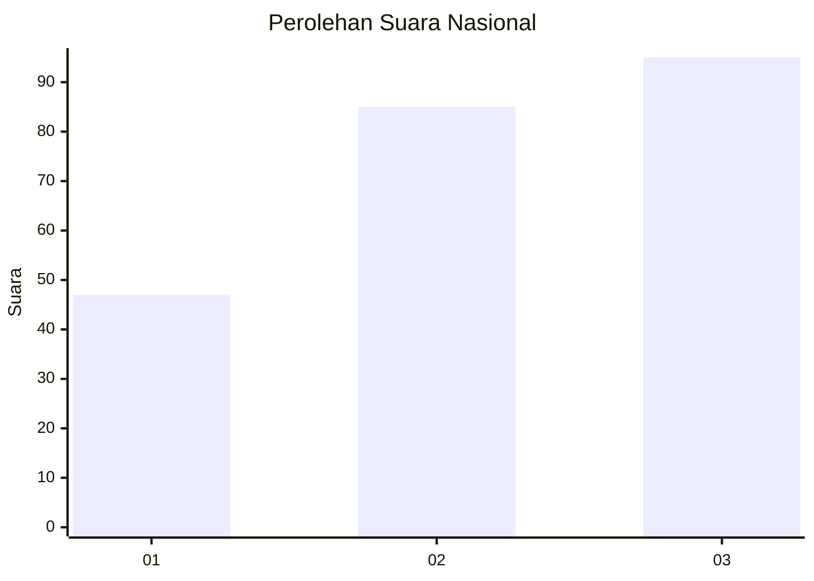
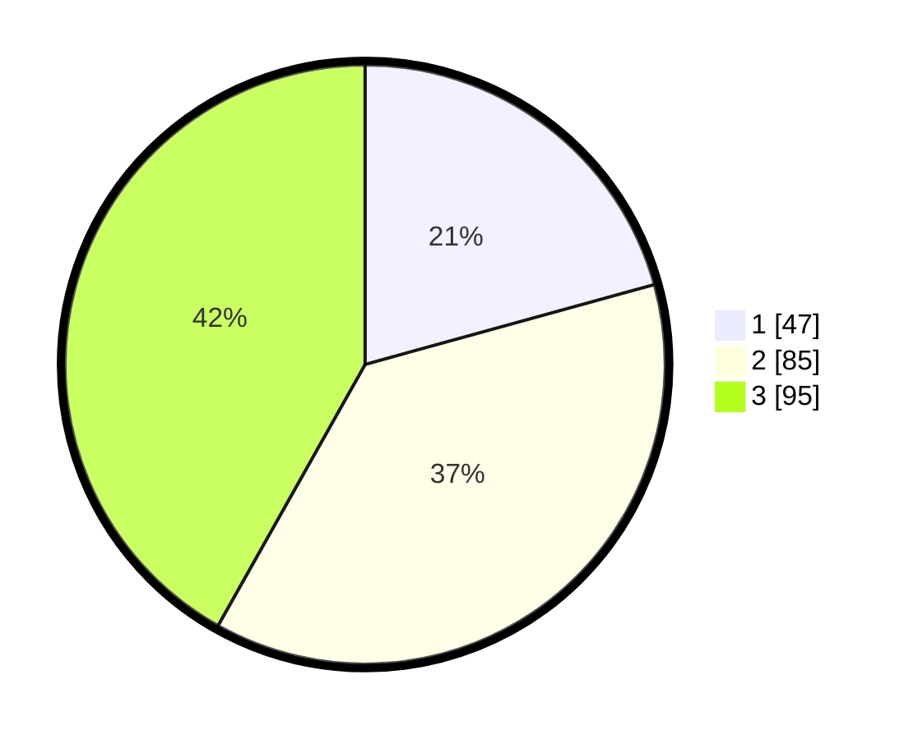

# Hasil

## Grafik

## Tabel

| No. | Nama Paslon    | Suara | Suara (raw) | Persentase |
|:--- |:-------------- | -----:| -----------:| ----------:|
| 1   | ANIES MUHAIMIN | 47    | [47][p-1]   | 20,70      |
| 2   | PRABOWO GIBRAN | 85    | [85][p-2]   | 37,44      |
| 3   | GANJAR MAHFUD  | 95    | [95][p-3]   | 41,85      |

[p-1]: https://github.com/gigit-pemilu/pemilu-2024/blob/main/pilpres/hitung-suara/sub/34-di-yogyakarta/sub/71-kota-yogyakarta/sub/03-gondokusuman/sub/1001-demangan/sub/004-tps/sub/paslon-1.txt
[p-2]: https://github.com/gigit-pemilu/pemilu-2024/blob/main/pilpres/hitung-suara/sub/34-di-yogyakarta/sub/71-kota-yogyakarta/sub/03-gondokusuman/sub/1001-demangan/sub/004-tps/sub/paslon-2.txt
[p-3]: https://github.com/gigit-pemilu/pemilu-2024/blob/main/pilpres/hitung-suara/sub/34-di-yogyakarta/sub/71-kota-yogyakarta/sub/03-gondokusuman/sub/1001-demangan/sub/004-tps/sub/paslon-3.txt

## Foto C Plano

https://sirekap-obj-formc.kpu.go.id/ef79/pemilu/ppwp/34/71/03/10/01/3471031001004-20240215-044321--672acf05-a0da-43bd-8691-59dafc0cfb49.jpg

https://sirekap-obj-formc.kpu.go.id/ef79/pemilu/ppwp/34/71/03/10/01/3471031001004-20240215-044331--d6879e56-c02d-449b-8136-b0001bd9c6dd.jpg

https://sirekap-obj-formc.kpu.go.id/ef79/pemilu/ppwp/34/71/03/10/01/3471031001004-20240215-044337--52c70fa4-f394-4019-9ea1-da325784d9a0.jpg

## Metadata

| Key        | Value               |
| ---------- | ------------------- |
| Time Stamp | 2024-02-19 06:16:00 |

## DATA PEMILIH TETAP

Jumlah pemilih dalam DPT: **283**.
 * L: **132**.
 * P: **151**.

## DATA PENGGUNA HAK PILIH

Jumlah pengguna hak pilih dalam DPT: **219**.
 * L: **98**.
 * P: **121**.

Jumlah pengguna hak pilih dalam DPTb: **17**.
 * L: **5**.
 * P: **12**.

Jumlah pengguna hak pilih dalam DPK: **2**.
 * L: **1**.
 * P: **1**.

Jumlah pengguna hak pilih: **238**.
 * L: **104**.
 * P: **134**.

## JUMLAH SUARA SAH DAN TIDAK SAH

JUMLAH SELURUH SUARA SAH: **227**.

JUMLAH SUARA TIDAK SAH: **11**.

JUMLAH SELURUH SUARA SAH DAN SUARA TIDAK SAH: **238**.

