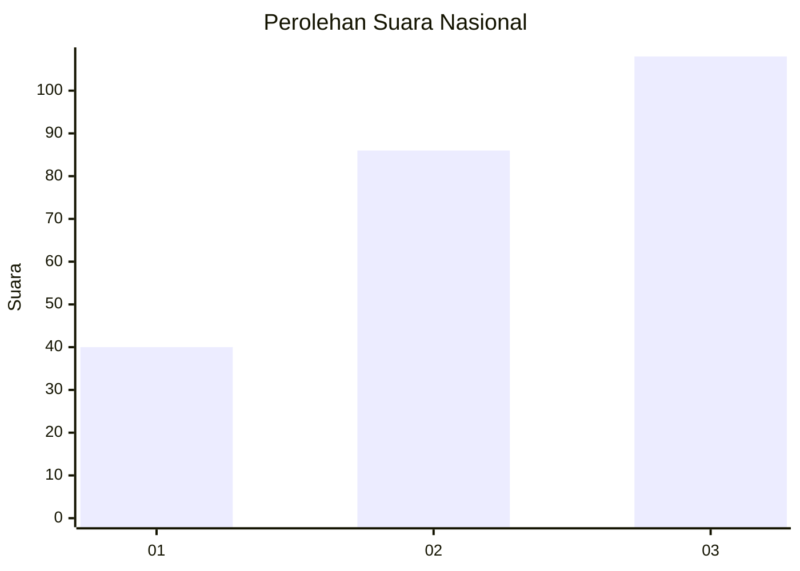
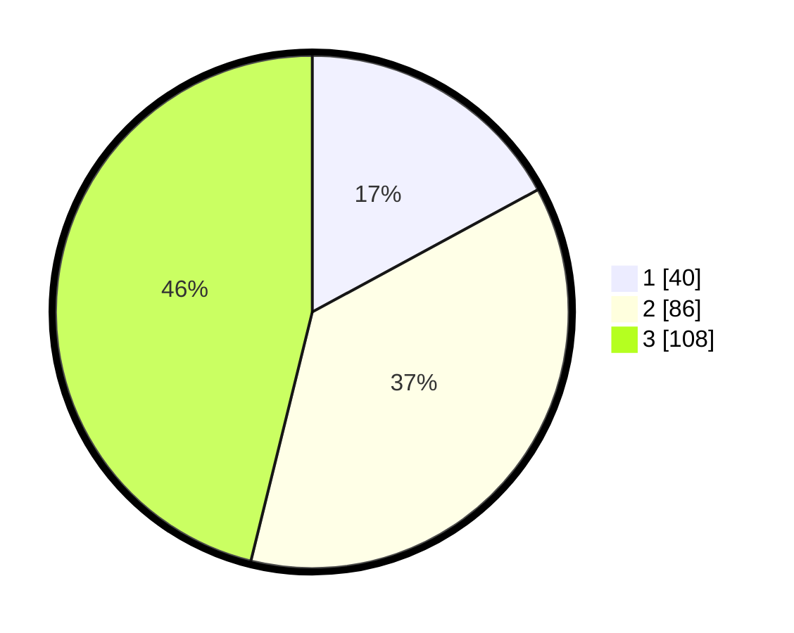

# Hasil

## Grafik

## Tabel

| No. | Nama Paslon    | Suara | Suara (raw) | Persentase |
|:--- |:-------------- | -----:| -----------:| ----------:|
| 1   | ANIES MUHAIMIN | 40    | [40][p-1]   | 17,09      |
| 2   | PRABOWO GIBRAN | 86    | [86][p-2]   | 36,75      |
| 3   | GANJAR MAHFUD  | 108   | [108][p-3]  | 46,15      |

[p-1]: https://github.com/gigit-pemilu/pemilu-2024/blob/main/pilpres/hitung-suara/sub/34-di-yogyakarta/sub/71-kota-yogyakarta/sub/03-gondokusuman/sub/1001-demangan/sub/006-tps/sub/paslon-1.txt
[p-2]: https://github.com/gigit-pemilu/pemilu-2024/blob/main/pilpres/hitung-suara/sub/34-di-yogyakarta/sub/71-kota-yogyakarta/sub/03-gondokusuman/sub/1001-demangan/sub/006-tps/sub/paslon-2.txt
[p-3]: https://github.com/gigit-pemilu/pemilu-2024/blob/main/pilpres/hitung-suara/sub/34-di-yogyakarta/sub/71-kota-yogyakarta/sub/03-gondokusuman/sub/1001-demangan/sub/006-tps/sub/paslon-3.txt

## Foto C Plano

https://sirekap-obj-formc.kpu.go.id/e889/pemilu/ppwp/34/71/03/10/01/3471031001006-20240214-194758--ca05ecd3-bdd1-4db6-b625-fc3f396bf3b1.jpg

https://sirekap-obj-formc.kpu.go.id/e889/pemilu/ppwp/34/71/03/10/01/3471031001006-20240214-194906--cb31850d-e8f6-4271-8d11-b249fa57eefd.jpg

https://sirekap-obj-formc.kpu.go.id/e889/pemilu/ppwp/34/71/03/10/01/3471031001006-20240214-195004--5251c480-e866-4dbe-9833-1aa546ca8ba8.jpg

## Metadata

| Key        | Value               |
| ---------- | ------------------- |
| Time Stamp | 2024-02-15 12:00:28 |

## DATA PEMILIH TETAP

Jumlah pemilih dalam DPT: **278**.
 * L: **117**.
 * P: **161**.

## DATA PENGGUNA HAK PILIH

Jumlah pengguna hak pilih dalam DPT: **224**.
 * L: **94**.
 * P: **130**.

Jumlah pengguna hak pilih dalam DPTb: **15**.
 * L: **9**.
 * P: **6**.

Jumlah pengguna hak pilih dalam DPK: **0**.
 * L: **0**.
 * P: **0**.

Jumlah pengguna hak pilih: **239**.
 * L: **103**.
 * P: **136**.

## JUMLAH SUARA SAH DAN TIDAK SAH

JUMLAH SELURUH SUARA SAH: **234**.

JUMLAH SUARA TIDAK SAH: **5**.

JUMLAH SELURUH SUARA SAH DAN SUARA TIDAK SAH: **239**.

