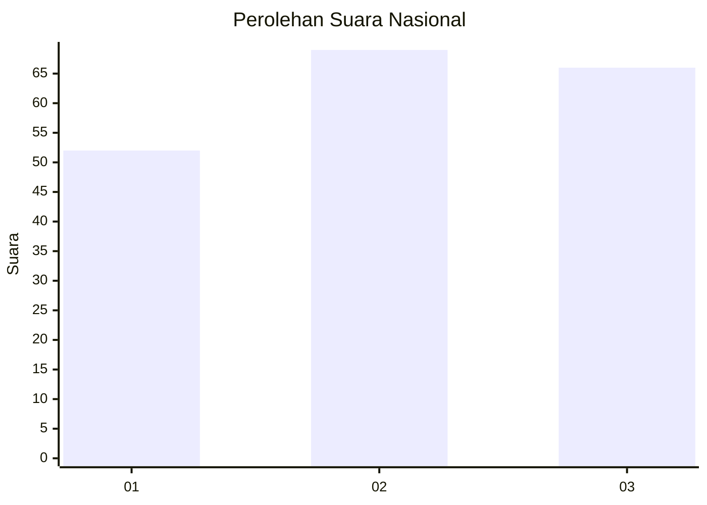
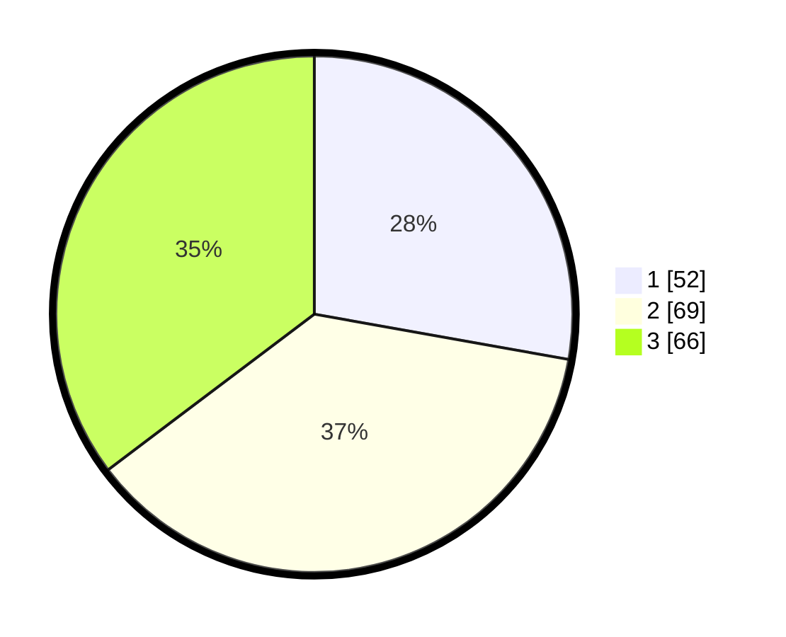

# Hasil

## Grafik

## Tabel

| No. | Nama Paslon    | Suara | Suara (raw) | Persentase |
|:--- |:-------------- | -----:| -----------:| ----------:|
| 1   | ANIES MUHAIMIN | 52    | [52][p-1]   | 27,81      |
| 2   | PRABOWO GIBRAN | 69    | [69][p-2]   | 36,90      |
| 3   | GANJAR MAHFUD  | 66    | [66][p-3]   | 35,29      |

[p-1]: https://github.com/gigit-pemilu/pemilu-2024/blob/main/pilpres/hitung-suara/sub/34-di-yogyakarta/sub/71-kota-yogyakarta/sub/03-gondokusuman/sub/1001-demangan/sub/008-tps/sub/paslon-1.txt
[p-2]: https://github.com/gigit-pemilu/pemilu-2024/blob/main/pilpres/hitung-suara/sub/34-di-yogyakarta/sub/71-kota-yogyakarta/sub/03-gondokusuman/sub/1001-demangan/sub/008-tps/sub/paslon-2.txt
[p-3]: https://github.com/gigit-pemilu/pemilu-2024/blob/main/pilpres/hitung-suara/sub/34-di-yogyakarta/sub/71-kota-yogyakarta/sub/03-gondokusuman/sub/1001-demangan/sub/008-tps/sub/paslon-3.txt

## Foto C Plano

https://sirekap-obj-formc.kpu.go.id/6022/pemilu/ppwp/34/71/03/10/01/3471031001008-20240214-194803--f095b030-23bc-4d1d-976e-806a2c32db09.jpg

https://sirekap-obj-formc.kpu.go.id/6022/pemilu/ppwp/34/71/03/10/01/3471031001008-20240214-195012--8533d3e0-a793-4c7e-b954-c98ee1c0ae94.jpg

https://sirekap-obj-formc.kpu.go.id/6022/pemilu/ppwp/34/71/03/10/01/3471031001008-20240214-195124--66377fdb-fded-41b7-8e20-5dee738b770f.jpg

## Metadata

| Key        | Value               |
| ---------- | ------------------- |
| Time Stamp | 2024-02-14 21:46:01 |

## DATA PEMILIH TETAP

Jumlah pemilih dalam DPT: **215**.
 * L: **104**.
 * P: **111**.

## DATA PENGGUNA HAK PILIH

Jumlah pengguna hak pilih dalam DPT: **171**.
 * L: **77**.
 * P: **94**.

Jumlah pengguna hak pilih dalam DPTb: **14**.
 * L: **7**.
 * P: **7**.

Jumlah pengguna hak pilih dalam DPK: **2**.
 * L: **1**.
 * P: **1**.

Jumlah pengguna hak pilih: **187**.
 * L: **85**.
 * P: **102**.

## JUMLAH SUARA SAH DAN TIDAK SAH

JUMLAH SELURUH SUARA SAH: **187**.

JUMLAH SUARA TIDAK SAH: **0**.

JUMLAH SELURUH SUARA SAH DAN SUARA TIDAK SAH: **187**.

