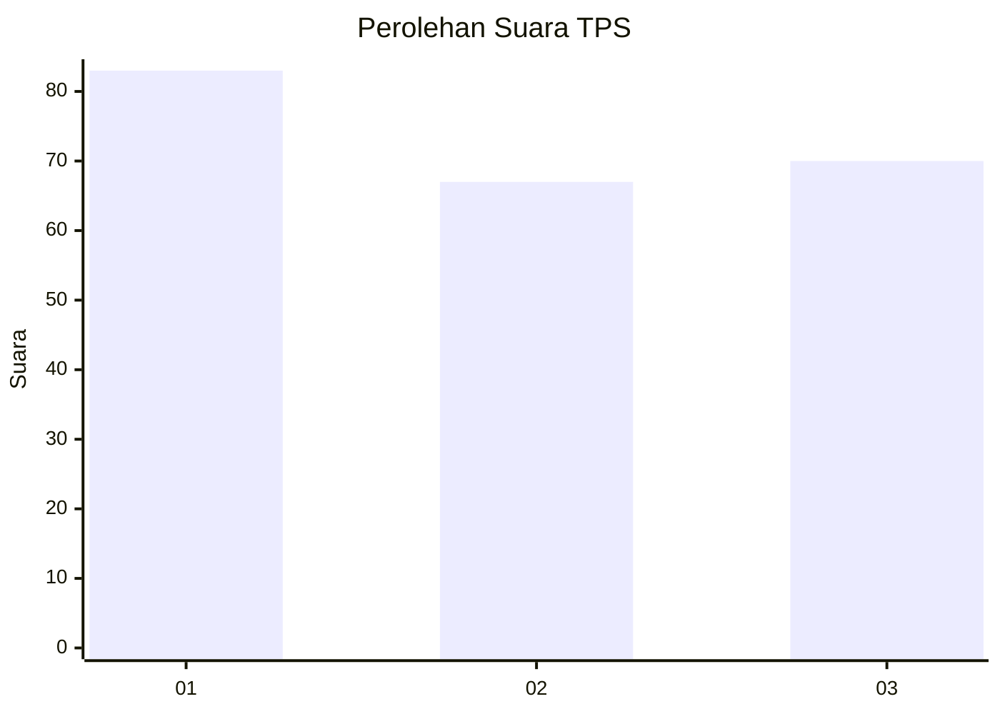
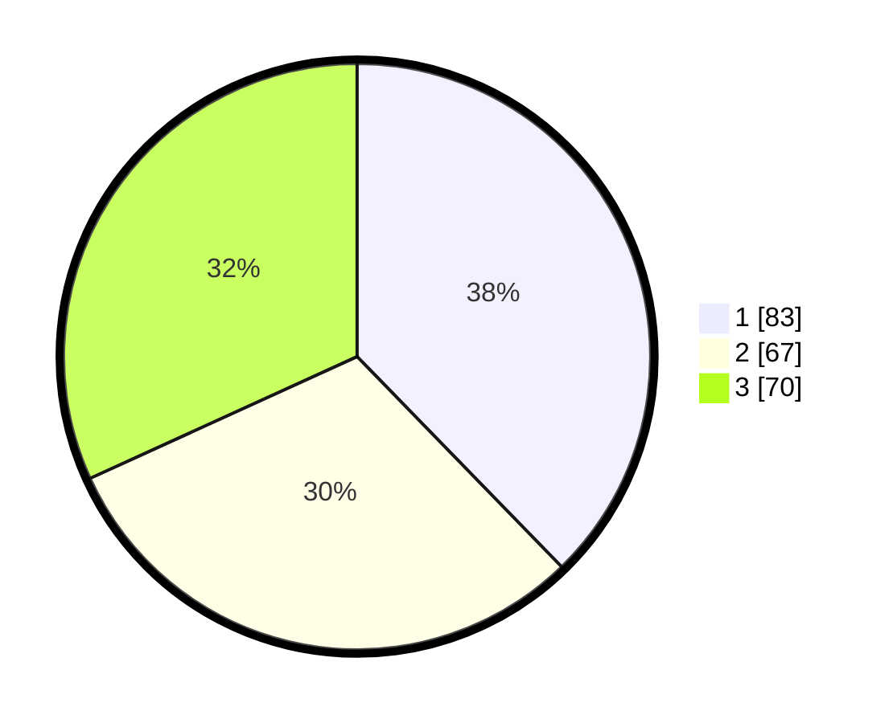

# Hasil

## Grafik

## Tabel

| No. | Nama Paslon    | Suara | Suara (raw) | Persentase |
|:--- |:-------------- | -----:| -----------:| ----------:|
| 1   | ANIES MUHAIMIN | 83    | [83][p-1]   | 37,73      |
| 2   | PRABOWO GIBRAN | 67    | [67][p-2]   | 30,45      |
| 3   | GANJAR MAHFUD  | 70    | [70][p-3]   | 31,82      |

[p-1]: https://github.com/gigit-pemilu/pemilu-2024-34-di-yogyakarta/blob/main/pilpres/hitung-suara/sub/34-di-yogyakarta/sub/71-kota-yogyakarta/sub/03-gondokusuman/sub/1001-demangan/sub/009-tps/sub/paslon-1.txt
[p-2]: https://github.com/gigit-pemilu/pemilu-2024-34-di-yogyakarta/blob/main/pilpres/hitung-suara/sub/34-di-yogyakarta/sub/71-kota-yogyakarta/sub/03-gondokusuman/sub/1001-demangan/sub/009-tps/sub/paslon-2.txt
[p-3]: https://github.com/gigit-pemilu/pemilu-2024-34-di-yogyakarta/blob/main/pilpres/hitung-suara/sub/34-di-yogyakarta/sub/71-kota-yogyakarta/sub/03-gondokusuman/sub/1001-demangan/sub/009-tps/sub/paslon-3.txt

## Foto C Plano

https://sirekap-obj-formc.kpu.go.id/04ff/pemilu/ppwp/34/71/03/10/01/3471031001009-20240215-030645--ffd88a66-4ef3-44f8-a61a-904b5ca14caa.jpg

https://sirekap-obj-formc.kpu.go.id/04ff/pemilu/ppwp/34/71/03/10/01/3471031001009-20240215-030804--e91bfb89-02ea-44e5-b50c-8bf04829c77e.jpg

https://sirekap-obj-formc.kpu.go.id/04ff/pemilu/ppwp/34/71/03/10/01/3471031001009-20240215-030905--3576d785-99a7-46e1-87a5-cfc3fcc866f7.jpg

## Metadata

| Key        | Value               |
| ---------- | ------------------- |
| Time Stamp | 2024-02-25 15:00:00 |

## DATA PEMILIH TETAP

Jumlah pemilih dalam DPT: **240**.
 * L: **112**.
 * P: **128**.

## DATA PENGGUNA HAK PILIH

Jumlah pengguna hak pilih dalam DPT: **201**.
 * L: **90**.
 * P: **111**.

Jumlah pengguna hak pilih dalam DPTb: **19**.
 * L: **6**.
 * P: **13**.

Jumlah pengguna hak pilih dalam DPK: **2**.
 * L: **1**.
 * P: **1**.

Jumlah pengguna hak pilih: **222**.
 * L: **97**.
 * P: **125**.

## JUMLAH SUARA SAH DAN TIDAK SAH

JUMLAH SELURUH SUARA SAH: **220**.

JUMLAH SUARA TIDAK SAH: **2**.

JUMLAH SELURUH SUARA SAH DAN SUARA TIDAK SAH: **222**.

