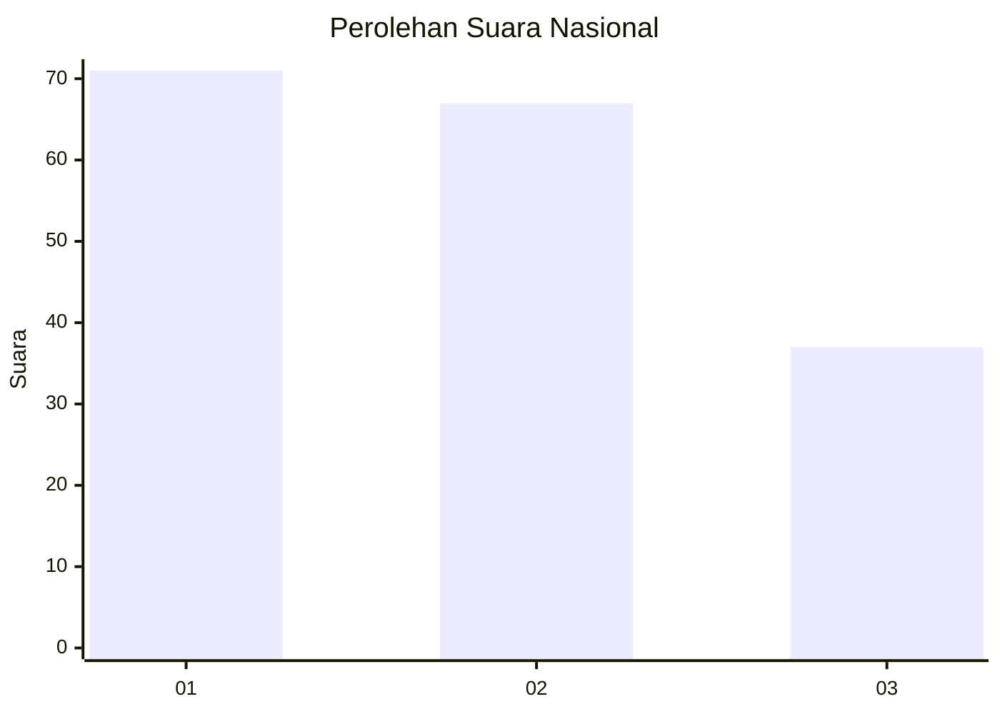
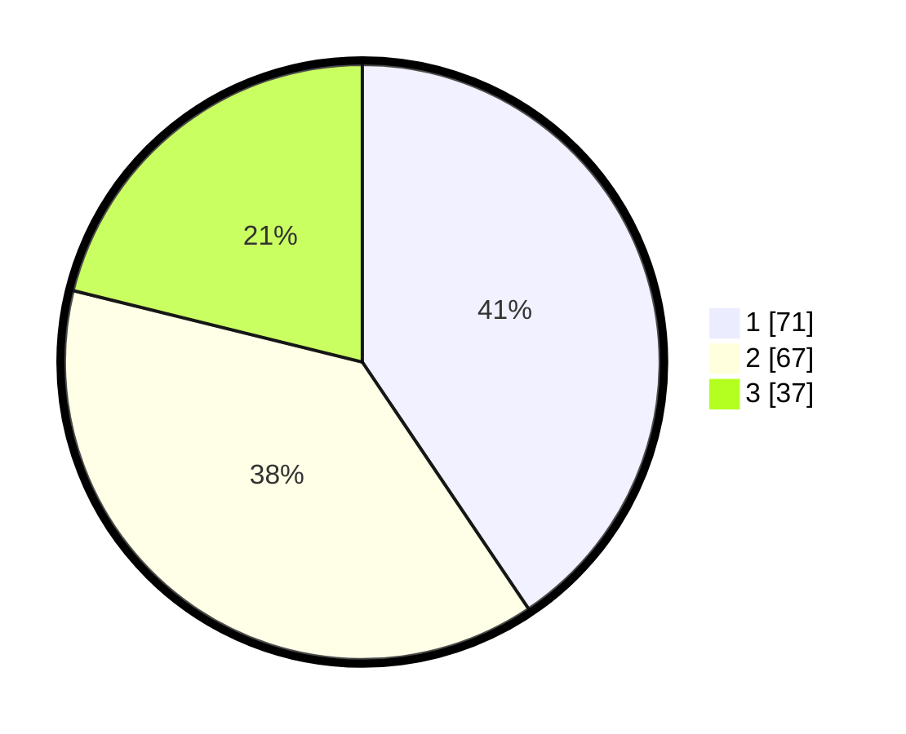

# Hasil

## Grafik

## Tabel

| No. | Nama Paslon    | Suara | Suara (raw) | Persentase |
|:--- |:-------------- | -----:| -----------:| ----------:|
| 1   | ANIES MUHAIMIN | 71    | [71][p-1]   | 40,57      |
| 2   | PRABOWO GIBRAN | 67    | [67][p-2]   | 38,29      |
| 3   | GANJAR MAHFUD  | 37    | [37][p-3]   | 21,14      |

[p-1]: https://github.com/gigit-pemilu/pemilu-2024/blob/main/pilpres/hitung-suara/sub/34-di-yogyakarta/sub/71-kota-yogyakarta/sub/03-gondokusuman/sub/1001-demangan/sub/010-tps/sub/paslon-1.txt
[p-2]: https://github.com/gigit-pemilu/pemilu-2024/blob/main/pilpres/hitung-suara/sub/34-di-yogyakarta/sub/71-kota-yogyakarta/sub/03-gondokusuman/sub/1001-demangan/sub/010-tps/sub/paslon-2.txt
[p-3]: https://github.com/gigit-pemilu/pemilu-2024/blob/main/pilpres/hitung-suara/sub/34-di-yogyakarta/sub/71-kota-yogyakarta/sub/03-gondokusuman/sub/1001-demangan/sub/010-tps/sub/paslon-3.txt

## Foto C Plano

https://sirekap-obj-formc.kpu.go.id/1b07/pemilu/ppwp/34/71/03/10/01/3471031001010-20240214-160103--f664643c-bd18-4215-a540-e83b7b8a6068.jpg

https://sirekap-obj-formc.kpu.go.id/1b07/pemilu/ppwp/34/71/03/10/01/3471031001010-20240214-160132--b9151ab5-1a85-4532-9124-aefb04331cd0.jpg

https://sirekap-obj-formc.kpu.go.id/1b07/pemilu/ppwp/34/71/03/10/01/3471031001010-20240214-160154--7219052c-727b-4df3-8d2a-a010b253e052.jpg

## Metadata

| Key        | Value               |
| ---------- | ------------------- |
| Time Stamp | 2024-02-14 21:46:01 |

## DATA PEMILIH TETAP

Jumlah pemilih dalam DPT: **202**.
 * L: **100**.
 * P: **102**.

## DATA PENGGUNA HAK PILIH

Jumlah pengguna hak pilih dalam DPT: **157**.
 * L: **80**.
 * P: **77**.

Jumlah pengguna hak pilih dalam DPTb: **18**.
 * L: **2**.
 * P: **16**.

Jumlah pengguna hak pilih dalam DPK: **2**.
 * L: **1**.
 * P: **1**.

Jumlah pengguna hak pilih: **177**.
 * L: **83**.
 * P: **94**.

## JUMLAH SUARA SAH DAN TIDAK SAH

JUMLAH SELURUH SUARA SAH: **175**.

JUMLAH SUARA TIDAK SAH: **2**.

JUMLAH SELURUH SUARA SAH DAN SUARA TIDAK SAH: **177**.

