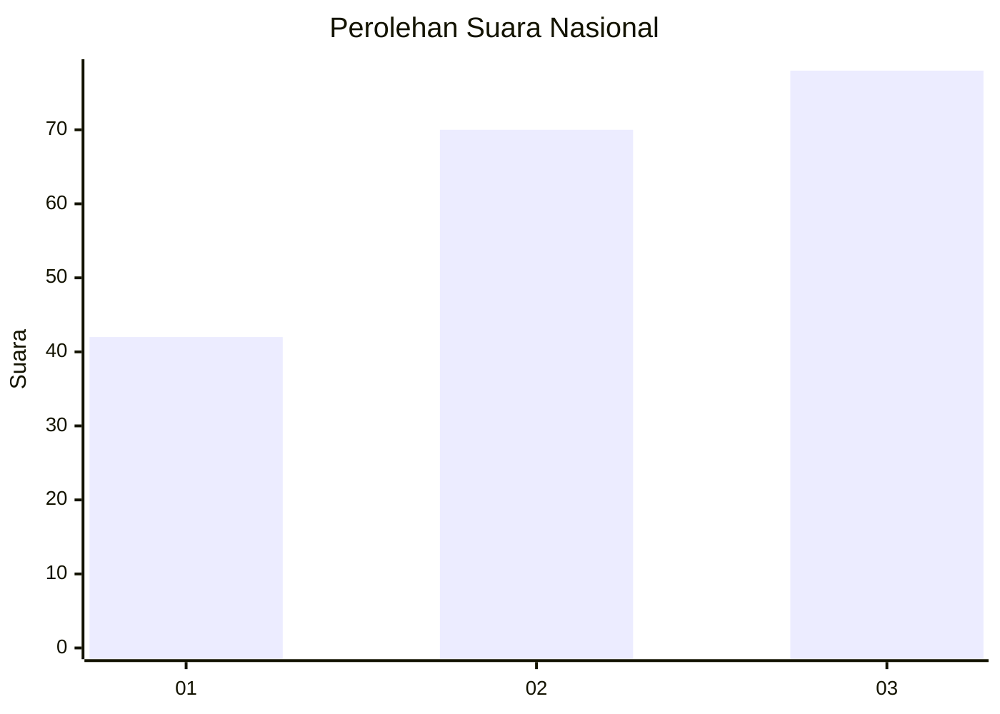
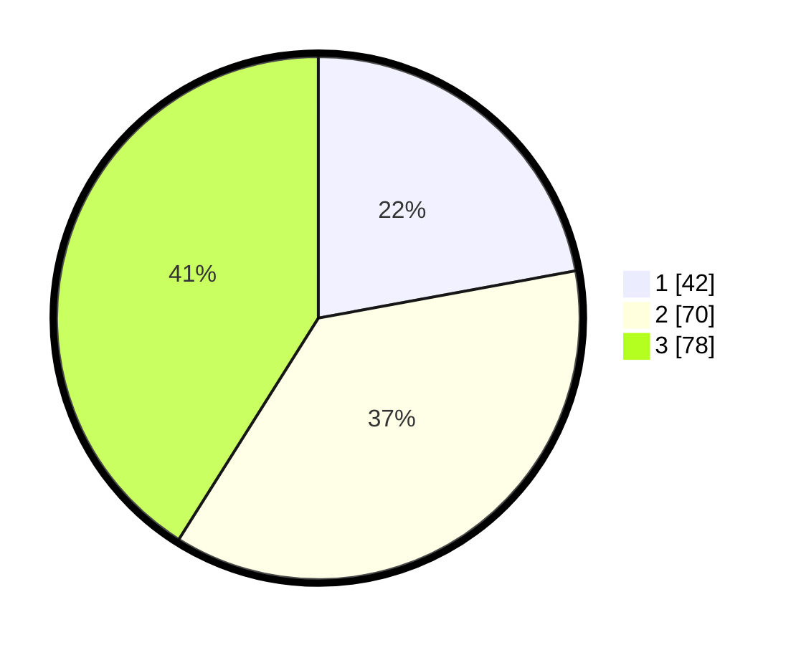

# Hasil

## Grafik

## Tabel

| No. | Nama Paslon    | Suara | Suara (raw) | Persentase |
|:--- |:-------------- | -----:| -----------:| ----------:|
| 1   | ANIES MUHAIMIN | 42    | [42][p-1]   | 22,11      |
| 2   | PRABOWO GIBRAN | 70    | [70][p-2]   | 36,84      |
| 3   | GANJAR MAHFUD  | 78    | [78][p-3]   | 41,05      |

[p-1]: https://github.com/gigit-pemilu/pemilu-2024/blob/main/pilpres/hitung-suara/sub/34-di-yogyakarta/sub/71-kota-yogyakarta/sub/03-gondokusuman/sub/1001-demangan/sub/011-tps/sub/paslon-1.txt
[p-2]: https://github.com/gigit-pemilu/pemilu-2024/blob/main/pilpres/hitung-suara/sub/34-di-yogyakarta/sub/71-kota-yogyakarta/sub/03-gondokusuman/sub/1001-demangan/sub/011-tps/sub/paslon-2.txt
[p-3]: https://github.com/gigit-pemilu/pemilu-2024/blob/main/pilpres/hitung-suara/sub/34-di-yogyakarta/sub/71-kota-yogyakarta/sub/03-gondokusuman/sub/1001-demangan/sub/011-tps/sub/paslon-3.txt

## Foto C Plano

https://sirekap-obj-formc.kpu.go.id/ff2e/pemilu/ppwp/34/71/03/10/01/3471031001011-20240218-171105--1c20998f-13fe-4123-81e9-0f23e349949e.jpg

https://sirekap-obj-formc.kpu.go.id/ff2e/pemilu/ppwp/34/71/03/10/01/3471031001011-20240218-171229--f18be5bd-013a-4452-afbb-f2369a4a281c.jpg

https://sirekap-obj-formc.kpu.go.id/ff2e/pemilu/ppwp/34/71/03/10/01/3471031001011-20240218-171633--3f7b927a-1db5-4aeb-a077-8ffc0dbf13b0.jpg

## Metadata

| Key        | Value               |
| ---------- | ------------------- |
| Time Stamp | 2024-02-21 12:00:00 |

## DATA PEMILIH TETAP

Jumlah pemilih dalam DPT: **0**.
 * L: **0**.
 * P: **0**.

## DATA PENGGUNA HAK PILIH

Jumlah pengguna hak pilih dalam DPT: **850**.
 * L: **0**.
 * P: **700**.

Jumlah pengguna hak pilih dalam DPTb: **6**.
 * L: **705**.
 * P: **4**.

Jumlah pengguna hak pilih dalam DPK: **4**.
 * L: **3**.
 * P: **1**.

Jumlah pengguna hak pilih: **197**.
 * L: **92**.
 * P: **103**.

## JUMLAH SUARA SAH DAN TIDAK SAH

JUMLAH SELURUH SUARA SAH: **190**.

JUMLAH SUARA TIDAK SAH: **5**.

JUMLAH SELURUH SUARA SAH DAN SUARA TIDAK SAH: **195**.

