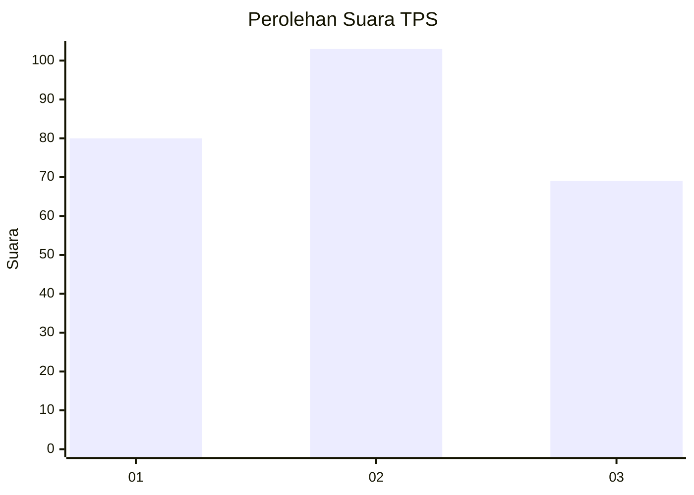
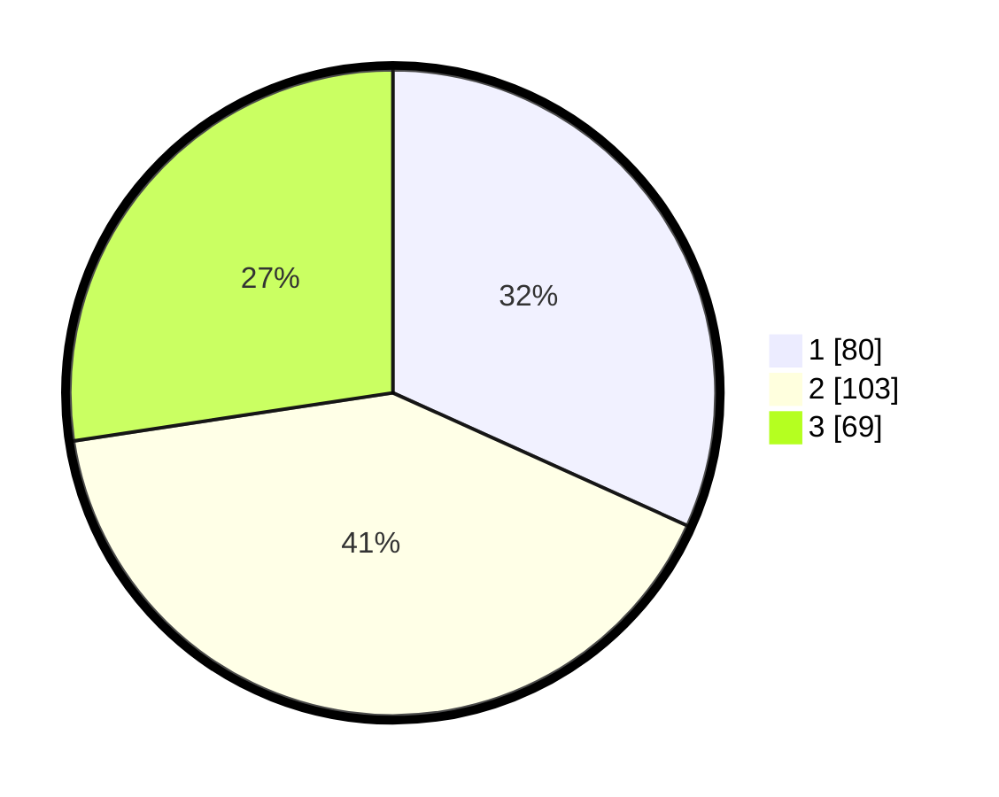

# Hasil

## Grafik

## Tabel

| No. | Nama Paslon    | Suara | Suara (raw) | Persentase |
|:--- |:-------------- | -----:| -----------:| ----------:|
| 1   | ANIES MUHAIMIN | 80    | [80][p-1]   | 31,75      |
| 2   | PRABOWO GIBRAN | 103   | [103][p-2]  | 40,87      |
| 3   | GANJAR MAHFUD  | 69    | [69][p-3]   | 27,38      |

[p-1]: https://github.com/gigit-pemilu/pemilu-2024-34-di-yogyakarta/blob/main/pilpres/hitung-suara/sub/34-di-yogyakarta/sub/71-kota-yogyakarta/sub/03-gondokusuman/sub/1001-demangan/sub/015-tps/sub/paslon-1.txt
[p-2]: https://github.com/gigit-pemilu/pemilu-2024-34-di-yogyakarta/blob/main/pilpres/hitung-suara/sub/34-di-yogyakarta/sub/71-kota-yogyakarta/sub/03-gondokusuman/sub/1001-demangan/sub/015-tps/sub/paslon-2.txt
[p-3]: https://github.com/gigit-pemilu/pemilu-2024-34-di-yogyakarta/blob/main/pilpres/hitung-suara/sub/34-di-yogyakarta/sub/71-kota-yogyakarta/sub/03-gondokusuman/sub/1001-demangan/sub/015-tps/sub/paslon-3.txt

## Foto C Plano

https://sirekap-obj-formc.kpu.go.id/29c5/pemilu/ppwp/34/71/03/10/01/3471031001015-20240214-193234--f13ab932-8c2f-4cda-934a-dec64bdcbc8a.jpg

https://sirekap-obj-formc.kpu.go.id/29c5/pemilu/ppwp/34/71/03/10/01/3471031001015-20240214-193605--7a499792-df80-49b0-8d7b-917010b3cc26.jpg

https://sirekap-obj-formc.kpu.go.id/29c5/pemilu/ppwp/34/71/03/10/01/3471031001015-20240214-193816--eff01058-f53f-4dc1-ab36-6ba7da5f56c3.jpg

## Metadata

| Key        | Value               |
| ---------- | ------------------- |
| Time Stamp | 2024-02-14 21:46:01 |

## DATA PEMILIH TETAP

Jumlah pemilih dalam DPT: **287**.
 * L: **155**.
 * P: **132**.

## DATA PENGGUNA HAK PILIH

Jumlah pengguna hak pilih dalam DPT: **244**.
 * L: **125**.
 * P: **119**.

Jumlah pengguna hak pilih dalam DPTb: **16**.
 * L: **4**.
 * P: **12**.

Jumlah pengguna hak pilih dalam DPK: **1**.
 * L: **1**.
 * P: **0**.

Jumlah pengguna hak pilih: **261**.
 * L: **130**.
 * P: **131**.

## JUMLAH SUARA SAH DAN TIDAK SAH

JUMLAH SELURUH SUARA SAH: **252**.

JUMLAH SUARA TIDAK SAH: **8**.

JUMLAH SELURUH SUARA SAH DAN SUARA TIDAK SAH: **260**.

